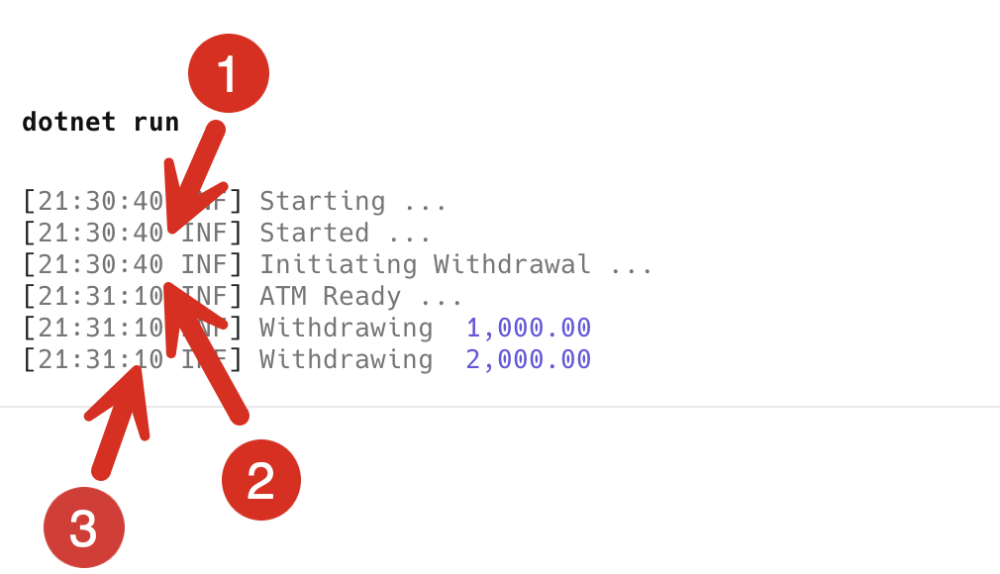

Initialization of a class, where we set its initial state, is something we do all the time, and usually don't think too much about as it is very routine.

Let us take an example of this class that models an **ATM** machine:

```c#
using Serilog;

public sealed class ATM
{
    public decimal Balance { get; private set; }

    public ATM(decimal balance)
    {
        Balance = balance;
        Log.Information("ATM Ready ...");
    }

    public void Withdraw(decimal amount)
    {
        if (amount < Balance)
        {
            Log.Information("Withdrawing  {Amount:#,0.00}", amount);
            Balance -= amount;
        }
        else
            Log.Error($"Insufficient ATM balance");
    }

    public void Deposit(decimal amount)
    {
        Log.Information("Depositing {amount:#,0.00}", amount);
        Balance += amount;
    }
}
```

In our program, we are using [Serilog](https://serilog.net/) and logging to the console using [Serilog.Sinks.Console](https://www.nuget.org/packages/Serilog.Sinks.Console/) package.

Then, let us take a look at this class that models an **ATM Booth**.

```c#
public sealed class ATMBooth
{
    public ATM ATM { get; }

    public ATMBooth()
    {
        ATM = new ATM(100_000);
    }
}
```

So far, so good.

Now, suppose it was **expensive** to initialize an ATM. Assume the constructor was as follows:

```c#
public ATM(decimal balance)
{
    // Simulate a lengthy process
    Thread.Sleep(TimeSpan.FromSeconds(30));
    Balance = balance;
    Log.Information("ATM Ready ...");
}
```

We then have this simple program:

```c#
using Serilog;

Log.Logger = new LoggerConfiguration()
    .WriteTo.Console()
    .CreateLogger();

Log.Information("Starting...");
// Create an ATM Booth
var booth = new ATMBooth();
booth.ATM.Withdraw(1_000);
```

If we run this program, we will see the following:

```plaintext
[21:07:24 INF] Starting...
[21:07:54 INF] ATM Ready ...
[21:07:54 INF] Withdrawing  1,000.00
```

If we look closely:


We can see here that **for 30 seconds, the program is unusable**, as it is **initializing** the ATM.

This presents a problem. It is currently OK because we have a withdrawal request, but what if there wasn't? Then, there would be no need to initialize the ATM.

We could then decide to initialize our ATM **only when we actually need it**.

We can modify our ATM class as follows:

```c#
public sealed class ATMBooth
{
    // Initially this is null
    private ATM? _atm;

    public ATM ATM
    {
        get
        {
            // Check if the field is null
            if (_atm == null)
            {
                // If it is, create a new one
                _atm = new ATM(100_000);
            }

            // Return the field
            return _atm;
        }
    }
}
```

A couple of changes here:

1. The **constructor** has been removed
2. We have introduced a **nullable** **private** **field**, `_atm`
3. When accessed, the public property, `ATM`, checks if `_atm` is `null`. If it is, it **creates** a new ATM. Otherwise, it returns the **existing** `_atm` instance.

We can then tweak our program slightly to demonstrate a few things:

```c#
Log.Information("Starting ...");
// Create an ATM Booth
var booth = new ATMBooth();
Log.Information("Started ...");
Log.Information("Initiating Withdrawal ...");
// Do a withdrawal
booth.ATM.Withdraw(1_000);
// Do a second withdrawal
booth.ATM.Withdraw(2_000);
```

If we run the program we should see the following:

```plaintext
[21:30:40 INF] Starting ...
[21:30:40 INF] Started ...
[21:30:40 INF] Initiating Withdrawal ...
[21:31:10 INF] ATM Ready ...
[21:31:10 INF] Withdrawing  1,000.00
[21:31:10 INF] Withdrawing  2,000.00
```

If we look closely at the timestamps:



1. The initial 30-second hit at initialization is **gone**.
2. The 30-second initialization hit was taken **when we attempted to make the first withdrawal**.
3. The subsequent withdrawal is **instantaneous**.

This is a much better design, but it has one fatal problem - it is **not** [thread-safe](https://en.wikipedia.org/wiki/Thread_safety). If we had **several withdrawals** to make and wanted to do them in **several threads**, we have a potential edge case when **multiple threads attempt to access an ATM at the same time**, find it is `null`, and then there are potentially **multiple attempts to create an ATM**.

This section, in particular, is the problem:

```c#
// Check if the field is null
if (_atm == null)
{
    // If it is, create a new one
    _atm = new ATM(100_000);
}
```

A solution to this problem is to use a [Lock](https://learn.microsoft.com/en-us/dotnet/api/system.threading.lock?view=net-9.0), as discussed in a [previous post](), like this:

```c#
public sealed class ATMBooth
{
    // Initially this is null
    private ATM? _atm;
    // Create a lock object
    private readonly Lock _lock = new();

    public ATM ATM
    {
        get
        {
            if (_atm == null)
            {
                // Do our null check & creation in a scope
                using (_lock.EnterScope())
                {
                    // Check if the field is null
                    if (_atm == null)
                    {
                        // If it is, create a new one
                        _atm = new ATM(100_000);
                    }
                }
            }

            // Return the field
            return _atm;
        }
    }
}
```

A couple of things to notice here:

1. We create a `Lock` at the `ATMBooth` level as a `private` `readonly` field
2. In the ATM property **getter**, we first check if the private `_atm` field is `null`. If it isn't, we **immediately return the instance**. If not, we **use the lock to control access** to the field as we **initialize** it.

This pattern is called [double-checked locking](https://en.wikipedia.org/wiki/Double-checked_locking).

There is an even better solution to this problem that saves us all the heavy lifting of having to manage creaton of the object and the managing of locks ourselves - functionality in the [System.Lazy](https://learn.microsoft.com/en-us/dotnet/api/system.lazy-1?view=net-9.0) class.

We can rewrite our class as follows:

```c#
public sealed class ATMBooth
{
    // Indicate we need lazy initialization for our ATM
    private Lazy<ATM> _atm;

    public ATMBooth()
    {
        // Lazily initiate our ATM, and indicate we want it thread-safe
        _atm = new Lazy<ATM>(() => new ATM(10_000), true);
    }

    // Return the value from our Lazy object when requested
    public ATM ATM => _atm.Value;
}
```

The code is much **simpler**. The `Lazy` object and the delegate that tells it how to **initialize** our ATM class do the heavy lifting.

### TLDR

**The `Lazy` class offers the ability to indicate objects that we want to be initialized lazily, and we can indicate thread-safety of the same.**

The code is in my [Github](https://github.com/conradakunga/BlogCode/tree/master/2025-01-29%20-%20Lazy).

Happy hacking!
