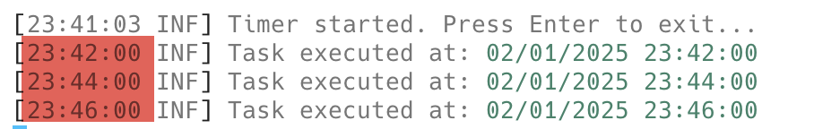
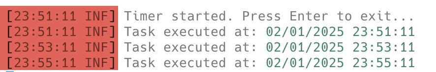

Suppose your program needs to carry out a task **periodically**, say every five minutes.

Before you write a single line of code, you need to take a minute to figure out what "**every five minutes**" means, as it will affect how you go about writing your program.

One interpretation is that you want the program to run from a reference time **every five minutes at the top of the minute**.

For example:

```plaintext
23:00.00	23:05.00	23:10.00 	23:15.00	23:30.0
```

Or, it can mean every five minutes **from the start of the program**.

Which is to say, if you start the program at **23:01.22,** it will execute the task as follows:

```plaintext
23:06.22	23:11.22	23:16.22	23:21.22	23:23.22
```

To solve the first scenario, we essentially **poll the system clock every second** and then fire if the time changes such that the minute is **divisible by five and the second is exactly 0**.

Our program will look like this:

```c#
using Serilog;

const int minutesToWait = 2;

Log.Logger = new LoggerConfiguration()
    .WriteTo.Console()
    .CreateLogger();

// Create a timer that executes RunTask every second, starting immediately. 
var timer = new Timer(RunTask, null, TimeSpan.Zero, TimeSpan.FromSeconds(1));
Log.Information("Timer started. Press Enter to exit...");
Console.ReadLine();
return;

// Local function that runs the task
void RunTask(object? state)
{
    // Get the current time
    var currentTme = DateTime.Now;
    // Check the minute and the second
    if (currentTme.Minute % MinutesToWait == 0 && currentTme.Second == 0)
        Log.Information("Task executed at: {CurrentTime}", currentTme);
}
```

***I've changed the period to wait to 2 minutes to make it easier to write this post!***

As usual, I am using [Serilog](https://serilog.net/) and logging with the [console sink](https://github.com/serilog/serilog-sinks-console).

The results should be as follows:

```plaintext
[23:30:58 INF] Timer started. Press Enter to exit...
[23:32:00 INF] Task executed at: 01/02/2025 23:32:00
[23:34:00 INF] Task executed at: 01/02/2025 23:34:00
[23:36:00 INF] Task executed at: 01/02/2025 23:36:00
```

We can see from the logs that it runs strictly on the minute.



For the second scenario, where we want to run **a set period after the start**, we change our code like this:

```c#
// Create a timer that executes RunTask every 2 minutes, starting immediately. 
var timer = new Timer(RunTask, null, TimeSpan.Zero, TimeSpan.FromMinutes(minutesToWait));
Log.Information("Timer started. Press Enter to exit...");
Console.ReadLine();
return;

// Local function that runs the task
void RunTask(object? state)
{
    Log.Information("Task executed at: {CurrentTime}", DateTime.Now);
}
```

The results will be as follows:

```plaintext
[23:51:11 INF] Timer started. Press Enter to exit...
[23:51:11 INF] Task executed at: 02/01/2025 23:51:11
[23:53:11 INF] Task executed at: 02/01/2025 23:53:11
[23:55:11 INF] Task executed at: 02/01/2025 23:55:11
```

If we look at the timestamps, we see they are **exactly two minutes apart**.



There is a newer, better way to do this - the [PeriodicTimer](https://learn.microsoft.com/en-us/dotnet/api/system.threading.periodictimer?view=net-9.0).

The code looks like this:

```c#
// Create the periodic timer
using var timer = new PeriodicTimer(TimeSpan.FromMinutes(minutesToWait));

// Write the handler for the work to be done
while (await timer.WaitForNextTickAsync())
{
    Log.Information("Task executed at: {CurrentTime}", DateTime.Now);
}
```

The code, as you can see, is much **simpler**, and given it is asynchronous, you can have asynchronous method calls therein.

It also supports the [CancellationToken](https://learn.microsoft.com/en-us/dotnet/standard/threading/cancellation-in-managed-threads), which means it can be called from the context of any method that passes around a cancellation token.

Or you can create the infrastructure for cancellation yourself.

```c#
// Create a cancellation token source
using var cts = new CancellationTokenSource();
// Create the periodic timer
using var periodicTimer = new PeriodicTimer(TimeSpan.FromMinutes(minutesToWait));

// Write the handler for the work to be done
while (await periodicTimer.WaitForNextTickAsync(cts.Token))
{
    Log.Information("Task executed at: {CurrentTime}", DateTime.Now);
}
```

You can also change the period **after the fact**, if you need to, by changing the [Period](https://learn.microsoft.com/en-us/dotnet/api/system.threading.periodictimer.period?view=net-9.0).

So, suppose we want the interval to **increase** if the hour is past noon.

```c#
// Write the handler for the work to be done
while (await periodicTimer.WaitForNextTickAsync(cts.Token))
{
    var currentDate = DateTime.Now;
    // If past noon, use 5 minutes. Else, the default
    if (currentDate.Hour >= 12)
        periodicTimer.Period = TimeSpan.FromMinutes(5);
    else
        periodicTimer.Period = TimeSpan.FromMinutes(minutesToWait);

    Log.Information("Task executed at: {CurrentTime}", currentDate);
}
```

### TLDR

**The `PeriodicTimer` allows for programs that execute tasks periodically to be written easily. You can also change the period after the timer has started.**

The code is in my [GitHub](https://github.com/conradakunga/BlogCode/tree/master/2025-02-01%20-%20PeriodicTimer).

Happy hacking!
