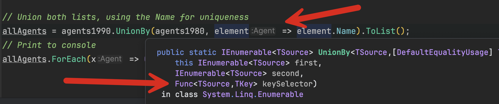

In the post [Set Operations With LINQ,]() we looked at how to use LINQ Union to merge two collections into a third collection.

This normally is pretty straightforward when both collections have **heterogeneous** types, such as primitives or simple classes, where the logic to merge is straightforward.

Sometimes, however, you are presented with a situation where you need to **tell the runtime what you mean when you want two collections merged**.

For example, take this type, which is some sort of **register** that collects a spy's **name** and **how old** they were when the collection was taken.

```c#
public record Agent
{
    public required string Name { get; init; }
    public required int Age { get; init; }
}
```

We then have a register as of the year 1980

```c#
Agent[] agents1980 =
[
    new() { Name = "James Bond", Age = 40 },
    new() { Name = "Jason Bourne", Age = 37 },
    new() { Name = "Evelyn Salt", Age = 28 },
    new() { Name = "Ros Myers", Age = 25 },
];
```

We then have a second register as of the year 1990, 10 years later.

```c#
Agent[] agents1990 =
[
    new() { Name = "James Bond", Age = 50 },
    new() { Name = "Jason Bourne", Age = 45 },
    new() { Name = "Evelyn Salt", Age = 35 },
    new() { Name = "Ros Myers", Age = 30 },
    new() { Name = "Ethan Hunt", Age = 40 },
    new() { Name = "Benji Dunn", Age = 30 },
    new() { Name = "Luther Stickell", Age = 37 },
];
```

We then write a program to [Union](https://learn.microsoft.com/en-us/dotnet/api/system.linq.enumerable.union?view=net-9.0) these and print the results.

```c#
// Union both lists
var allAgents = agents1990.Union(agents1980).ToList();
// Print to console
allAgents.ForEach(x => Console.WriteLine($"Agent: {x.Name}, Age: {x.Age}"));
```

You should see the following:

```plaintext
Agent: James Bond, Age: 50
Agent: Jason Bourne, Age: 45
Agent: Evelyn Salt, Age: 35
Agent: Ros Myers, Age: 30
Agent: Ethan Hunt, Age: 40
Agent: Benji Dunn, Age: 30
Agent: Luther Stickell, Age: 37
Agent: James Bond, Age: 40
Agent: Jason Bourne, Age: 37
Agent: Evelyn Salt, Age: 28
Agent: Ros Myers, Age: 25
```

Here, we can see that the runtime has simply merged both collections. This is **technically correct**, as both were separate collections, but it is also **incorrect** because we have **repeating agents**—they are the same agents, just 10 years older.

For this sort of problem, we need to tell `LINQ` how to consider **equality**. This is important because, in set theory, a [set cannot have duplicate elements](https://en.wikipedia.org/wiki/Set_(mathematics)).

This is achieved using the [UnionBy](https://learn.microsoft.com/en-us/dotnet/api/system.linq.enumerable.unionby?view=net-9.0) method, which allows you to indicate **how you want a comparison** for equality to be handled.

In this example, we want to indicate that the agent `Name` is sufficient for this comparison.

```c#
// Union both lists, using the Name for uniqueness
allAgents = agents1990.UnionBy(agents1980, 
    element => element.Name).ToList();
// Print to console
allAgents.ForEach(x => Console.WriteLine($"Agent: {x.Name}, Age: {x.Age}"));
```

The magic is taking place in the **key selector**, where we specify we want to use the `Name` to differentiate the elements of both lists.



This will print the following:

```plaintext
Agent: James Bond, Age: 50
Agent: Jason Bourne, Age: 45
Agent: Evelyn Salt, Age: 35
Agent: Ros Myers, Age: 30
Agent: Ethan Hunt, Age: 40
Agent: Benji Dunn, Age: 30
Agent: Luther Stickell, Age: 37
```

### TLDR

**`LINQ` `UnionBy` allows you to specify a function allowing the runtime to segregate unique members of two collections when performing a set union.**

The code is in my [GitHub](https://github.com/conradakunga/BlogCode/tree/master/2025-02-02%20-%20UnionBy).

Happy hacking!
