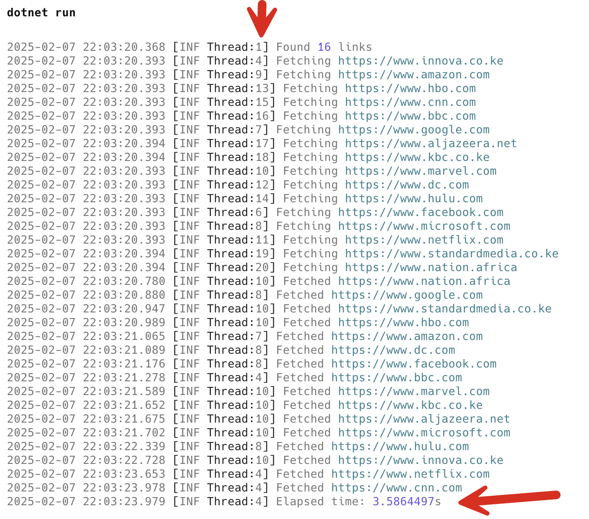

I recently had a challenge - given a text file with URLs, I needed to download their homepages to extract some information from each home page.

I believe strongly in **iterative development** - develop version 1 that does the job, then improve performance, clarity, etc.

Version 1 was as follows:

1. Get the text file
2. Extract all the URLs into an array
3. Loop through the array and download the home pages
4. Victory!

The code looked like this:

```c#
using System.Diagnostics;
using Serilog;

Log.Logger = new LoggerConfiguration()
    .WriteTo.Console()
    .CreateLogger();

const string linkText = """
                        https://www.innova.co.ke
                        https://www.facebook.com
                        https://www.google.com
                        https://www.microsoft.com
                        https://www.amazon.com
                        https://www.marvel.com
                        https://www.netflix.com
                        https://www.dc.com
                        https://www.hbo.com
                        https://www.hulu.com
                        https://www.cnn.com
                        https://www.bbc.com	
                        https://www.aljazeera.net
                        https://www.kbc.co.ke	
                        https://www.standardmedia.co.ke
                        https://www.nation.africa
                        """;

// Split the text into an array if strings
var links = linkText.Split(Environment.NewLine);

Log.Information("Found {TotalLinks} links", links.Length);

// Create a new HttpClient
var client = new HttpClient();
// Set the user agent (some servers reject requests without one!)
client.DefaultRequestHeaders.Add("User-Agent",
    "Mozilla/5.0 (platform; rv:gecko-version) Gecko/gecko-trail Firefox/firefox-version");

// Start a stopwatch
var sp = Stopwatch.StartNew();
foreach (var link in links)
{
    Log.Information("Requesting {URL}", link);
    try
    {
        // Fetch (but discard) the home page
        _ = await client.GetStringAsync(link);
    }
    catch (Exception ex)
    {
        Log.Error(ex, "Could not fetch {URL}", link);
    }
}

// Stop the stopwatch
sp.Stop();

Log.Information("Elapsed time: {Elapsed}s", sp.Elapsed.TotalSeconds);
```

The results are as follows:


Looking back at the code a couple of things stand out:

1. The code does [I/O](https://en.wikipedia.org/wiki/Input/output), and in particular, network I/O. This is **slow**, and a lot of time is spent simply **awaiting a response**.
2. Each link request **waits for the previous one to complete**.

This is a prime example of code that can benefit from [parallelism](https://en.wikipedia.org/wiki/Parallel_computing). We can fire off **multiple requests at a time**.

There are, it turns out, several ways to do this:

### Parallel.ForEachAsync

We can use the [Parallel.ForEachAsync](https://learn.microsoft.com/en-us/dotnet/api/system.threading.tasks.parallel.foreachasync?view=net-9.0) construct executes our work **asynchronously** and in parallel using **several threads**.

We can make some improvements to the code.

We can start off by leveraging a [Serilog Enricher](https://github.com/serilog/serilog/wiki/Enrichment) that allows us to log thread details - [Serilog.Enrichers.Thread](https://www.nuget.org/packages/serilog.enrichers.thread).

```bash
dotnet add package Serilog.Enrichers.Thread
```

We then configure the logging to log the **ThreadID** in an output template.

```c#
Log.Logger = new LoggerConfiguration()
    .Enrich.WithThreadId()
    .WriteTo.Console(
        outputTemplate:
        "{Timestamp:yyyy-MM-dd HH:mm:ss.fff} [{Level:u3} Thread:{ThreadId}] {Message:lj}{NewLine}{Exception}")
    .CreateLogger();
```

We then update our program like this:

```c#
var parallelOptions = new ParallelOptions
{
  // Specify number of threads to use
  MaxDegreeOfParallelism = links.Length
};

// Start a stopwatch
var sp = Stopwatch.StartNew();
await Parallel.ForEachAsync(links, parallelOptions,
    async (link, cancellationToken) =>
    {
        try
        {
            Log.Information("Fetching {URL}", link);
            await client.GetStringAsync(link, cancellationToken);
            Log.Information("Fetched {URL}", link);
        }
        catch (Exception ex)
        {
            Log.Error(ex, "Could not fetch {URL}", link);
        }
    });

// Stop the stopwatch
sp.Stop();

Log.Information("Elapsed time: {Elapsed}s", sp.Elapsed.TotalSeconds);
```

If we run the program we will see the following:



As you can see, the time taken is **significantly** less. Also, in the screenshot you can see in the log messages that the work is being split among **multiple threads**.

### Task.WhenAll

Another way of doing this is to use a collection of [Tasks](https://learn.microsoft.com/en-us/dotnet/api/system.threading.tasks.task?view=net-9.0), and using [Task.WhenAll](https://learn.microsoft.com/en-us/dotnet/api/system.threading.tasks.task.whenall?view=net-9.0) to execute them in parallel.

```c#
// Start the stopwatch
sp = Stopwatch.StartNew();

// Create a list of tasks
var tasks = new List<Task>();

// Create task for fetching each link
// and add to the list of tasks
foreach (var link in links)
    tasks.Add(FetchLink(link));

// Wait for completion
await Task.WhenAll(tasks.ToArray());
Log.Information("Elapsed time: {Elapsed}s", sp.Elapsed.TotalSeconds);
return;

// Local function to fetch links
async Task FetchLink(string link)
{
    try
    {
        Log.Information("Fetching {Link}", link);
        await client.GetStringAsync(link);
        Log.Information("Successfully fetched {Link}", link);
    }
    catch (Exception ex)
    {
        Log.Error(ex, "Failed to fetch {Link}", link);
    }
}
```


As you can see, the performance is comparable to the previous technique.

Of interest here is that, unlike the previous technique, the requests are **started on one thread** and **completed on others**.

## TLDR

**.NET offers a couple of ways to execute parallel work - `Parallel.ForEach` and `Task.WhenAll` that can allow you to improve system response times for work that is parallelizable.**

The code is in my [GitHub](https://github.com/conradakunga/BlogCode/tree/master/2025-02-07%20-%20Parallelism).

Happy hacking!
