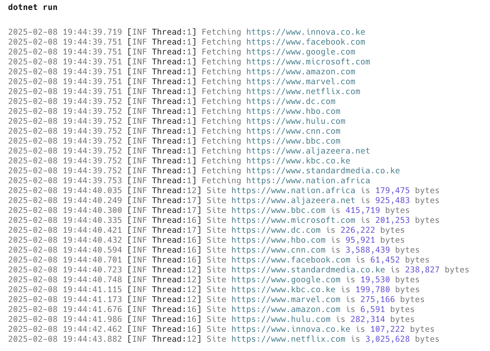

Yesterday, we looked at how to [parallelize work using `Parallel.ForEach` and `Task.WhenAll`]()

Today, we will examine a scenario where you have **several tasks that perform** some work, and you would like the **results processed as soon as they are available**.

For this, .NET 9 has added a construct to support such scenarios: [Task.ForEach](https://learn.microsoft.com/en-us/dotnet/api/system.threading.tasks.task.wheneach?view=net-9.0)

For our example, we will address the problem of **establishing the size (in bytes) of the home pages of various websites**.

The algorithm is as follows:

1. Send a [HEAD](https://developer.mozilla.org/en-US/docs/Web/HTTP/Methods/HEAD) request to the site
2. Read the response and check if there is a [Content-Length](https://developer.mozilla.org/en-US/docs/Web/HTTP/Headers/Content-Length) header. Not all servers set this header.
3. If there is, return that
4. If there isn't, **fetch the actual page** as a string
5. **Determine the size** of the string and return that.

```c#
using System.Text;
using Serilog;

Log.Logger = new LoggerConfiguration()
    .Enrich.WithThreadId()
    .WriteTo.Console(
        outputTemplate:
        "{Timestamp:yyyy-MM-dd HH:mm:ss.fff} [{Level:u3} Thread:{ThreadId}] {Message:lj}{NewLine}{Exception}")
    .CreateLogger();

const string linkText = """
                        https://www.innova.co.ke
                        https://www.facebook.com
                        https://www.google.com
                        https://www.microsoft.com
                        https://www.amazon.com
                        https://www.marvel.com
                        https://www.netflix.com
                        https://www.dc.com
                        https://www.hbo.com
                        https://www.hulu.com
                        https://www.cnn.com
                        https://www.bbc.com
                        https://www.aljazeera.net
                        https://www.kbc.co.ke
                        https://www.standardmedia.co.ke
                        https://www.nation.africa
                        """;

// Split the text into an array if strings
var links = linkText.Split(Environment.NewLine);

// Create a new HttpClient
var client = new HttpClient();
// Set the user agent (some servers reject requests without one!)
client.DefaultRequestHeaders.Add("User-Agent",
    "Mozilla/5.0 (platform; rv:gecko-version) Gecko/gecko-trail Firefox/firefox-version");

// Create a list of tasks
List<Task<(long Bytes, string URL)>> tasks = [];
foreach (var link in links)
    tasks.Add(FetchLink(link));

// Execute the work
await foreach (var task in Task.WhenEach(tasks))
    try
    {
        var result = await task;
        Log.Information("Site {Site} is {Size:#,0} bytes", result.URL, result.Bytes);
    }
    catch (Exception ex)
    {
        Log.Error(ex, "Error occured while fetching site {Site}", task.Result.URL);
    }

return;

// Local function to fetch links
async Task<(long Bytes, string URL)> FetchLink(string link)
{
    // Log request
    Log.Information("Fetching {Link}", link);
    // Send HEAD request to home oage
    var result = await client.SendAsync(new HttpRequestMessage(HttpMethod.Head, new Uri(link)));
    // Check if the header is present
    if (result.Content.Headers.ContentLength.HasValue)
        return (result.Content.Headers.ContentLength.Value, link);
    // If we are here, fetch the size manually
    var rawResult = await client.GetStringAsync(link);
    // Measure the size 
    return (Encoding.UTF8.GetByteCount(rawResult), link);
}
```

The results are as follows:



`Task.ForEach` works by creating an [IAsyncEnumerable](https://learn.microsoft.com/en-us/dotnet/api/system.collections.generic.iasyncenumerable-1?view=net-9.0) that will yield the supplied tasks as those tasks completed.

### TLDR

**`Task.WhenEach` allows for asynchronous processing of multiple tasks, returning results per task immediately they are available for processing.**

The code is in my [GitHub](https://github.com/conradakunga/BlogCode/tree/master/2025-02-08%20-%20WhenEach).

Happy hacking!
