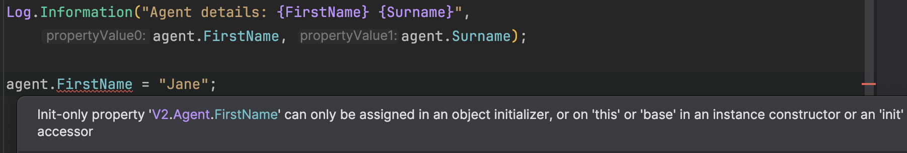

Often on this blog I have mentioned **immutable types**, and my examples have tended to be the same.

Take the following type:

```c#
public sealed record Agent
{
    public string FirstName { get; set; } = null!;
    public string Surname { get; set; } = null!;
}
```

We then write a simple program as follows:

```c#
using Serilog;

Console.WriteLine("");
Log.Logger = new LoggerConfiguration()
    .WriteTo.Console()
    .CreateLogger();

var agent = new Agent { FirstName = "James", Surname = "Bond" };

Log.Information("Agent details: {FirstName} {Surname}", agent.FirstName, agent.Surname);
```

This will print the following:

```plaintext
[02:13:10 INF] Agent details: James Bond
```

I can do the following with the agent:

```c#
Log.Information("Agent details: {FirstName} {Surname}", agent.FirstName, agent.Surname);

agent.FirstName = "Jane";

Log.Information("Agent details: {FirstName} {Surname}", agent.FirstName, agent.Surname);
```

This now prints the following:

```plaintext
[02:16:00 INF] Agent details: Jane Bond
```

You can see here the name has changed from *James* to *Jane*.

The question then arises: is this a valid thing to do? When would an `Agent` first name change? This naturally depends on the nature of the domain of the problem that you are trying to solve.

You might want to signal to the compiler that you **do not intend this to happen**.

This is done using the [init](https://learn.microsoft.com/en-us/dotnet/csharp/language-reference/keywords/init) keyword for the property definition.

```c#
public sealed record Agent
{
  public required string FirstName { get; init; }
  public required string Surname { get; init; }
}
```

If we try to modify the `FirstName` after creation we get the following compiler errorr:



You can also enforce immutability without using the `init` property definition, using a [constructor](https://learn.microsoft.com/en-us/dotnet/csharp/programming-guide/classes-and-structs/constructors) and **read-only properties - properties with a getter, but no setter**. 

```c#
public sealed record Agent
{
  public Agent(string firstName, string surname)
  {
    FirstName = firstName;
    Surname = surname;
  }

  public string FirstName { get; }
  public string Surname { get; }
}
```

What are the benefits of immutable types?

1. **Predictability**, and this easy debugging. If you know an object is immutable, that means its values cannot change once they are set. This makes it very easy to reason about program state.
2. **Impossible to make inadvertent changes**.
3. **Thread-safety**. Given there is no way to change the state, immutable objects are automatically thread-safe without requiring [locks](https://learn.microsoft.com/en-us/dotnet/api/system.threading.lock?view=net-9.0), [monitors](https://learn.microsoft.com/en-us/dotnet/api/system.threading.monitor?view=net-9.0) and other concurrent constructs.
4. **Cacheable**. As their state cannot change, caching is simpler to implement.

Immutable types are heavily used, and are in fact the default implementation in many functional programming languages like [F#](https://fsharp.org/), [Haskell](https://www.haskell.org/), [Clojure](https://clojure.org/about/functional_programming) & [OCAML](https://ocaml.org/). They also lend themselves very well to solviing some common problems such as [data transfer objects](https://en.wikipedia.org/wiki/Data_transfer_object).

However, there are cases where, inasmuch as the type is immutable, you need to **represent a change of state**. How would this be achieved?

You **create a totally new object with the new state**.

```c#
var vesperLynd = new V2.Agent { FirstName = "Vesper", Surname = "Lynd" };
Log.Information("Agent details: {FirstName} {Surname}", vesperLynd.FirstName, vesperLynd.Surname);
// Verpser got married
vesperLynd = new V2.Agent { FirstName = vesperLynd.FirstName, Surname = "Bond" };
Log.Information("Agent details: {FirstName} {Surname}", vesperLynd.FirstName, vesperLynd.Surname);
```

This prints the following:

```plaintext
[02:41:46 INF] Agent details: Vesper Lynd
[02:41:46 INF] Agent details: Vesper Bond
```

This operation is supported natively by the C# record, using the with keyword, where you specify the **changes** to the type. The other values are **copied** over to the new type.

```c#
vesperLynd = vesperLynd with { Surname = "Bond II" };
Log.Information("Agent details: {FirstName} {Surname}", vesperLynd.FirstName, vesperLynd.Surname);
```

This prints the following:

```plaintext
[02:44:37 INF] Agent details: Vesper Bond II
```

### TLDR

**Immutable types are a powerful aid to writing predictable, debuggable & maintainable programs**

The code is in my [GitHub](https://github.com/conradakunga/BlogCode/tree/master/2025-02-09%20-%20Immutability).

Happy hacking!
