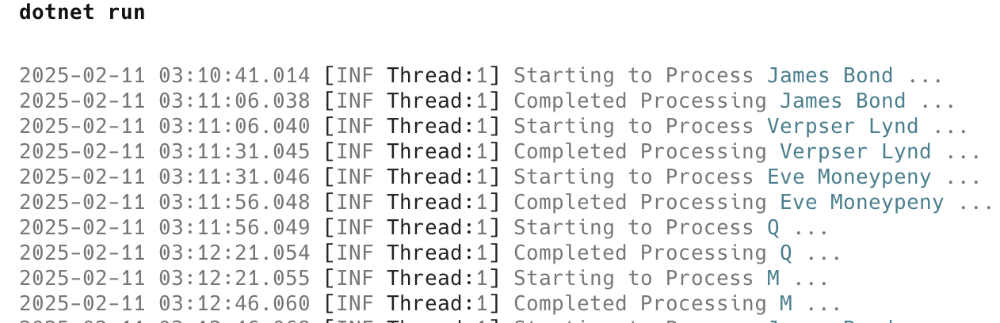
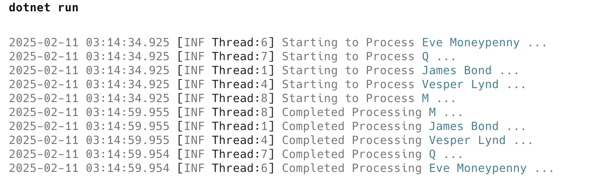

In the post [Parallelizing Work With C# & .NET]() we discussed using [Parallel.ForEach](https://learn.microsoft.com/en-us/dotnet/api/system.threading.tasks.parallel.foreach?view=net-9.0) to process [Tasks](https://learn.microsoft.com/en-us/dotnet/api/system.threading.tasks.task?view=net-9.0) **in parallel** and consume their **results**.

Occasionally, the problem is that you have to process several tasks, **neither of which returns results**. One opportunity for improvement is **running these in parallel**.

This is an opportunity to use [Parallel.Invoke](https://learn.microsoft.com/en-us/dotnet/api/system.threading.tasks.parallel.invoke?view=net-9.0).

Let us take for example the following example, a task that processes **spies** given their **names**:

```c#
void ProcessSpy(string name)
{
    Log.Information("Starting to Process {Name} ...", name);
    Thread.Sleep(TimeSpan.FromSeconds(25));
    Log.Information("Completed Processing {Name} ...", name);
}
```

Our initial program can look like this:

```c#
Log.Logger = new LoggerConfiguration()
    .Enrich.WithThreadId()
    .WriteTo.Console(
        outputTemplate:
        "{Timestamp:yyyy-MM-dd HH:mm:ss.fff} [{Level:u3} Thread:{ThreadId}] {Message:lj}{NewLine}{Exception}")
    .CreateLogger();

// Process James Bond
ProcessSpy("James Bond");
// Process Vesper Lynd
ProcessSpy("Verpser Lynd");
// Process Eve Moneypeny
ProcessSpy("Eve Moneypeny");
// Process Q
ProcessSpy("Q");
// Process M
ProcessSpy("M");
```

Running this program will produce the following:



We can see here that this program has taken over **three minutes** to run.

We can improve this to run in parallel like so:

```c#
Parallel.Invoke(
    () => ProcessSpy("James Bond"),
    () => ProcessSpy("Vesper Lynd"),
    () => ProcessSpy("Eve Moneypenny"),
    () => ProcessSpy("Q"),
    () => ProcessSpy("M")
);
```

This will return the following:



We can see here that the program now takes **30 seconds**, because all the tasks are run in parallel.

### TLDR

**`Parallel.Invoke` allows tasks that do not return anything ([Actions](https://learn.microsoft.com/en-us/dotnet/api/system.action-1?view=net-9.0)) to be run in parallel.**

The code is in my GitHub.

Happy hacking!
