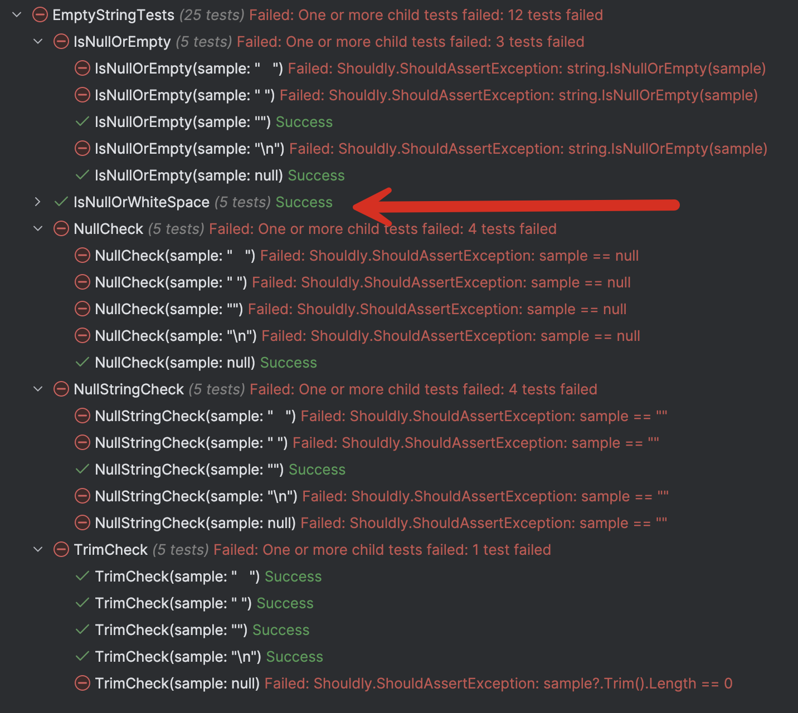

When dealing with string data, you will almost certainly encounter a situation where you must determine if your string has a value.

Having a value means it is NOT one of the following:

1. `null`
2. Empty String: [string.Empty](https://learn.microsoft.com/en-us/dotnet/api/system.string.empty?view=net-9.0) or `""`
3. Whitespace (tab, space, newlines, etc)

You would be surprised how these innocuous concepts can land you in trouble with unintentional bugs.

Let us start by creating a [xUnit](https://xunit.net/) test project.

```bash
dotnet new xunit -o EmptyStringTests
```

We then add [Shouldly](https://docs.shouldly.org/) to help with our assertions now that [FluentAssertions has a ridiculous license]().

```bash
dotnet add package Shouldly
```

Next, we write a small method to supply our test data cases. This will save us from **copying and pasting** the test cases repeatedly.

```c#
public static IEnumerable<object[]> SampleStrings()
{
  yield return [null]; // a null
  yield return [""]; // a null string
  yield return [" "]; // a space
  yield return ["   "]; // a tab
  yield return [Environment.NewLine]; // a newline
}
```

Next, we will create tests for several methodologies of testing for the absence of data:

1. Comparing against `null`
2. Comparing against `string.Empty`
3. Using the method [string.IsNullOrEmpty](https://learn.microsoft.com/en-us/dotnet/api/system.string.isnullorempty?view=net-9.0)
4. Using the method [IsNullOrWhiteSpace](https://learn.microsoft.com/en-us/dotnet/api/system.string.isnullorwhitespace?view=net-9.0)
5. [Trim](https://learn.microsoft.com/en-us/dotnet/api/system.string.trim?view=net-9.0) the `string` and checking its **length** is **zero**

The code for the tests is as follows:

```c#
[Theory]
[MemberData(nameof(SampleStrings))]
public void NullCheck(string sample)
{
    (sample == null).ShouldBe(true);
}


[Theory]
[MemberData(nameof(SampleStrings))]
public void NullStringCheck(string sample)
{
    (sample == "").ShouldBe(true);
}

[Theory]
[MemberData(nameof(SampleStrings))]
public void IsNullOrEmpty(string sample)
{
    string.IsNullOrEmpty(sample).ShouldBe(true);
}

[Theory]
[MemberData(nameof(SampleStrings))]
public void IsNullOrWhiteSpace(string sample)
{
    string.IsNullOrWhiteSpace(sample).ShouldBe(true);
}

[Theory]
[MemberData(nameof(SampleStrings))]
public void TrimCheck(string sample)
{
    (sample?.Trim().Length == 0).ShouldBe(true);
}
```

If we run our unit tests, the results are surprising.



Only one technique - using the method `string.IsNullOrWhiteSpace` passes all the tests.

### TLDR

Use the method `string.IsNullOrWhiteSpace` to reliably check if a string has data.

The code is in my GitHub.

Happy hacking!
