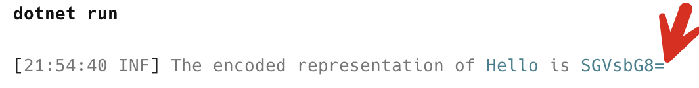
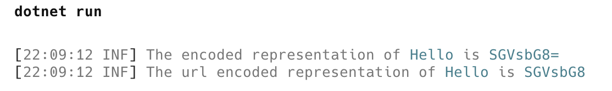

You would be surprised how much computing is powered by plain old text, particularly [ASCII](https://en.wikipedia.org/wiki/ASCII). Take, for example, the humble [email](https://datatracker.ietf.org/doc/html/rfc2822).

"Even email with images and attachments?" you might ask?

Yes.

Any binary data is encoded into text, using a protocol called [Base64](https://en.wikipedia.org/wiki/Base64).

`Base64` is named after the fact that it uses a set of 64 **printable** characters to encode data.

1. Uppercase letters: `A`- `Z` (26)
2. Lowercase letters: `a`- `z` (26)
3. Digits: `0`- `9` (10)
4. Symbols: `+` `/` (2)

`Base64` also has padding,  `=`. This is used to make the encoded output a **multiple of 4 characters**. 

This is natively supported in .NET

```c#
using Serilog;
using System.Text;

Log.Logger = new LoggerConfiguration()
    .WriteTo.Console()
    .CreateLogger();

// First get the text into a byte array
var textToEncode = "Hello";
// Encode the text
var rawBytes = Encoding.UTF8.GetBytes(textToEncode);
// Print to console
Log.Information("The encoded representation of {Original} is {Current}", textToEncode,
    Convert.ToBase64String(rawBytes));
```

This program will print the following:



`Base64` conversion is handled using the [Convert.ToBase64String](https://learn.microsoft.com/en-us/dotnet/api/system.convert.tobase64string?view=net-9.0) method.

Note the **padding** used to make the final string 8 characters.

You can also leverage the fact that the compiler can do **UTF8 encoding for you** as follows:

```c#
// Get a ReadOnlySpan<byte> of the text
var rawBytes = "Hello"u8;
// Print to console
Log.Information("The encoded representation of {Original} is {Current}", "Hello",
    Convert.ToBase64String(rawBytes));
```

This is useful for representing binary data under several scenarios:

1. **Email**
2. **JSON** & **XML**
3. Encoding in **CSS** & **HTML**

Occasionally, you need to pass encoded data using a URL. This presents a number of problems:

- `/` means something in a URL
- `+` means something in a URL
- `=` means something in a URL

This means you will have to do some extra work to remove them for a URL.

Luckily there exists a method that does this heavy lifting for you - [Base64Url.EncodeToString](https://learn.microsoft.com/en-us/dotnet/api/system.buffers.text.base64url.encodetostring?view=net-9.0)

Using the example above:

```c#
// Print to console
Log.Information("The encoded representation of {Original} is {Current}", "Hello",
    Convert.ToBase64String(rawBytes));
Log.Information("The url encoded representation of {Original} is {Current}", "Hello",
    Base64Url.EncodeToString(rawBytes));
```

This will print the following:



Note **the padding has been omitted**.

### TLDR

**`Base64` encoding is a useful technique to represent binary data as printable text. However, care needs to be taken if you want to pass around `Base64` encoded data in a URL.**

The code is in my GitHub.

Happy hacking!
