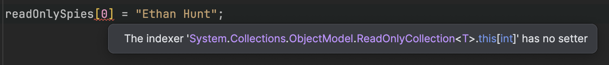

We have talked about immutable types in [previous posts]() when it comes to designing, creating and manipulating types.

The same problems presents itself when you have a **collection of types**.

Take the following example:

```c#
string[] spies = ["James Bond", "Jason Bourne", "Eve MoneyPenny", "Evelyn Salt"];

// Print to console
foreach (string spy in spies)
    Console.WriteLine(spy);

Console.WriteLine();

// Modify the first element
spies[0] = "Ethan Hunt";
foreach (string spy in spies)
    Console.WriteLine(spy);
```

Running this program will print the following:

```plaintext
James Bond
Jason Bourne
Eve MoneyPenny
Evelyn Salt

Ethan Hunt
Jason Bourne
Eve MoneyPenny
Evelyn Salt
```

Suppose we did not want the list of spies to be **modifiable**.

We can achieve it by calling the [AsReadOnly](https://learn.microsoft.com/en-us/dotnet/api/system.array.asreadonly?view=net-9.0) method of the array, which returns a generic read-only collection. The method `AsReadOnly` is available for most  of the collections you would typically use.

The code is as follows:

```c#
var readOnlySpies = spies.AsReadOnly();
foreach (string spy in readOnlySpies)
    Console.WriteLine(spy);
```

If we try to modify the first element we get a compiler error:



You might think this solves the problem, but **you would be wrong**.

Let us modify the original collection as follows:

```c#
// Modify the second element
spies[1] = "Roz Myers";
foreach (string spy in readOnlySpies)
    Console.WriteLine(spy);
```

If we run our program, the following results will be printed:

```plaintext
James Bond
Jason Bourne
Eve MoneyPenny
Evelyn Salt

James Bond
Roz Myers
Eve MoneyPenny
Evelyn Salt
```

We can see here that **if we change the original collection, the read-only collection returned by `AsReadOnly` updates accordingly**, so this does not solve our problem.

For this we can turn to the [ToFrozenSet](https://learn.microsoft.com/en-us/dotnet/api/system.collections.frozen.frozenset.tofrozenset?view=net-9.0) method.

The code looks like this:

```c#
var frozenSpies = spies.ToFrozenSet();
foreach (string spy in frozenSpies)
    Console.WriteLine(spy);

spies[1] = "Jason Bourne";
foreach (string spy in frozenSpies)
    Console.WriteLine(spy);
```

This prints the following:

```plaintext
James Bond
Jason Bourne
Eve MoneyPenny
Evelyn Salt

James Bond
Jason Bourne
Eve MoneyPenny
Evelyn Salt
```

We can see here that despite **manipulating the original collection**, the **frozen one remains unchanged**.

Of interest is that this method returns a **set**, which means there will be **no duplicates**.

### TLDR

**`FrozenCollections` solves a common problem when your program has some sort of static master data that will not change during the lifetime of the program execution and you expect to frequently access it.**

The code is in my GitHub.

Happy hacking!
