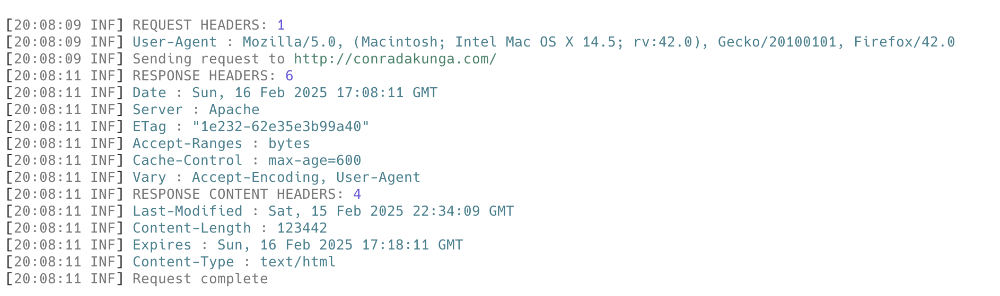
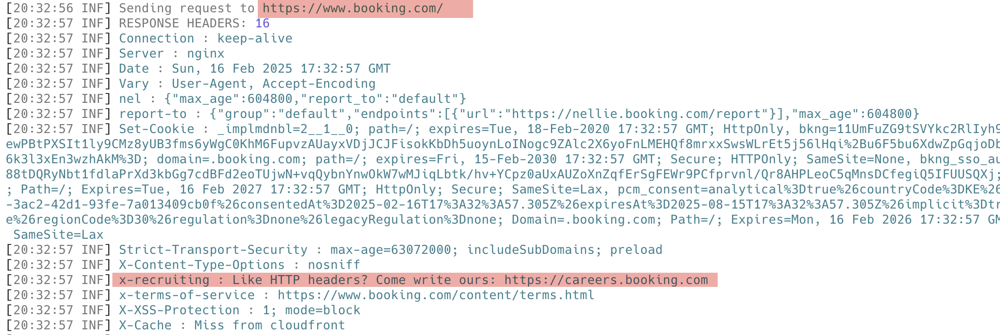
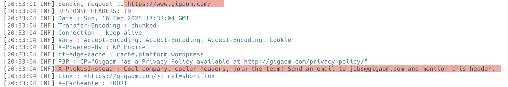
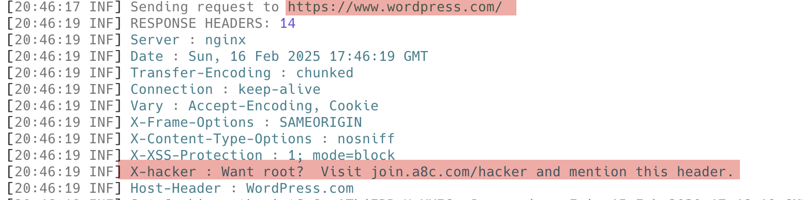

It is very straightforward to send a [HTTP](https://developer.mozilla.org/en-US/docs/Web/HTTP) request in C#. You do it like this:

```c#
// Setup our httpClient
var client = new HttpClient();
// Set the user agent because some servers reject requests without one
client.DefaultRequestHeaders.Add("User-Agent", "Mozilla/5.0 (Macintosh; Intel Mac OS X x.y; rv:42.0) Gecko/20100101 Firefox/42.0");
// Make a GET request
var response = await client.GetAsync("http://conradakunga.com");
// Retrieve the content
var result = await response.Content.ReadAsStringAsync();
// Print to console
Console.WriteLine(result);
```

Now, suppose you wanted to view the **headers** returned in your responses? This is very useful when **troubleshooting** and **debugging**.

You can achieve this using a [DelegatingHandler](https://learn.microsoft.com/en-us/dotnet/api/system.net.http.delegatinghandler?view=net-9.0). You can pass this class to your [HttpClient](https://learn.microsoft.com/en-us/dotnet/api/system.net.http.httpclient?view=net-9.0), telling it to delegate its work. It is within this class that you do the heavy lifting.

The class looks like this:

```c#
public sealed class ViewHeadersDelegatingHandler : DelegatingHandler
{
    public ViewHeadersDelegatingHandler() : base(new HttpClientHandler())
    {
    }

    protected override async Task<HttpResponseMessage> SendAsync(HttpRequestMessage request,
        CancellationToken cancellationToken)
    {
        // Log request header summary
        Log.Information("REQUEST HEADERS: {Count}", request.Headers.Count());
        foreach (var header in request.Headers)
        {
            // Log each header
            Log.Information("{Header} : {Value}", header.Key, string.Join(", ", header.Value));
        }

        // Check if the request contents have headers
        if (request.Content?.Headers != null)
        {
            // Log request content header summary
            Log.Information("REQUEST CONTENT HEADERS: {Count}", request.Content.Headers.Count());
            foreach (var header in request.Content.Headers)
            {
                // Log each header
                Log.Information("{Header} : {Value}", header.Key, string.Join(", ", header.Value));
            }
        }

        Log.Information("Sending request to {URL}", request.RequestUri);

        // Send the request and get the response
        HttpResponseMessage response = await base.SendAsync(request, cancellationToken);

        // Log response headers summary
        Log.Information("RESPONSE HEADERS: {Count}", response.Headers.Count());
        foreach (var header in response.Headers)
        {
            // Log each header
            Log.Information("{Header} : {Value}", header.Key, string.Join(", ", header.Value));
        }

        // Check if response content has headers. It is unlikely
        // for the content to be null, but check anyway
        if (response.Content?.Headers != null)
        {
            Log.Information("RESPONSE CONTENT HEADERS: {Count}", response.Content.Headers.Count());
            foreach (var header in response.Content.Headers)
            {
                // Log each header
                Log.Information("{Header} : {Value}", header.Key, string.Join(", ", header.Value));
            }
        }

        Log.Information("Request complete");

        return response;
    }
```

In this class I am using [Serilog](https://www.nuget.org/packages/serilog) to output log messages.

You can then use this class in a calling program, like this:

```c#
Log.Logger = new LoggerConfiguration()
    .WriteTo.Console()
    .CreateLogger();

var client = new HttpClient(new ViewHeadersDelegatingHandler());
// Set the user agent because some servers reject requests without one
client.DefaultRequestHeaders.Add("User-Agent",
    "Mozilla/5.0 (Macintosh; Intel Mac OS X 14.5; rv:42.0) Gecko/20100101 Firefox/42.0");
// Make a GET request
var response = await client.GetAsync("http://conradakunga.com");
// Retrieve the content
var result = await response.Content.ReadAsStringAsync();
```

If I run this code, I get the following results:

```plaintext
[20:08:09 INF] REQUEST HEADERS: 1
[20:08:09 INF] User-Agent : Mozilla/5.0, (Macintosh; Intel Mac OS X 14.5; rv:42.0), Gecko/20100101, Firefox/42.0
[20:08:09 INF] Sending request to http://conradakunga.com/
[20:08:11 INF] RESPONSE HEADERS: 6
[20:08:11 INF] Date : Sun, 16 Feb 2025 17:08:11 GMT
[20:08:11 INF] Server : Apache
[20:08:11 INF] ETag : "1e232-62e35e3b99a40"
[20:08:11 INF] Accept-Ranges : bytes
[20:08:11 INF] Cache-Control : max-age=600
[20:08:11 INF] Vary : Accept-Encoding, User-Agent
[20:08:11 INF] RESPONSE CONTENT HEADERS: 4
[20:08:11 INF] Last-Modified : Sat, 15 Feb 2025 22:34:09 GMT
[20:08:11 INF] Content-Length : 123442
[20:08:11 INF] Expires : Sun, 16 Feb 2025 17:18:11 GMT
[20:08:11 INF] Content-Type : text/html
[20:08:11 INF] Request complete
```

Which looks like this:



We can update the program to fetch a bunch of headers from different sites, which have some interesting headers.

```c#
string[] urls =
[
    "https://www.booking.com",
    "https://www.conradakunga.com",
    "https://www.gigaom.com",
    "https://www.newsblur.com",
    "https://www.wordpress.com",
];
// Make a GET request
foreach (var url in urls)
{
    _ = await client.GetAsync(url);
}
```

[Booking.com](https://www.booking.com) has this:



[Gigaom](https://www.gigaom.com) has this:



[NewsBlur](https://www.newsblur.com) has this:


[WordPress](https://www.wordpress.com) has this:



### TLDR

**`DelegatingHandlers` allow you to access data from any of the points of a HTTP request, such as the complete set of headers and content headers.**

The code is in my GitHub.

Happy hacking!
