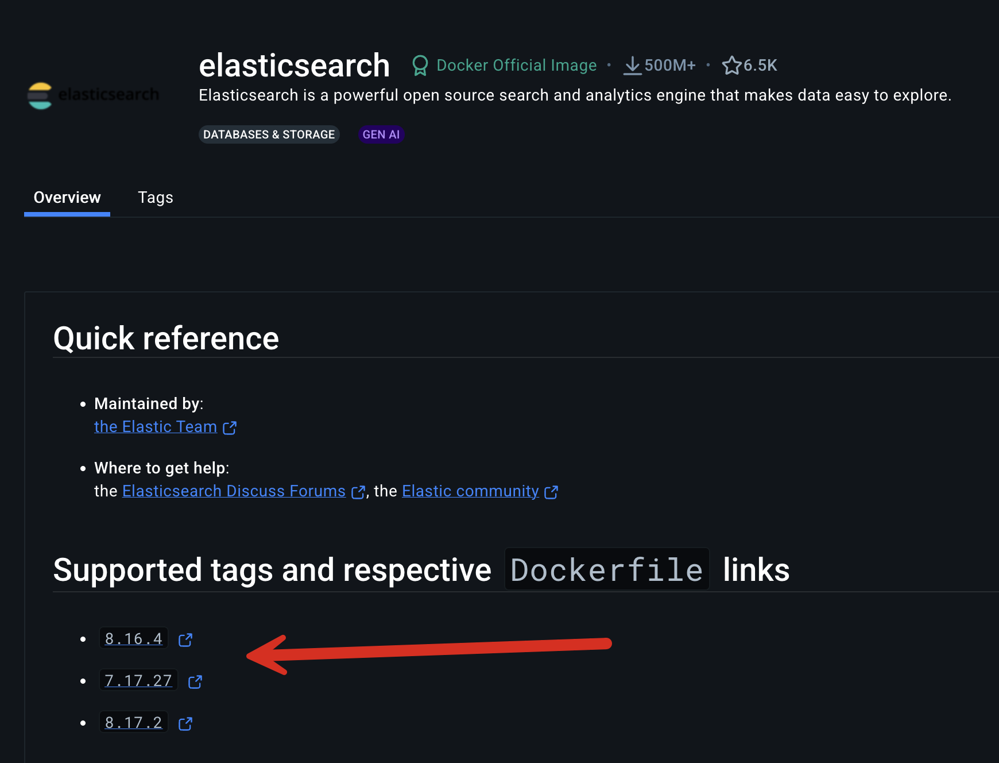
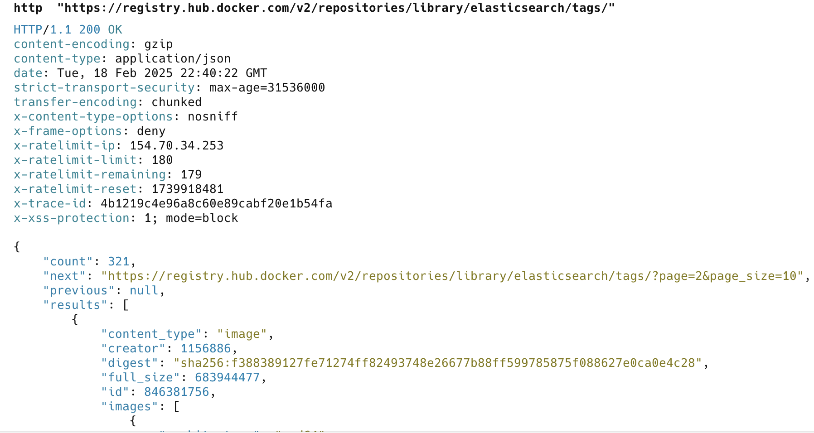
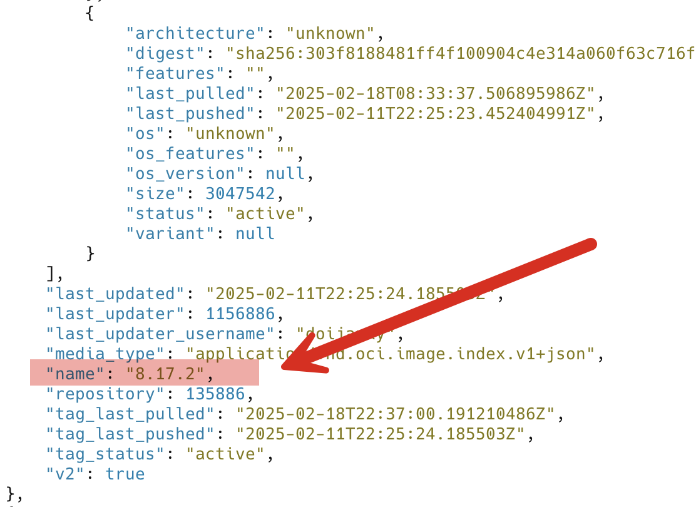

For logging, I generally use [Elasticsearch](https://www.elastic.co/elasticsearch) to *store* the logs themselves, and [Kibana](https://www.elastic.co/kibana) for **visualizing** said logs.

Naturally, I use them via [Docker](https://www.docker.com/).

Unlike most Docker images, **Elasticsearch** and **Kibana** do not have a rolling `latest` tag. This means you must request a **specific image** to run a container. The supported images are listed on the page.



The problem is knowing **when there are new builds** of the images.

One way is to periodically check the [Docker Hub page](https://hub.docker.com/_/elasticsearch).

Another is to use the command console to check for yourself.

You can make use of the following endpoint for this purpose:

```bash
http "https://registry.hub.docker.com/v2/repositories/library/<image-name>/tags/" 
```

So, for this case we do the following using [Httpie](https://httpie.io/cli)

```bash
http  "https://registry.hub.docker.com/v2/repositories/library/elasticsearch/tags/"
```

This returns a large JSON object



We need only to fetch the interesting bits:



We can extract this tag that is in the `name` property from the `results` array using the [jq](https://jqlang.org/) tool, like this:

```bash
http "https://registry.hub.docker.com/v2/repositories/library/elasticsearch/tags/" | jq -r '.results[].name'
```

This returns the following:

```plaintext
8.17.2
8.16.4
8.17.1
8.16.3
7.17.27
8.17.0
8.16.2
7.17.26
8.15.5
8.16.1
```

Much less noisy, but needs to be sorted.

We can pipe this to the [sort](https://en.wikipedia.org/wiki/Sort_(Unix)) command and specify that we want a ***reverse*** **sort**. Like so:

```bash
http "https://registry.hub.docker.com/v2/repositories/library/elasticsearch/tags/" | jq -r '.results[].name' | sort -r
```

This returns the following:

```plaintext
8.17.2
8.17.1
8.17.0
8.16.4
8.16.3
8.16.2
8.16.1
8.15.5
7.17.27
7.17.26
```

Is there a simpler way? **Probably**. I'd be interested in hearing from you. My email is on the [about page](/blog/about).

Happy hacking!
