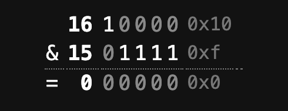

Recently, I discovered several helper integer methods that I had never noticed before, making code much easier to read and understand.

### Even Number Detection

Typically, you would do it like this:

```c#
var input = 7;

if (input % 2 == 0)
    Console.WriteLine($"{input} is even");
else
    Console.WriteLine($"{input} is odd");
```

Here, we use [modulus division](https://en.wikipedia.org/wiki/Modulo) to detect whether there is a **remainder** after dividing by 2. If there **isn't** - the number is **odd**.

This can be rewritten as follows using the [int.IsEvenInteger](https://learn.microsoft.com/en-us/dotnet/api/system.int32.iseveninteger?view=net-9.0) method.

```c#
if (int.IsEvenInteger(input))
    Console.WriteLine($"{input} is even");
else
    Console.WriteLine($"{input} is odd");
```

Much easier to scan through and understand, even for a junior developer or a developer for whom C# is not their native language.

### Odd Number Detection

This is a minor alteration of the above.

Traditionally you would do it this way, a negation of the **even** logic:

```c#
if (input % 2 != 0)
    Console.WriteLine($"{input} is odd");
else
    Console.WriteLine($"{input} is even");
```

You can rewrite this to use the [int.IsOddInteger](https://learn.microsoft.com/en-us/dotnet/api/system.int32.isoddinteger?view=net-9.0) method

```c#
if (int.IsOddInteger(input))
    Console.WriteLine($"{input} is odd");
else
    Console.WriteLine($"{input} is even");
```

### Positive Number Detection

Similarly, to check if a number is positive we would typically do it this way:

```c#
if (input > 0)
    Console.WriteLine($"{input} is positive");
else
    Console.WriteLine($"{input} is negative");
```

You can rewrite this to use the [int.IsPositive](https://learn.microsoft.com/en-us/dotnet/api/system.int32.ispositive?view=net-9.0) method:

```c#
if (int.IsPositive(input))
    Console.WriteLine($"{input} is positive");
else
    Console.WriteLine($"{input} is negative");
```

### Negative Number Detection

This is, again, a slight tweak of the code for positive detection.

Typically we'd do it as follows:

```c#
if (input < 0)
    Console.WriteLine($"{input} is negative");
else
    Console.WriteLine($"{input} is positive");
```

We can rewrite this to use the [int.IsNegative](https://learn.microsoft.com/en-us/dotnet/api/system.int32.isnegative?view=net-9.0) method:

```c#
if (int.IsNegative(input))
    Console.WriteLine($"{input} is negative");
else
    Console.WriteLine($"{input} is positive");
```

### Power Of Two Detection

Detecting if a number is a power of two requires a bit more thought.

A simple a algorithm is as follows:

1. Get the log of the number  in **base 2**
2. If it is a **whole number**, it must be a power of two.

```c#
bool IsPowerOfTwo(int value)
{
    return Math.Log2(value) % 1 == 0;
}
```

There is a subtle bug here because zero will also return true, and **zero is not a power of 2**. We can fix that as follows:

```c#
bool IsPowerOfTwo(int value)
{
    return value > 0 && Math.Log2(value) % 1 == 0;
}
```

You can avoid writing your own method and use the int.Pow2 method like so:

```c#
Console.WriteLine(int.IsPow2(8));
```

Over and above saving you writing code, this method is **faster** than our algorithm above, as it uses [bitwise operations](https://en.wikipedia.org/wiki/Bitwise_operation) for this check.

The code for [int.Pow2](https://learn.microsoft.com/en-us/dotnet/api/system.int32.ispow2?view=net-9.0) is as follows:

```c#
[MethodImpl(MethodImplOptions.AggressiveInlining)]
public static bool IsPow2(int value) => (value & (value - 1)) == 0 && value > 0;
```

The logic here is as follows:

1. Take a number, and express it in **binary**
2. Subtract one from that number, and express it in **binary**
3. Perform a [bitwise AND](https://learn.microsoft.com/en-us/cpp/cpp/bitwise-and-operator-amp?view=msvc-170) for each **corresponding digit** of the two numbers

**For powers of two, this computation returns all zeros**.

Take `16` and 15:

```plaintext
	10000
	01111
```

If you do a bitwise AND of each corresponding digit, and the first number is a power of two, the result will be zero.



As a bonus, these methods are also available for `decimal` and `float` types.

The code is in my [GitHub](https://github.com/conradakunga/BlogCode/tree/master/2025-02-19%20-%20Integer%20Helpers).

Happy hacking!
