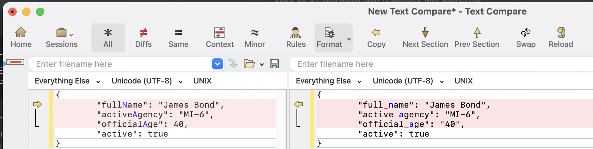

Writing an API with [ASP.NET](https://dotnet.microsoft.com/en-us/apps/aspnet) is a very trivial exercise.

Assuming we have this type:

```c#
public record Spy(string FullName, string ActiveAgency, byte OfficialAge, bool Active);
```

We can write an endpoint that returns a `Spy` like this:

```c#
app.MapGet("/", () =>
    {
        var spy = new Spy("James Bond", "MI-6", 40, true);
        return spy;
    }
);
```

This is short-hand for the following:

```c#
app.MapGet("/", () =>
    {
        var spy = new Spy("James Bond", "MI-6", 40, true);
        return Results.Ok(spy);
    }
);
```

Here, we explicitly indicate that we are returning the response with an [HTTP 200](https://developer.mozilla.org/en-US/docs/Web/HTTP/Status/200) response.

Both the above will return the following:

```json
{
  "fullName": "James Bond",
  "activeAgency": "MI-6",
  "officialAge": 40,
  "active": true
}
```

Suppose, for whatever reason, we want to customize this [JSON](https://www.json.org/json-en.html) response.

Let us say that the target consumer expects the `OfficialAge` to be `string` delimited. And that the target consumer, for some reason, expects the attributes to be lowercase [snake_cased](https://en.wikipedia.org/wiki/Snake_case), as people in the [Python](https://www.python.org) community are used to, as opposed to the default [camelCase](https://en.wikipedia.org/wiki/Camel_case).

This is trivial to achieve.

Rather than just returning the object or using [Results.OK](https://learn.microsoft.com/en-us/dotnet/api/microsoft.aspnetcore.http.results.ok?view=aspnetcore-9.0), we use the [Results.Json](https://learn.microsoft.com/en-us/dotnet/api/microsoft.aspnetcore.http.results.json?view=aspnetcore-9.0) method and pass a configured [JsonSerializerOptions](https://learn.microsoft.com/en-us/dotnet/api/system.text.json.jsonserializeroptions?view=net-9.0) object to it.

```c#
app.MapGet("/Formatted", () =>
    {
        var spy = new Spy("James Bond", "MI-6", 40, true);
        // Setup our options here
        var options = new JsonSerializerOptions
        {
            // Output numbers as strings
            NumberHandling = JsonNumberHandling.WriteAsString,
            // Use lower case, kebab case
            PropertyNamingPolicy = JsonNamingPolicy.SnakeCaseLower
        };
        return Results.Json(spy, options);
    }
);
```

This will return the following:

```json
{
  "full_name": "James Bond",
  "active_agency": "MI-6",
  "official_age": "40",
  "active": true
}
```

The difference is as follows:



If you have many endpoints, doing this for **every endpoint** can get **tedious**. Plus, it will be a nightmare to **maintain** if you have to change, as you need to remember to check **all the endpoints** and update your configuration.

You can configure your application to do this by default by configuring the [WebApplicationBuilder](https://learn.microsoft.com/en-us/dotnet/api/microsoft.aspnetcore.builder.webapplicationbuilder?view=aspnetcore-9.0):

```c#
var builder = WebApplication.CreateBuilder(args);
builder.Services.Configure<JsonOptions>(options =>
{
  
    options.SerializerOptions.NumberHandling = JsonNumberHandling.WriteAsString;
    options.SerializerOptions.PropertyNamingPolicy = JsonNamingPolicy.SnakeCaseLower;
});
```

Once this is done, all endpoints will use these settings.

You can, however, **override** them on a case-by-case basis.

Our final program looks like this:

```c#
using System.Text.Json;
using System.Text.Json.Serialization;
using Microsoft.AspNetCore.Http.Json;

var builder = WebApplication.CreateBuilder(args);
// Configure global json handling
builder.Services.Configure<JsonOptions>(options =>
{
    options.SerializerOptions.NumberHandling = JsonNumberHandling.WriteAsString;
    options.SerializerOptions.PropertyNamingPolicy = JsonNamingPolicy.SnakeCaseLower;
});
var app = builder.Build();

app.MapGet("/", () =>
    {
        var spy = new Spy("James Bond", "MI-6", 40, true);
        return Results.Ok(spy);
    }
);

app.MapGet("/Formatted", () =>
    {
        var spy = new Spy("James Bond", "MI-6", 40, true);
        // Override the global handling to use UPPER-CASE-KEBAB
        var options = new JsonSerializerOptions
        {
            // Output numbers as strings
            NumberHandling = JsonNumberHandling.Strict,
            // Use lower case, kebab case
            PropertyNamingPolicy = JsonNamingPolicy.KebabCaseUpper,
        };
        return Results.Json(spy, options);
    }
);

app.Run();
```

If we run the default path, `/`, we get the following response:

```json
{
  "full_name": "James Bond",
  "active_agency": "MI-6",
  "official_age": "40",
  "active": true
}
```

If we run the `/Formatted`, we get the following:

```json
{
  "FULL-NAME": "James Bond",
  "ACTIVE-AGENCY": "MI-6",
  "OFFICIAL-AGE": 40,
  "ACTIVE": true
}
```

### TLDR

**You can configure ASP.NET to control the output of JSON responses, either at the global level or at the endpoint level, using an appropriately configured `JsonSerializerOptions` object.**

The code is in my GitHub.

Happy hacking!
