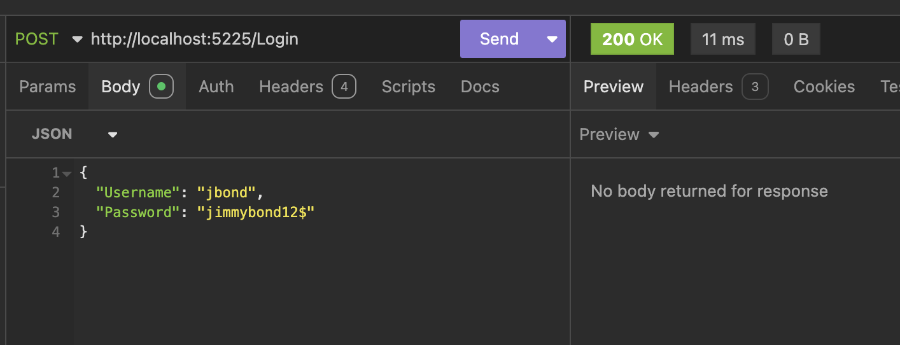
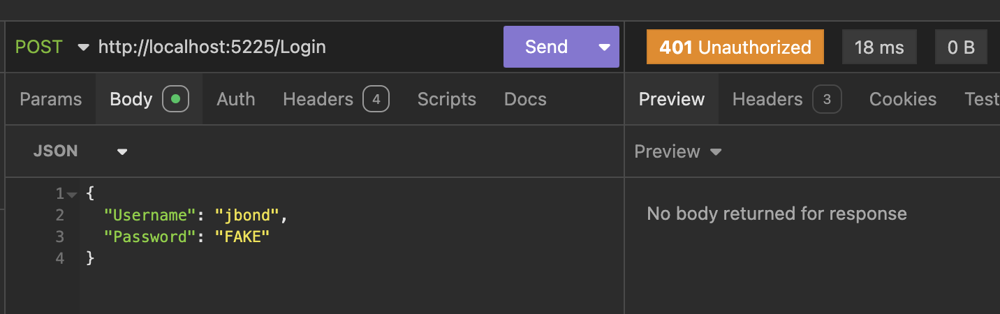
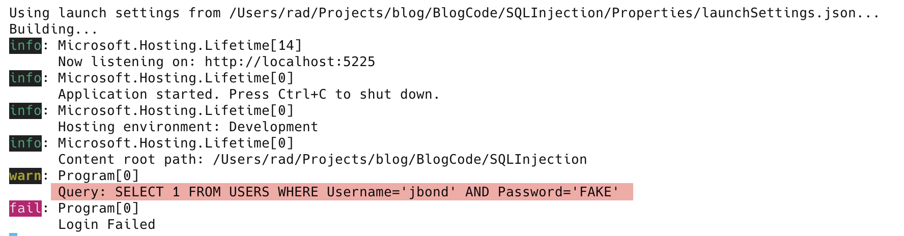
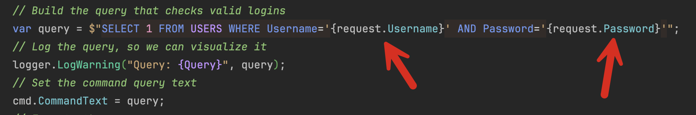
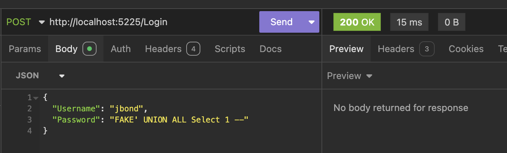
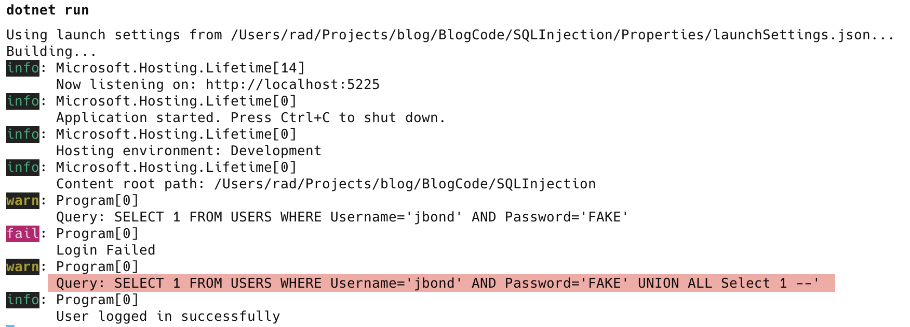
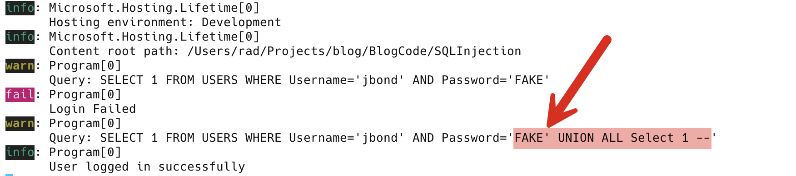

You must be living under a very big rock, indeed, if you have not heard of **SQL injection**.

But what is SQL injection?

This post will explain using a simple example.

Assume we have a very simple application that provides an admin login.

This login requires a **username** and a **password**, after which the user is **authenticated**.

The users are stored in a **table** that looks like this:

| Column Name  | Data Type    | Description   |
| ------------ | ------------ | ------------- |
| **UserID**   | Int          | Primary Key   |
| **UserName** | varchar(100) | User name     |
| **Password** | varchar(100) | User password |

In our example, we will model this using a [WebAPI](https://dotnet.microsoft.com/en-us/apps/aspnet) and [ADO.NET](https://learn.microsoft.com/en-us/dotnet/framework/data/adonet/ado-net-overview). This is to say, we are **NOT** using [Entity Framework](https://learn.microsoft.com/en-us/ef/).

We first create the project:

```bash
dotnet new console -o SQLInjection
```

Next, we add the package for [Sqlite](https://www.sqlite.org/) support, [Microsoft.Data.Sqlite](https://www.nuget.org/packages/Microsoft.Data.SQLite/). `Sqlite` is the database we will use for this example, but the principles will apply to any other database.

```c#
dotnet add package Microsoft.Data.Sqlite
```

**THIS IS NOT HOW TO DO IT IN A PROPER APPLICATION. THIS IS JUST A DEMO**

We will start by defining a simple type to store a login request.

```c#
public record LoginRequest(string Username, string Password);
```

Then, we will write a helper class with some methods to 

1. **initialize** our database schema (tables)
2. Insert demo **master data**

```c#
public class Initializer
{
    public const string ConnectionString = "data source=test.db";

    public static void EnsureDatabaseExists()
    {
        const string initializeDatabase = """
                                          CREATE TABLE IF NOT EXISTS USERS(UserID INTEGER PRIMARY KEY, Username VARCHAR(100), Password VARCHAR(100));

                                          INSERT INTO USERS (UserID, Username,Password) VALUES (1, 'jbond','jimmybond12$');
                                          """;

        const string checkForTable = "SELECT COUNT(1) FROM sqlite_master WHERE type='table' AND name='USERS'";
        // Create a connection object
        using (var cn = new SqliteConnection(ConnectionString))
        {
            // Open the connection
            cn.Open();
            var cmd = cn.CreateCommand();
            //
            // Check if table exists
            //

            // Set the command text to our query defined above
            cmd.CommandText = checkForTable;
            // Execute the query and obtain the returned value
            var returns = cmd.ExecuteScalar();
            if (Convert.ToInt32(returns) == 0)
            {
                // Table does not exist. Initialize
                // Set the command text to the query defined above
                // to generate the database
                cmd.CommandText = initializeDatabase;
                // Execute the query
                cmd.ExecuteNonQuery();
            }
        }
    }
}
```

Finally, we will wire everything together and write an API endpoint to process login requests

```c#
using Microsoft.Data.Sqlite;

var builder = WebApplication.CreateBuilder(args);

// Setup DI to inject a Sqlite connection
builder.Services.AddSingleton<SqliteConnection>(_ => new SqliteConnection(Initializer.ConnectionString));

var app = builder.Build();
// Ensure our database is created and seeded
Initializer.EnsureDatabaseExists();

app.MapPost("/Login", (SqliteConnection cn, ILogger<Program> logger, LoginRequest request) =>
{
    // Open a connection to the database from the injected connection
    cn.Open();
    // Create a command object from the connection
    var cmd = cn.CreateCommand();
    // Build the query that checks valid logins
    var query = $"SELECT 1 FROM USERS WHERE Username='{request.Username}' AND Password='{request.Password}'";
    // Log the query, so we can visualize it
    logger.LogWarning("Query: {Query}", query);
    // Set the command query text
    cmd.CommandText = query;
    // Execute the query
    var status = Convert.ToInt32(cmd.ExecuteScalar());
    // Check the returned number
    if (status == 1)
    {
        // We are now logged in
        logger.LogInformation("User logged in successfully");
        return Results.Ok();
    }

    logger.LogError("Login Failed");
    // Return a 401
    return Results.Unauthorized();
});

app.Run();
```

A couple of things to note here:

1. In our endpoint, we inject the [SqliteConnection](https://learn.microsoft.com/en-us/dotnet/api/microsoft.data.sqlite.sqliteconnection?view=msdata-sqlite-9.0.0), a `LoginRequest`, and an `ILogger`.
2. We build a query to check that there is a result returned for a matching **username** (***jbond***) and **password** (***jimmybond12$***)
3. If the username and password **match**, the user is **authenticated**
4. If they do not, the user is **unauthorized**. Return an [HTTP 401](https://developer.mozilla.org/en-US/docs/Web/HTTP/Status/401) response.

We can then go on to create and send two test responses using your favourite client.

My favourite is [Insomnia](https://insomnia.rest/).

Here we see a successful request in progress:



This is the equivalent in [curl](https://curl.se/)

```bash
curl --request POST \
  --url http://localhost:5225/Login \
  --header 'Content-Type: application/json' \
  --header 'User-Agent: insomnia/10.3.1' \
  --data '{
	"Username": "jbond",
	"Password": "jimmybond12$"
}'
```

Here, we see a failed request in progress.



This is the equivalent in `curl`

```bash
curl --request POST \
  --url http://localhost:5225/Login \
  --header 'Content-Type: application/json' \
  --header 'User-Agent: insomnia/10.3.1' \
  --data '{
	"Username": "jbond",
	"Password": "FAKE"
}'
```

If we look in the logs, we will see the **query** that got submitted to the database:



And it is here that the premise of SQL injection hinges.

Remember that the query is constructed at this point:



Given that the query is constructed using **user-generated input**, it is possible for an attacker to **craft input so that the database receives a different query from what was intended for execution**.

Instead of submitting ***FAKE***, an attacker can submit the following:

```plaintext
FAKE' UNION ALL Select 1 --
```

If we submit this request **with an invalid password, we are logged in**!



How?

The answer is in the submitted query:



```SQL
SELECT 1 FROM USERS WHERE Username='jbond' AND Password='FAKE' UNION ALL Select 1 --'
```

This is actually **TWO** queries:

```SQL
SELECT 1 FROM USERS WHERE Username='jbond' AND Password='FAKE' 
UNION ALL Select 1 --'
```

The first query will return no result as the condition is invalid.

The second query, however, returns a **single value**, 1, which the application is looking for as an indicator of a successful login.

Of interest is the second query has a section [commented out](https://www.sqlite.org/lang_comment.html): `--'`

This is because, remember, the **entirety of this** is what is meant to be the password:



Given the attacker has already provided a closing quote, the one that the application will provide will need to be commented out to ensure that the SQL submitted is valid.

**Thus, with carefully crafted input, an attacker has breached this application.**

At this point, you might ask what would happen if the application used a different technique to validate logins. Perhaps returning a **count**, **checking for existence**, or the many different ways to approach his problem. The attacker would probably not know which in advance.

That is a very valid observation.

Attackers have also addressed this. They build tools that send several carefully crafted payloads optimized for various scenarios with the probability that at least once would work. These attacks are usually **automated**, and **one will be tried after another until one works**, at which point the tool will **signal to the attacker** using logs or another such mechanism that a breach has been successful.

In the next post, we will look at h**ow to defend against this** on the .NET platform.

### TLDR

**SQL Injection is the ability for attackers to craft a payload in such a manner that insecure applications submit to the database engine a totally different query than was intended by the developers.**

The code is in my [GitHub](https://github.com/conradakunga/BlogCode/tree/master/2025-02-23%20-%20SQL%20Injection).

Happy hacking!
