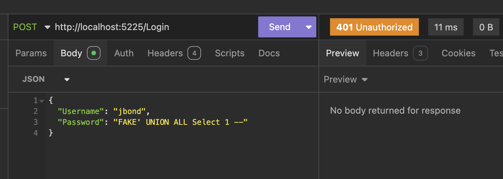
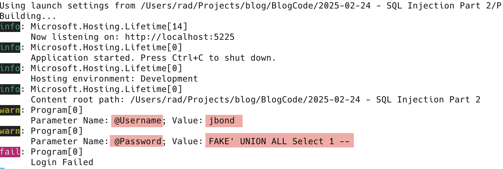

**This is Part 2 of a series on SQL injection.**

In our [last post](), we saw how SQL injection actually works and how a **carefully constructed payload can allow a hacker to gain access to a system**.

The fact that the attacker can run any query means they can also execute queries that do **more than grant them access** - they can **manipulate data** and even **modify and drop database objects**. And for sophisticated database engines that allow for **operating system access**, even more damage can be wrought. 

To protect from this, we approach constructing queries differently.

Instead of **concatenating strings** to build queries, we can make use of an [ADO.NET](https://learn.microsoft.com/en-us/dotnet/framework/data/adonet/) object - the [DBParameter](https://learn.microsoft.com/en-us/dotnet/api/system.data.common.dbparameter?view=net-9.0).

All [providers](https://learn.microsoft.com/en-us/dotnet/framework/data/adonet/data-providers) have implementations of this object. `Parameters` essentially allow you to directly set values for the provider to construct queries correctly. The implementation of this is that every [command](https://learn.microsoft.com/en-us/dotnet/api/microsoft.data.sqlite.sqlitecommand?view=msdata-sqlite-9.0.0) has a [Parameters](https://learn.microsoft.com/en-us/dotnet/api/microsoft.data.sqlite.sqlitecommand.parameters?view=msdata-sqlite-9.0.0) collection to which you can add parameters by specifying their **names** and their **values**.

Rather than build the query through string concatenation, you specify in the **command text** of the query the `parameters` that you will provide by **name**, prefixed with a `@` (or a `:`, or a `$` for [Sqlite](https://www.sqlite.org/)).

``` SQL
// Set the command query text
cmd.CommandText = "SELECT 1 FROM USERS WHERE Username=@Username AND Password=@Password";
// Add the parameters
cmd.Parameters.AddWithValue("@Username", request.Username);
cmd.Parameters.AddWithValue("@Password", request.Password);
```

If we now try to submit an attack payload, it fails.



This is because the entirety of the payload is **substituted** for the parameter **value**. In other words, the entirety of the password payload, `FAKE' UNION ALL Select 1 --` is considered as the password. This is why it fails because that is not a valid password.

Another benefit of using **parameters** is it avoids the problems you will get with string concatenation when the payload contains **characters that are considered special by the database engine**, such as **apostrophes**.

A name like ***Ng'ang'a*** will trip up the database engine if you build the query using string concatenation, as it will consider the `username` to have **ended** at the `Ng`, thus the rest is **invalid SQL**.

We can visualize how the parameters are populated like this:

```c#
// Set the command query text
cmd.CommandText = "SELECT 1 FROM USERS WHERE Username=@Username AND Password=@Password";
// Add the parameters
cmd.Parameters.AddWithValue("@Username", request.Username);
cmd.Parameters.AddWithValue("@Password", request.Password);
// Loop through the parameters and print the name and value
foreach (SqliteParameter param in cmd.Parameters)
{
    logger.LogWarning("Parameter Name: {Name}; Value: {Value}", param.ParameterName, param.Value);
}
```

If we re-run the API and view the logs, we will see the following:



Parameter also allow you to mitigate against another attack - excessively **large payloads**.

For example in our database we have specified that the size of the `Username` and `Password` columns is **100** characters. We can therefore **truncte** any incoming payloads to that length with this knowledge. You do that by setting the `Size` property as follows:

```c#
cmd.Parameters.AddWithValue("@Username", request.Username).Size = 100;
cmd.Parameters.AddWithValue("@Password", request.Password).Size = 100;
```

You can also **explicitly** create [SqliteParameter](https://learn.microsoft.com/en-us/dotnet/api/microsoft.data.sqlite.sqliteparameter?view=msdata-sqlite-9.0.0) objects and then add them to the `command` like this:

```c#
cmd.CommandText = "SELECT 1 FROM USERS WHERE Username=@Username AND Password=@Password";
//
// Add the parameters
//

// Username
var paramUsername = cmd.CreateParameter();
paramUsername.SqliteType = SqliteType.Text;
paramUsername.ParameterName = "@Username";
paramUsername.Size = 100;
paramUsername.Value = request.Username;
cmd.Parameters.Add(paramUsername);
// Password
cmd.Parameters.AddWithValue("@Password", request.Password).Size = 100;
```

### TLDR

**`Parameters` can be used to mitigate SQL injection, by setting the values directly so that the database engine will correctly interpret the query command text.**

The code is in my GitHub.

Happy hacking!
