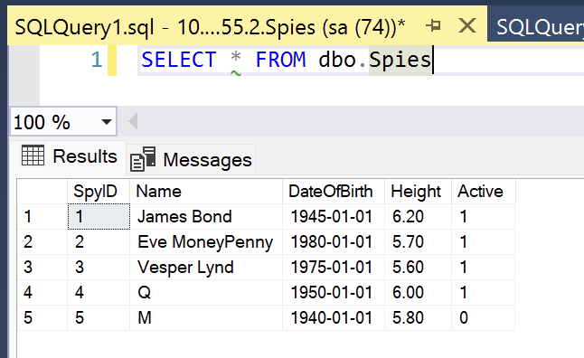
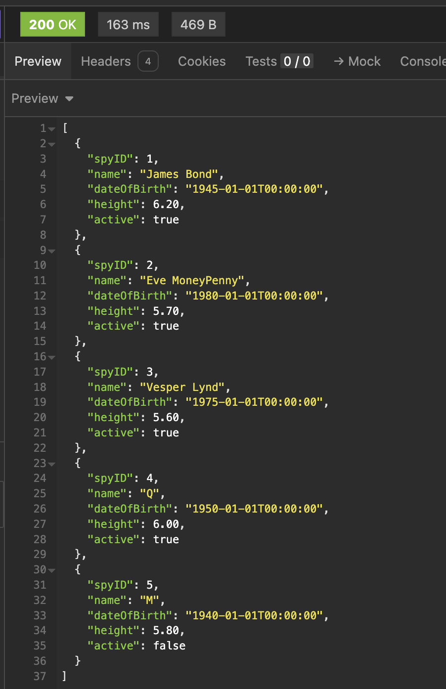
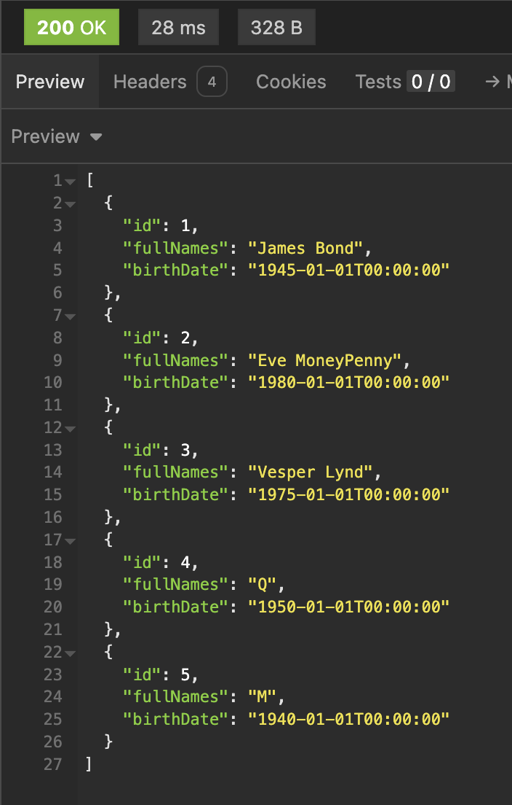
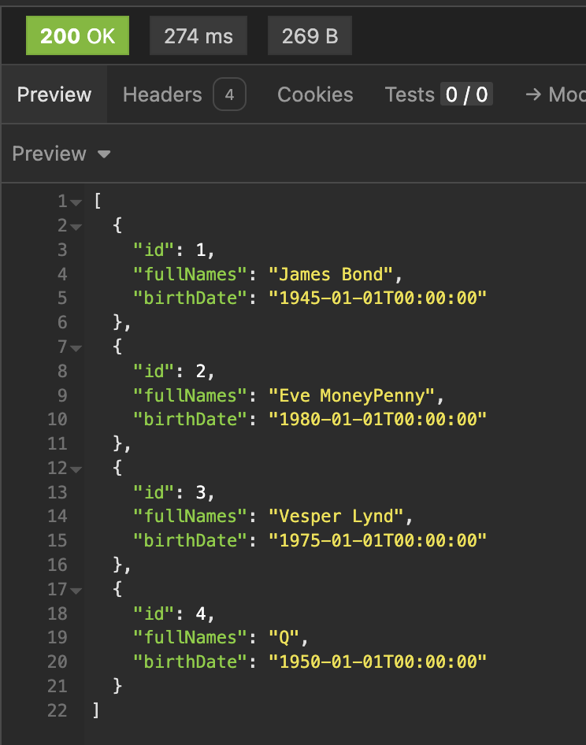
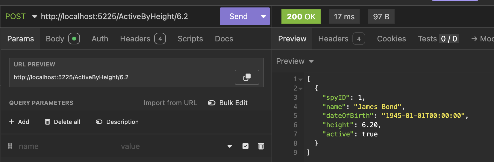
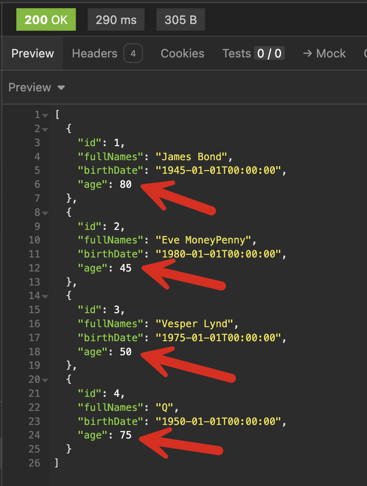
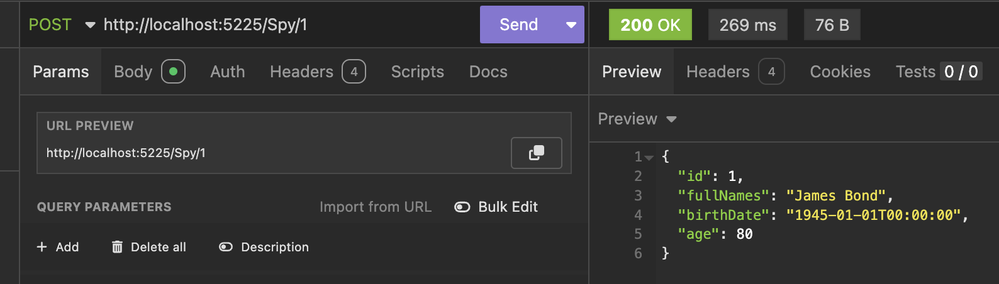
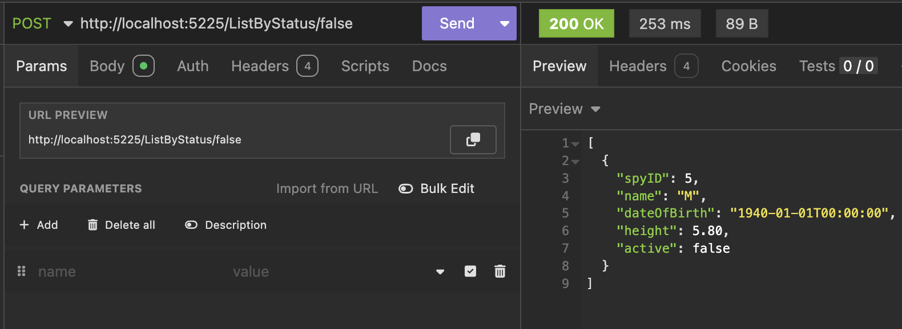
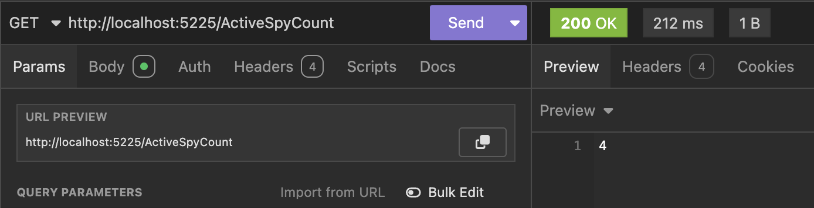

This is Part 2 of a series on using `Dapper` to simplify data access with `ADO.NET`

* [Simpler .NET Data Access With Dapper - Part 1]()
* **Dapper Part 2 - Querying The Database (This post)**
* [Dapper Part 3 - Executing Queries]()
* [Dapper Part 4 - Passing Data To And From The Database]()
* [Dapper Part 5 - Passing Data In Bulk To The Database]()

In our [last post](), we saw an introduction to how [Dapper](https://github.com/DapperLib/Dapper) makes life simpler for data access.

In this post, we shall drill a little deeper.

First, we will create a new web project.

```bash
dotnet new web -o DapperTest
```

Next, we add the [Microsoft SQL Server](https://www.microsoft.com/en-gb/sql-server/sql-server-2022) [ADO.NET](https://learn.microsoft.com/en-us/dotnet/framework/data/adonet/) [provider](https://www.nuget.org/packages/microsoft.data.sqlclient)

```bash
dotnet add package Microsoft.Data.SqlClient
```

Next, we add `Dapper`

```bash
dotnet add package Dapper
```

We shall first define a simple type that we are storing in the database:

```c#
namespace V1
{
    public sealed record Spy(int SpyID, string Name, DateTime DateOfBirth, decimal Height, bool Active);
}
```

For this series, we will use SQL Server as our database.

The schema is as follows:

```sql
CREATE TABLE Spies
    (
        SpyID       int           IDENTITY PRIMARY KEY,
        [Name]      nvarchar(100) NOT NULL
            UNIQUE,
        DateOfBirth date          NOT NULL,
        Height      decimal(3, 2) NOT NULL,
        Active      bit           NOT NULL
    );
```

And we can seed some data as follows:

```sql
INSERT dbo.Spies
    (
        Name,
        DateOfBirth,
        Height,
        Active
    )
VALUES
    (
        'James Bond', '1 jan 1945', 6.2, 1
    ),
    (
        'Eve MoneyPenny', '1 jan 1980', 5.7, 1
    ),
    (
        'Vesper Lynd', '1 jan 1975', 5.6, 1
    ),
    (
        'Q', '1 jan 1950', 6.0, 1
    ),
    (
        'M', '1 jan 1940', 5.8, 0
    );
```

If you query your database, you should see the following:



Now, let us tackle some tasks.

## 1. Listing Data

For this, we will create an API endpoint, and within it, we shall use the generic `Query<T>` method, specifying our query and passing `Spy` as the type parameter. We then call `AsList()` to return a list of `Spy`, which we return to the user.

```c#
app.MapGet("/List", (SqlConnection cn, ILogger<Program> logger) =>
{
    var spies = cn.Query<V1.Spy>("SELECT * FROM Spies").AsList();
    return Results.Ok(spies);
});

app.Run();
```

This will return the following:



Specifying the query as follows:

```sql
SELECT * FROM Spies
```

is a bad habit, as columns being renamed would quietly break your code.

It is better to be **explicit** and specify the query as follows:

```sql
SELECT
    Spies.SpyID,
    Spies.Name,
    Spies.DateOfBirth,
    Spies.Height,
    Spies.Active
FROM
    dbo.Spies;
```

What if your type was as follows:

```c#
namespace V2
{
    public sealed record Spy(int ID, string FullNames, DateTime BirthDate);
}
```

Here, the properties are **named differently** from the columns, and we are **not using some of the attributes**.

In such a scenario, we do the following:

1. Rewrite our query to provide [aliases](https://www.w3schools.com/sql/sql_alias.asp) to the columns we want

    ```sql
    SELECT
        Spies.SpyID       ID,
        Spies.Name        FullNames,
        Spies.DateOfBirth BirthDate
    FROM
        dbo.Spies;
    ```

2. We **omit the columns that we don't need**

The updated code is as follows:

```c#
app.MapGet("/List", (SqlConnection cn, ILogger<Program> logger) =>
{
    const string query = """
                         SELECT
                             Spies.SpyID ID,
                             Spies.Name FullNames,
                             Spies.DateOfBirth BirthDate
                         FROM
                             dbo.Spies;
                         """;
    var spies = cn.Query<V2.Spy>(query).AsList();
    return Results.Ok(spies);
});
```

The results are as follows:



## 2. Filtering Returned Data

We can achieve that by querying database data using **parameters**.

Let us say we wanted a list of every active `Spy`.

We write a new endpoint, as follows:

```c#
app.MapGet("/ActiveList", (SqlConnection cn, ILogger<Program> logger) =>
{
    const string query = """
                         SELECT
                             Spies.SpyID ID,
                             Spies.Name FullNames,
                             Spies.DateOfBirth BirthDate
                         FROM
                             dbo.Spies WHERE Active = @Active;
                         """;
    var param = new DynamicParameters();
    param.Add("Active", true);
    var spies = cn.Query<V2.Spy>(query, param).AsList();
    return Results.Ok(spies);
});
```

We are using `DynamicParameters` to pass the `boolean` **Active** filter to the query.

This returns the following:



You do not have to use `DynamicParameters` for this purpose—you can also use [anonymous types](https://learn.microsoft.com/en-us/dotnet/csharp/fundamentals/types/anonymous-types), provided the **attributes of your anonymous type match the parameter names** (they are not case-sensitive).

For example, we can define an endpoint where we specify a **desired height in the URL** route, and the API will fetch all active spies that are that height or taller for us.

```c#
app.MapGet("/ActiveByHeight/{height:decimal}", (SqlConnection cn, ILogger<Program> logger, decimal height) =>
{
    const string query = """
                         SELECT
                             Spies.SpyID,
                             Spies.Name,
                             Spies.DateOfBirth,
                             Spies.Height,
                             Spies.Active
                         FROM
                             dbo.Spies WHERE Active = @Active AND Height >= @Height;
                         """;
    var spies = cn.Query<V1.Spy>(query, new { Active = true, Height = height }).AsList();
    return Results.Ok(spies);
});
```

If we query for all `Spy` entities that are  6.2 and above...



An additional benefit of `Dapper` is it allows you to have types that have **computed fields**.

We can define version 3 of our `Spy` as follows:

```c#
namespace V3
{
    public sealed record Spy
    {
        public required int ID { get; init; }
        public required string FullNames { get; init; }
        public required DateTime BirthDate { get; init; }
      	// Compute the age against the current year 
        public int Age => DateTime.Now.Year - BirthDate.Year;
    }
}
```

We can then write another endpoint to fetch this new type:

```c#
app.MapGet("/ActiveListComputed", (SqlConnection cn, ILogger<Program> logger) =>
{
    const string query = """
                         SELECT
                             Spies.SpyID ID,
                             Spies.Name FullNames,
                             Spies.DateOfBirth BirthDate
                         FROM
                             dbo.Spies WHERE Active = @Active;
                         """;
    var param = new DynamicParameters();
    param.Add("Active", true);
    var spies = cn.Query<V3.Spy>(query, param).AsList();
    return Results.Ok(spies);
});
```

This returns the following:



Of course, for this to work correctly, `BirthDate` must be specified in the query.

## 3. Fetching Single Rows

`Dapper` also allows you to fetch a **single row** from the database.

We can see how this works with another endpoint that fetches a `Spy` by their `ID`:



When using `QuerySingle`, if the database does not return a result or returns more than 1, **an exception will be thrown**.

You can mitigate this (and improve your endpoint) by using `QuerySingleOrDefault` as follows:

```c#
var spies = cn.QuerySingleOrDefault(query, new { ID = id });
if (spies != null)
    return Results.Ok(spies);
return Results.NotFound();
```

`QuerySingleOrDefault` will return a null if no data meets the criterion.

## 4. Using Stored Procedures

In our examples, we have used inline queries.

`Dapper` works in exactly the same way if you use stored procedures.

Assuming we had this procedure:

```sql
CREATE OR ALTER PROC [Spies.GetByStatus] @Status BIT
AS
    SELECT
        Spies.SpyID,
        Spies.Name,
        Spies.DateOfBirth,
        Spies.Height,
        Spies.Active
    FROM
        dbo.Spies
    WHERE
        Spies.Active = @Status;
```

We can define an endpoint that we can provide a desired status and have the API fetch the data for us:

```c#
app.MapGet("/ListByStatus/{status:bool}", (SqlConnection cn, ILogger<Program> logger, bool status) =>
{
    var spies = cn.Query<V1.Spy>("[Spies.GetByStatus]", new { Status = status }).AsList();
    return Results.Ok(spies);
});
```

This will return the following:



## 5. Querying Single Values

`Dapper` can also allow you to query **single values** as primitive types.

For example, if we needed an endpoint that **counted the number** of active `Spy` entities, we would do it as follows:

```c#
app.MapGet("/ActiveSpyCount/", (SqlConnection cn, ILogger<Program> logger) =>
{
    var spyCount = cn.QuerySingle<int>("SELECT COUNT(1) FROM Spies WHERE Active=1");
    return Results.Ok(spyCount);
});
```

Here, `QuerySingle` takes an `int` as the generic parameter.

The result is as follows:



Here, we are certain that a result will return - `0` or anything else.

However, there are scenarios where your query will not return anything. In this case, an exception will be thrown.

If you are unsure of getting a result, use `QuerySingleOrDefault<T>` instead. If nothing is returned, the default value of the type `<T>` will be returned instead - `0` for numerics, DateTime.MinValue for dates, `false` for `booleans,` and `null` for everything else, including your own custom types.

If there are multiple results and you only want one, use `QueryFirst<T>` or `QueryFirstOrDefault<T>`.

## Bonus

1. Your types **do not need to have setters** - `Dapper` will use **reflection** and correctly set the properties of types that have read-only public properties. This, however, is [not the case if you are using VB.NET](). **Mapping will fail if your type has no setters**.
2. If you use `Query<T>` and omit `AsList()`, you will get back an `IEnumerable<T>`, which you can use for intermediate lazy processing.
3. All the methods mentioned in this post - `Query`, `QuerySingle`, `QuerySingleOrDefault,` `QueryFirst`, `QueryFirstOrDefault` have `async` equivalents that you can execute [asynchronously](https://learn.microsoft.com/en-us/dotnet/csharp/asynchronous-programming/).

In our next post, we will look at how to execute queries in the database that do not return results.

### TLDR

**Dapper can map complex types or primitive return types from database queries for you.**

The code is in my [GitHub](https://github.com/conradakunga/BlogCode/tree/master/2025-02-26%20-%20Dapper%20Part%202).

Happy hacking!
