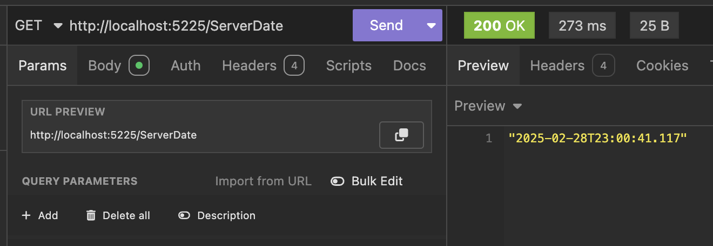

This is Part 4 of a series on using `Dapper` to simplify data access with `ADO.NET`

* [Simpler .NET Data Access With Dapper - Part 1]()
* [Dapper Part 2 - Querying The Database]()
* [Dapper Part 3 - Executing Queries]()
* **Dapper Part 4 - Passing Data To And From The Database (This Post)**
* [Dapper Part 5 - Passing Data In Bulk To The Database]()
* [Dapper Part 6 - Returning Multiple Sets Of Results]()
* [Dapper Part 7 - Adding DateOnly & TimeOnly Support]()
* [Dapper Part 8 - Controlling Database Timeouts]()

In our last post, we looked at how to execute **ad-hoc queries** and **stored procedures** on the server.

In this post, we will look at **various ways to pass data between server and client**.

## 1. Input Parameters

We have already used this **extensively** over the last few posts, and it is by far the **most common** way to pass data between client and server.

Take the following endpoint:

```c#
app.MapGet("/ActiveList", (SqlConnection cn, ILogger<Program> logger) =>
{
    const string query = """
                         SELECT
                             Spies.SpyID ID,
                             Spies.Name FullNames,
                             Spies.DateOfBirth BirthDate
                         FROM
                             dbo.Spies WHERE Active = @Active;
                         """;
    var param = new DynamicParameters();
    param.Add("Active", true);
    var spies = cn.Query<V2.Spy>(query, param).AsList();
    return Results.Ok(spies);
});
```

`Active` here is an **input parameter**.

You can specify a lot about your input parameter, as the example below indicates:

```c#
app.MapPost("/Login", (SqliteConnection cn, ILogger<Program> logger, LoginRequest request) =>
{
    var param = new DynamicParameters();
    // Create the Username parameter, specifying all the details
    param.Add("Username", request.Username, DbType.String, ParameterDirection.Input, 100);
    // Crete the password parameter
    param.Add("Password", request.Password);
    // Set the command query text
    var query = "SELECT 1 FROM USERS WHERE Username=@Username AND Password=@Password";
    // Execute the query
    var status = cn.QuerySingleOrDefault<int>(query, param);
    // Check the returned number
    if (status == 1)
    {
        // We are now logged in
        logger.LogInformation("User logged in successfully");
        return Results.Ok();
    }

    logger.LogError("Login Failed");
    // Return a 401
    return Results.Unauthorized();
});
```

The *Username* here has all its parameters **explicitly** set.

You generally do not need to do this - **the name and the value are usually enough**. The database engine will figure out the rest.

## 2. Output Parameters

Some databases, in addition to **input parameters**, also support [output parameters](https://learn.microsoft.com/en-us/sql/relational-databases/stored-procedures/return-data-from-a-stored-procedure?view=sql-server-ver16). This is commonly used in conjunction with store procedures.

When writing the stored procedure, **you specify that it has output parameters**. When the procedure is executed, the database engine will populate these parameters with values, which you can then read.

Take this example:

```sql
CREATE OR ALTER PROC [Spies.GetInfo]
    @SpyID       INT,
    @Name        NVARCHAR(100) OUTPUT,
    @DateOfBirth DATE          OUTPUT,
    @Active      BIT           OUTPUT
AS
    SELECT
        @Name        = Spies.Name,
        @DateOfBirth = Spies.DateOfBirth,
        @Active      = Spies.Active
    FROM
        dbo.Spies
    WHERE
        Spies.SpyID = @SpyID;
```

We can obtain the parameter values as follows:

```c#
app.MapGet("/GetSpyDetails/{id:int}", async (SqlConnection cn, ILogger<Program> logger, int id) =>
{
    var param = new DynamicParameters();
    // Add the input parameter - the ID
    param.Add("SpyID", id);
    // Add the output parameters
    param.Add("Name", dbType: DbType.String, size: 100, direction: ParameterDirection.Output);
    param.Add("DateOfBirth", dbType: DbType.DateTime, direction: ParameterDirection.Output);
    param.Add("Active", dbType: DbType.Boolean, direction: ParameterDirection.Output);
    // Execute the query
    await cn.ExecuteAsync("[Spies.GetInfo]", param);

    // Fetch the populated values
    var name = param.Get<string>("Name");
    var dateOfBirth = param.Get<DateTime>("DateOfBirth");
    var active = param.Get<bool>("Active");

    // Output as an anonymous type
    return new { Name = name, DateOfBirth = dateOfBirth, Active = active };
})
```

If we run this, we see the following:


**This is just an example, and I would not recommend doing things this way**. 

Creating a `Person` type and then using `QuerySingle<Person>` to retrieve the information you want is simpler.

But output parameters have their use in this scenario: **when inserting a row into a database, you want to return the generated primary key to the caller**.

## 3. Functions

Another common scenario is you want to execute a [function](https://learn.microsoft.com/en-us/sql/t-sql/functions/functions?view=sql-server-ver16) on the server and return a result to the client.

Take this built-in SQL server function that returns the system time:

```sql
GETDATE()
```

We can execute this function and return its result as follows:

```c#
app.MapGet("/ServerDate", async (SqlConnection cn, ILogger<Program> logger) =>
{
    // Execute the function
    var result = await cn.QuerySingleAsync<DateTime>("SELECT GETDATE()");

    return result;
});
```

This returns the following:



The same technique works for your **custom function**, which has parameters. Here, we have one that takes a `boolean` parameter and **counts** the **active** `Spy` entities with that status.

```sql
CREATE OR ALTER FUNCTION [Spies.GetActiveCountByStatus]
    (
        @Status BIT
    )
RETURNS INT
AS
    BEGIN
        DECLARE @Count AS INT;

        SELECT
            @Count = Count(1)
        FROM
            dbo.Spies
        WHERE
            Spies.Active = @Status;

        RETURN @Count;
    END;
```

The end-point that invokes this function is as follows:

```c#
app.MapGet("/GetActiveSpyCountByStatus/{status:bool}", async (SqlConnection cn, ILogger<Program> logger, bool status) =>
{
    // Set up the parameters
    var param = new DynamicParameters();
    param.Add("Status", status);

    // Execute the function
    var result = await cn.QuerySingleAsync<int>("SELECT dbo.[Spies.GetActiveCountByStatus](@Status)", param);

    return result;
});
```

Note how to invoke the function:

```sql
SELECT dbo.[Spies.GetActiveCountByStatus](@Status)
```

1. You must populate the `DynamicParameters` with the expected parameter names and values.
2. You must have the `SELECT`
3. You must also have the `dbo.`
4. You must pass the parameters in brackets, with the `@` prefix

If you run this, you get the following:


### TLDR

**You can pass data between the SQL server and the client using *input parameters*, *output parameters*, and *functions*.**

In our [next post](), we will look at how to pass [table-valued parameters](https://learn.microsoft.com/en-us/sql/relational-databases/tables/use-table-valued-parameters-database-engine?view=sql-server-ver16) to the database engine using `Dapper`.

The code is in my [GitHub](https://github.com/conradakunga/BlogCode/tree/master/2025-02-28%20-%20Dapper%20Part%204).

Happy hacking!
