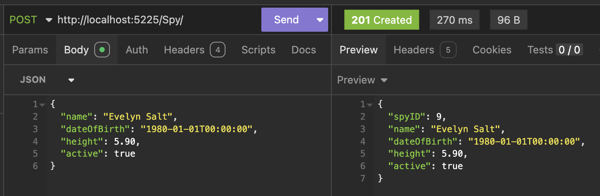
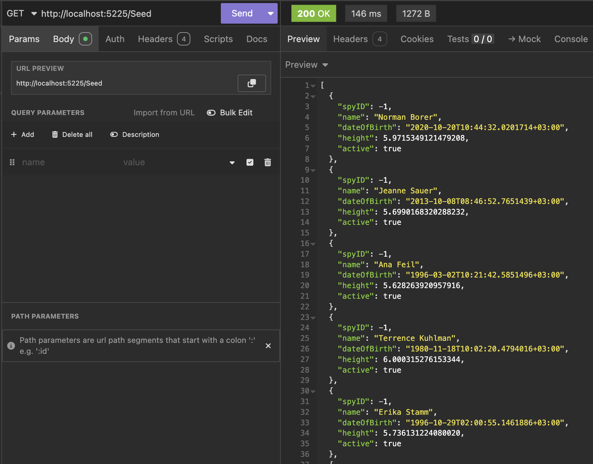
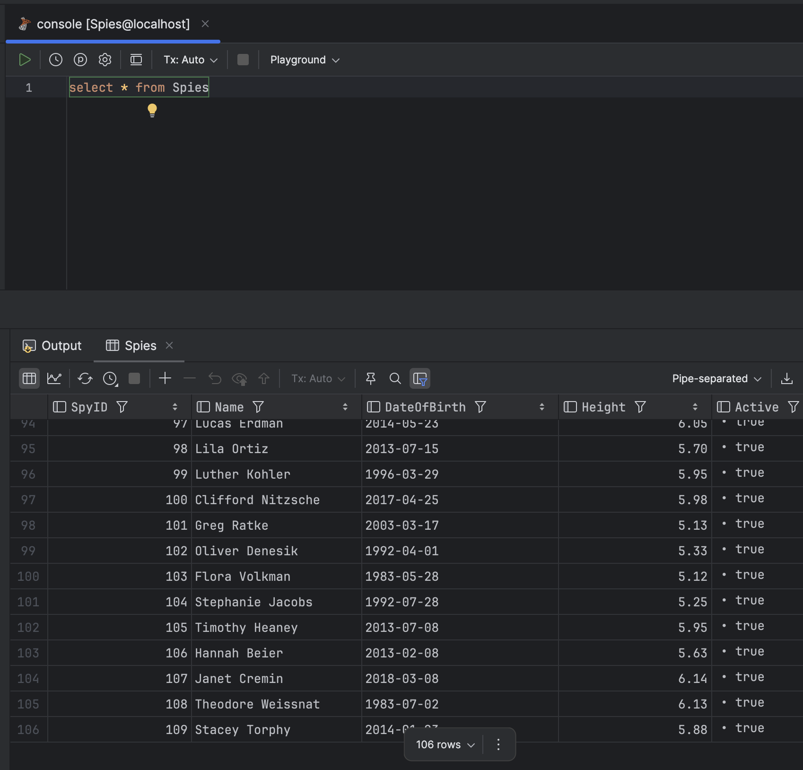
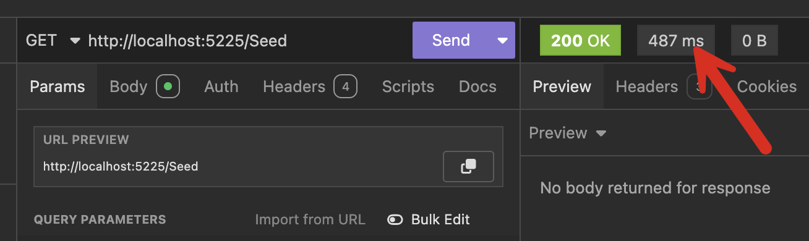
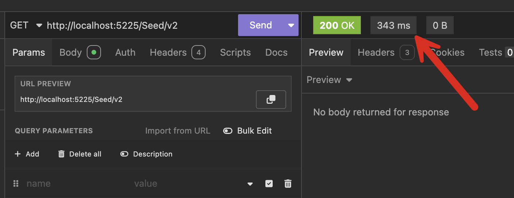
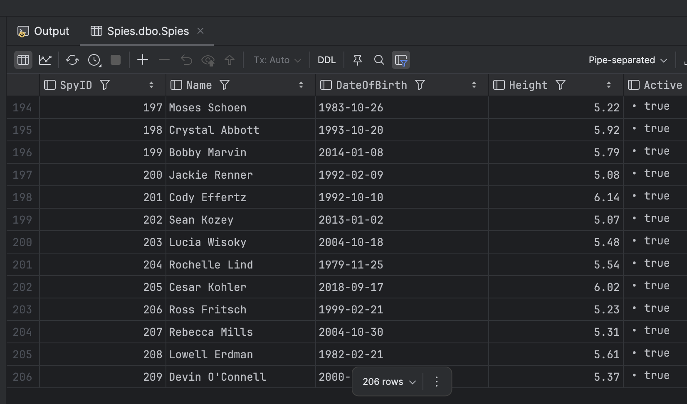

This is Part 5 of a series on using `Dapper` to simplify data access with `ADO.NET`

* [Simpler .NET Data Access With Dapper - Part 1]()
* [Dapper Part 2 - Querying The Database]()
* [Dapper Part 3 - Executing Queries]()
* [Dapper Part 4 - Passing Data To And From The Database]()
* **Dapper Part 5 - Passing Data In Bulk To The Database (This Post)**

In our [last post](), we looked at how to pass data to and from the database using **input parameters**, **output parameters,** and **calling functions**.

Today, we will tackle the problem of **how to pass data to the database in bulk**.

We want to add functionalilty to add a `Spy`.

This is the definition of the type:

```c#
public sealed class Spy
{
    // Unlike the other properties, this is mutable
    public int SpyID { get; set; }
    public required string Name { get; init; }
    public required DateTime DateOfBirth { get; init; }
    public required decimal Height { get; init; }
    public required bool Active { get; init; }
}
```

We also have several applications interfacing with the *Spies* database, and we want to harmonize the logic. So, we are going to use a stored procedure for this.

```sql
CREATE OR ALTER PROC dbo.[Spies.Create]
    @Name        NVARCHAR(100),
    @DateOfBirth DATE,
    @Height      DECIMAL(3, 2),
    @Active      BIT
AS
    BEGIN
        INSERT INTO dbo.Spies
            (
                Name,
                DateOfBirth,
                Height,
                Active
            )
        VALUES
            (
                @Name, @DateOfBirth, @Height, @Active
            );
    END;
```

Let us assume we have the following end-point that allows us to insert a new `Spy`.

```c#
app.MapPost("/Spy/", async (SqlConnection cn, Spy spy) =>
{
    var param = new DynamicParameters();
    param.Add("Name", spy.Name);
    param.Add("DateOfBirth", spy.DateOfBirth);
    param.Add("Height", spy.Height);
    param.Add("Active", spy.Active);
    param.Add("SpyID", dbType: DbType.Int32, direction: ParameterDirection.Output);

    await cn.ExecuteAsync("[Spies.Create]", param);

     // Capture the new SpyID from the output parameter
    var newID = param.Get<int>("SpyID");
    // Set it in our Spy object
    spy.SpyID = newID;
    // Return a 201 with the spy in the body 
    return Results.Created($"/Spy/{newID}", spy);
});
```

This example also demonstrates one of the **practical uses of an output parameter** - to capture the newly inserted primary key - `SpyID`.

This endpoint will create a `Spy` and then return an [HTTP 201](https://developer.mozilla.org/en-US/docs/Web/HTTP/Status/201). with the newly created Spy in the response.

Finally, we have an endpoint to view a `Spy`.

```c#
app.MapGet("/Spy/{id:int}", async (SqlConnection cn, int id) =>
{
    const string query = """
                         SELECT
                             Spies.SpyID,
                             Spies.Name,
                             Spies.DateOfBirth,
                             Spies.Height,
                             Spies.Active
                         FROM
                             dbo.Spies WHERE SpyID = @SpyID;
                         """;
    var param = new DynamicParameters();
    param.Add("SpyID", id);

    var spy = await cn.QuerySingleOrDefaultAsync<Spy>(query, param);

    if (spy == null)
        return Results.NotFound();

    return Results.Ok(spy);
});
```

Next, we submit a test payload to our endpoint as a POST request.

```json
{
	"name": "Evelyn Salt",
	"dateOfBirth": "1980-01-01T00:00:00",
	"height": 5.90,
	"active": true
}
```

We should get the following response:



So far, so good.

Now, suppose we need to insert **100** spies together. Perhaps we are seeding our new agency.

Let us create an endpoint for this. 

To generate our `Spies`, we are going to use the [Bogus](https://github.com/bchavez/Bogus) package.

```bash
dotnet add package Bogus
```

Next, we will build an endpoint to generate 10 `Spy` objects, **specifying the rules for object creation**:

```c#
app.MapGet("/Seed", (SqlConnection cn) =>
{
    // Create a faker object
    var faker = new Faker<Spy>();

    //
    // Configure our faker
    //

    // SpyID should always be -1, because the DB is generating them
    faker.RuleFor(x => x.SpyID, -1);
    // Generate realistic names
    faker.RuleFor(x => x.Name, f => f.Person.FullName);
    // Date of birth should be random date in the past, max 50 years go
    faker.RuleFor(x => x.DateOfBirth, y => y.Date.Past(50));
    // Active should always be true
    faker.RuleFor(x => x.Active, true);
    // Height should be between 5 feet and 6'3
    faker.RuleFor(x => x.Height, y => y.Random.Decimal(5.0M, 6.2M));

    // Generate 10 spies and print to screen
    var spies = faker.Generate(10);

    return Results.Ok(spies);
});
```

If we run our endpoint, we should see the following:



Now, back to our problem.

We want to insert **100** `Spy` entities.

We can generate the **100** `Spy` entities in a **loop**, call our **stored procedure,** and **pass it the parameters**.

```c#
// Generate our spies
var spies = faker.Generate(100);
// Loop through the collection and insert
foreach (var spy in spies)
{
    // Populate our parameters
    var param = new DynamicParameters();
    param.Add("Name", spy.Name);
    param.Add("DateOfBirth", spy.DateOfBirth);
    param.Add("Height", spy.Height);
    param.Add("Active", spy.Active);
    param.Add("SpyID", dbType: DbType.Int32, direction: ParameterDirection.Output);

    // Execute the query
    await cn.ExecuteAsync("[Spies.Create]", param);
}
```

Once we run the endpoint, we can query the database.



It works.

And if we look at how long the endpoint took:



487 milliseconds is pretty fast.

So, if it **worked**, and it was **fast**, **what is the problem**?

The problem here is we have 

1. **Created a connection** to the database,
2. **Passed parameters** to it
3. **Executed** a database query
4. **Closed** the connection
5. **Disconnected**

**100 times**.

This is not efficient.

Suppose it were possible to run **just one query** and achieve the same thing.

This is possible, but it requires a bit of **out-of-the-box thinking**.

Wouldn't it be nice if the database supported **types**?

**It does**. Remember that the table definition maps to our type.

Wouldn't it be nice if the database supported a **collection of types**?

**It does**. Remember what a table is - a collection of entities.

**Can we pass a collection of types to our database?**

Yes.

In SQL Server, we define a [user-defined table type](https://learn.microsoft.com/en-us/sql/t-sql/statements/create-type-transact-sql?view=sql-server-ver16).

Like this:

```sql
CREATE TYPE Spy AS TABLE
    (
        Name        NVARCHAR(100) NOT NULL
            UNIQUE,
        DateOfBirth DATE          NOT NULL,
        Height      DECIMAL(3, 2) NOT NULL,
        Active      BIT           NOT NULL
    );
GO
```

We then create a stored procedure that we will use to **submit our table.**

```sql
CREATE OR ALTER PROC [Spies.BulkCreate] @Spies Spy READONLY
AS
    BEGIN
        INSERT dbo.Spies
            (
                Name,
                DateOfBirth,
                Height,
                Active
            )
               SELECT
                   [@Spies].Name,
                   [@Spies].DateOfBirth,
                   [@Spies].Height,
                   [@Spies].Active
               FROM
                   @Spies;
    END;
```

Note the definition of the parameter here:

```sql
@Spies Spy READONLY
```

`Spy` is what we created earlier, and you must use the `READONLY` keyword when defining the parameter.

We can see our procedure simply does a `SELECT` **from our parameter table into the actual table**, inserting all the rows at once.

Now, we need to do some work on our endpoint.

We need to create a [DataTable](https://learn.microsoft.com/en-us/dotnet/api/system.data.datatable?view=net-9.0) object with **column definitions that map to our user-defined table type**.

We then create as many data rows as necessary, which we will then submit to the database as a [table-valued parameter.](https://learn.microsoft.com/en-us/dotnet/framework/data/adonet/sql/table-valued-parameters)

Our new endpoint looks like this:

```c#
app.MapGet("/Seed/v2", async (SqlConnection cn) =>
{
    // Create a faker object
    var faker = new Faker<Spy>();

    //
    // Configure our faker
    //

    // SpyID should always be -1, because the DB is generating them
    faker.RuleFor(x => x.SpyID, -1);
    // Generate realistic names
    faker.RuleFor(x => x.Name, f => f.Person.FullName);
    // Date of birth should be random date in the past, max 50 years go
    faker.RuleFor(x => x.DateOfBirth, y => y.Date.Past(50));
    // Active should always be true
    faker.RuleFor(x => x.Active, true);
    // Height should be between 5 feet and 6'3
    faker.RuleFor(x => x.Height, y => y.Random.Decimal(5.0M, 6.2M));

    // Generate our spies
    var spies = faker.Generate(100);

    // Create a datatable

    var dt = new DataTable();

    // Add columns
    dt.Columns.Add("Name", typeof(string));
    dt.Columns.Add("DateOfBirth", typeof(DateTime));
    dt.Columns.Add("Height", typeof(decimal));
    dt.Columns.Add("Active", typeof(bool));

    // Loop through the collection, create a datarow,
    // populate it with data and add it to he rows
    // collection of the datarow

    foreach (var spy in spies)
    {
        var row = dt.NewRow();
        row["Name"] = spy.Name;
        row["DateOfBirth"] = spy.DateOfBirth;
        row["Height"] = spy.Height;
        row["Active"] = spy.Active;
        dt.Rows.Add(row);
    }

    // Populate our parameters
    var param = new DynamicParameters();
    param.Add("Spies", dt.AsTableValuedParameter());
    
    // Execute the query
    await cn.ExecuteAsync("[Spies.BulkCreate]", param);
    return Results.Ok();
});
```

If we run our endpoint:



It is **slightly faster** than the previous version. The more **complex the type** and **the more the rows**, the better the **relative performance** should be. But the main benefit is that we **hit the database once**.

We can see our new rows have been inserted.



There are several ways to tackle this problem, one of which is **Bulk Inserting**. Depending on your circumstances and data, this might be a better solution. I will write a post on that later this month.

## TLDR

**Table-valued parameters allow you to submit data in bulk to your database engine.**

The code is in my [GitHub](https://github.com/conradakunga/BlogCode/tree/master/2025-03-01%20-%20Dapper%20Part%205).

Happy hacking!
