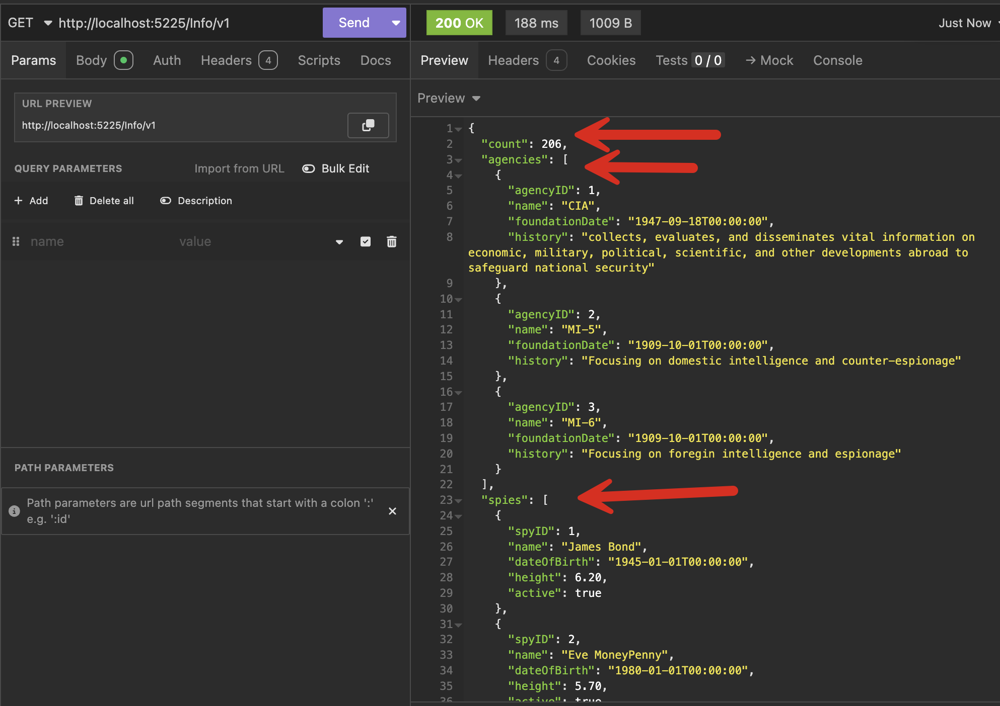

This is Part 6 of a series on using `Dapper` to simplify data access with `ADO.NET`

* [Simpler .NET Data Access With Dapper - Part 1]()
* [Dapper Part 2 - Querying The Database]()
* [Dapper Part 3 - Executing Queries]()
* [Dapper Part 4 - Passing Data To And From The Database]()
* [Dapper Part 5 - Passing Data In Bulk To The Database]()
* **Dapper Part 6 - Returning Multiple Sets Of Results (This Post)**

In our last post, we looked at how to pass data in bulk to the database using **table-valued functions**.

This post will look at a situation where you want to **return multiple sets of results**.

We shall first introduce a new type:

```c#
public sealed record Agency(int AgencyID, string Name, DateTime FoundationDate, string History);
```

The following is the schema for the new table:

```sql
CREATE TABLE Agencies
    (
        AgencyID       INT            PRIMARY KEY IDENTITY,
        Name           NVARCHAR(100)  NOT NULL
            UNIQUE,
        FoundationDate DATE           NOT NULL,
        History        NVARCHAR(4000) NOT NULL
    );

```

Below is a script that will seed the data:

```sql
INSERT dbo.Agencies
    (
        Name,
        FoundationDate,
        History
    )
VALUES
    (
        N'CIA', 'September 18 1947',
        N'collects, evaluates, and disseminates vital information on economic, military, political, scientific, and other developments abroad to safeguard national security'
    ),
    (
        N'MI-5', 'October 1 1909', N'Focusing on domestic intelligence and counter-espionage'
    ),
    (
        N'MI-6', 'October 1 1909', N'Focusing on foregin intelligence and espionage'
    );
```

Suppose we wanted the following:

1. A **list** of **5 spies**
2. A **list** of **all agencies**
3. A **count** of **all the spies**

We can write an endpoint that fetches all these separately in the body and then stitches together the results:

```c#
app.MapGet("/Info/v1", async (SqlConnection cn) =>
{
    const string allSpies = "SELECT TOP 5 * FROM Spies";
    const string allAgencies = "SELECT * FROM Agencies";
    const string spyCount = "SELECT Count(1) FROM Spies";

    var spies = await cn.QueryAsync<Spy>(allSpies);
    var agencies = await cn.QueryAsync<Agency>(allAgencies);
    var count = await cn.QuerySingleAsync<int>(spyCount);

    return Results.Ok(new { spies, agencies, count });
});
```

The results should be as follows:



`Dapper` allows you to simplify this by **submitting all the queries at once and retrieving the results**.

```c#
app.MapGet("/Info/v2", async (SqlConnection cn) =>
{
    const string query = """
                         SELECT Count(1) FROM Spies
                         SELECT * FROM Agencies
                         SELECT TOP 5 * FROM Spies
                         """;
    List<Spy> spies;
    List<Agency> agencies;
    int count;
    await using (var results = await cn.QueryMultipleAsync(query))
    {
        // Capture the count
        count = await results.ReadSingleAsync<int>();
        // Capture the agencies
        agencies = (await results.ReadAsync<Agency>()).ToList();
        // Capture the spies
        spies = (await results.ReadAsync<Spy>()).ToList();
    }

    return Results.Ok(new { count, agencies, spies })
```

**The order in which you capture the results must match the order of the queries.**

### TLDR

**`Dapper` allows you to submit multiple queries and retrieve the results from the aggregate returned results.**

The code is in my GitHub.

Happy hacking!

