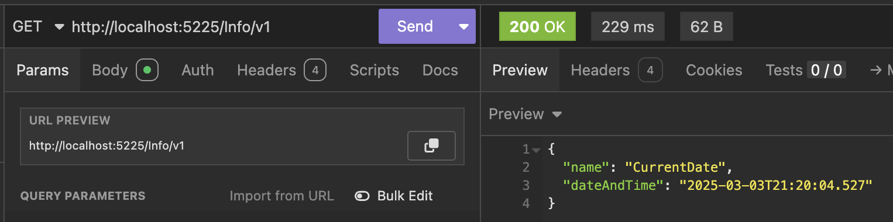
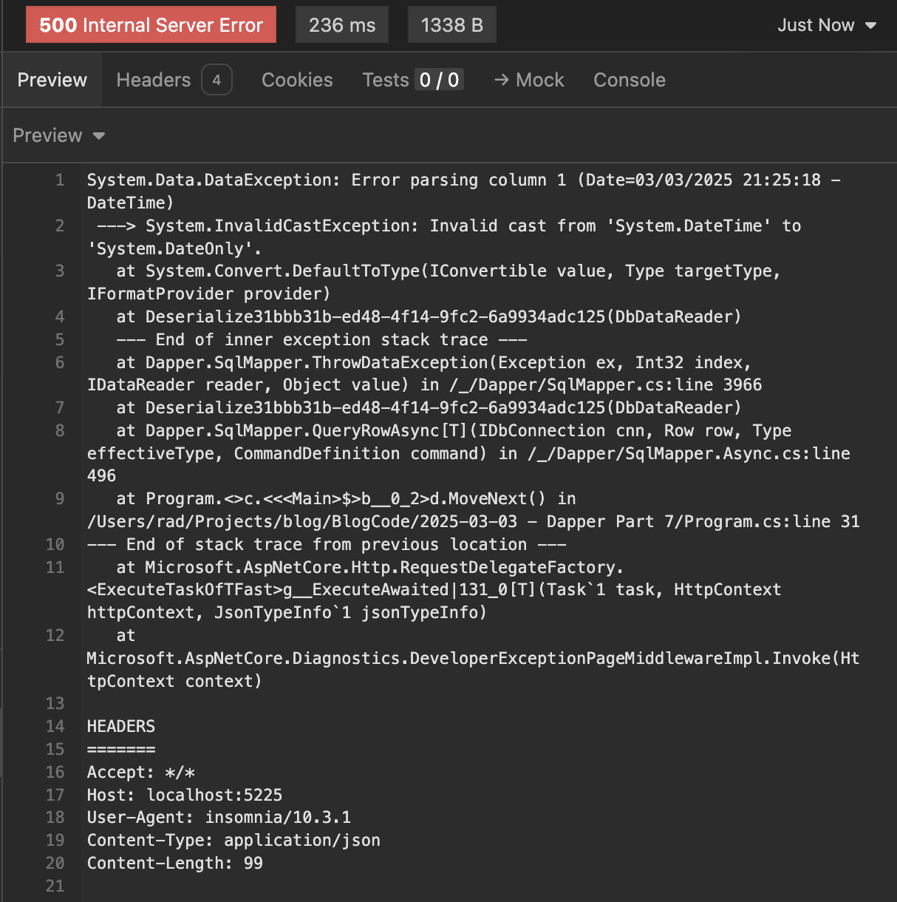

This is Part 7 of a series on using `Dapper` to simplify data access with `ADO.NET`

* [Simpler .NET Data Access With Dapper - Part 1]()
* [Dapper Part 2 - Querying The Database]()
* [Dapper Part 3 - Executing Queries]()
* [Dapper Part 4 - Passing Data To And From The Database]()
* [Dapper Part 5 - Passing Data In Bulk To The Database]()
* [Dapper Part 6 - Returning Multiple Sets Of Results]()
* **Dapper Part 7 - Adding DateOnly & TimeOnly Support (This Post)**

In our [last post](), we looked at how to **send a batch of SQL statements and retrieve their results in a batch**.

In this post, we shall look at how to overcome a problem with **type mapping**.

Assume you have the following type:

```c#
public sealed class DateInfo
{
    public string Name { get; } = null!;
    public DateTime DateAndTime { get; }
}
```

This is populated by the following query:

```sql
SELECT
    'CurrentDate' Name,
    GETDATE()     DateAndTime;
```

We can build a simple endpoint to retrieve this data:

```c#
app.MapGet("/Info/v1", async (SqlConnection cn) =>
{
    const string query = """
                         SELECT
                         'CurrentDate' Name,
                         GETDATE()     DateAndTime;
                         """;
    var result = await cn.QuerySingleAsync<DateInfo>(query);

    return result;
});
```

This will return the following:



```json
{
	"name": "CurrentDate",
	"dateAndTime": "2025-03-03T21:20:04.527"
}
```

One of the changes in .NET 6 was a realization that we often need the date and not the time component, or vice versa. And thus, [DateOnly](https://learn.microsoft.com/en-us/dotnet/api/system.dateonly?view=net-9.0) and [TimeOnly](https://learn.microsoft.com/en-us/dotnet/api/system.timeonly?view=net-9.0) types were introduced.

We might want to take advantage of this.

So, we start by changing our type as follows:

```c#
namespace V2
{
    public sealed class DateInfo
    {
        public string Name { get; } = null!;
        public DateOnly Date { get; }
    }
}
```

And a new endpoint with a slightly modified query:

```c#
app.MapGet("/Info/v2", async (SqlConnection cn) =>
{
    const string query = """
                         SELECT
                         'CurrentDate' Name,
                         GETDATE()     Date;
                         """;
    var result = await cn.QuerySingleAsync<V2.DateInfo>(query);

    return result;
});
```

If we run this:



It returns an **exception** - it cannot convert from a `DateTime` to a `DateOnly`.

```plaintext
System.Data.DataException: Error parsing column 1 (Date=03/03/2025 21:25:18 - DateTime)
 ---> System.InvalidCastException: Invalid cast from 'System.DateTime' to 'System.DateOnly'.
   at System.Convert.DefaultToType(IConvertible value, Type targetType, IFormatProvider provider)
   at Deserialize31bbb31b-ed48-4f14-9fc2-6a9934adc125(DbDataReader)
   --- End of inner exception stack trace ---
   at Dapper.SqlMapper.ThrowDataException(Exception ex, Int32 index, IDataReader reader, Object value) in /_/Dapper/SqlMapper.cs:line 3966
   at Deserialize31bbb31b-ed48-4f14-9fc2-6a9934adc125(DbDataReader)
   at Dapper.SqlMapper.QueryRowAsync[T](IDbConnection cnn, Row row, Type effectiveType, CommandDefinition command) in /_/Dapper/SqlMapper.Async.cs:line 496
   at Program.<>c.<<<Main>$>b__0_2>d.MoveNext() in /Users/rad/Projects/blog/BlogCode/2025-03-03 - Dapper Part 7/Program.cs:line 31
--- End of stack trace from previous location ---
   at Microsoft.AspNetCore.Http.RequestDelegateFactory.<ExecuteTaskOfTFast>g__ExecuteAwaited|131_0[T](Task`1 task, HttpContext httpContext, JsonTypeInfo`1 jsonTypeInfo)
   at Microsoft.AspNetCore.Diagnostics.DeveloperExceptionPageMiddlewareImpl.Invoke(HttpContext context)
```

There are two ways to go about this:

## 1. Computed Column

We can move this from a `Dapper` problem to **our** problem by **doing the conversion ourselves**.

We change the type slightly to add a computed column:

```c#
namespace V3
{
    public sealed class DateInfo
    {
        public string Name { get; } = null!;
        public DateTime DateAndTime { get; }
        public DateOnly Date => DateOnly.FromDateTime(DateAndTime);
    }
}
```

Here, we compute the `Date` property from the `DateAndTime`.

If we run this:

```json
{
	"name": "CurrentDate",
	"dateAndTime": "2025-03-03T21:35:11.947",
	"date": "2025-03-03"
}
```

This **works** well, but there is much to say about **duplicating data**.

## 2. Extending Dapper

The other option is to **extend** `Dapper` to do the conversion for us.

This is done by **subclassing** the generic `SqlMapper.TypeHandler<T>` to **implement our own conversion to and from our desired type**.

The class looks like this:

```c#
public class SqlDateOnlyTypeHandler : SqlMapper.TypeHandler<DateOnly>
{
	public override void SetValue(IDbDataParameter parameter, DateOnly date) => parameter.Value = date.ToDateTime(new TimeOnly(0, 0));
	public override DateOnly Parse(object value) => DateOnly.FromDateTime((DateTime)value);
}
```

We then configure `Dapper` using the static `SqlMapper.AddTypeHandle` method. This can be done **at the start of the program**.

```c#
var builder = WebApplication.CreateBuilder(args);

// Setup DI to inject a Sql Server connection
builder.Services.AddSingleton<SqlConnection>(_ => new SqlConnection(connectionString));

// Configure Dapper to support DateOnly
SqlMapper.AddTypeHandler(new SqlDateOnlyTypeHandler());

var app = builder.Build();
```

Our v2 endpoint should now work:

```c#
app.MapGet("/Info/v2", async (SqlConnection cn) =>
{
    const string query = """
                         SELECT
                         'CurrentDate' Name,
                         GETDATE()     Date;
                         """;
    var result = await cn.QuerySingleAsync<V2.DateInfo>(query);

    return result;
});
```

This will return the following:

```json
{
	"name": "CurrentDate",
	"date": "2025-03-03"
}
```

We can also use this same technique to map a `TimeOnly` from our response:

```c#
namespace V4
{
    public sealed class DateInfo
    {
        public string Name { get; } = null!;
        public TimeOnly Time { get; }
    }
}
```

Our endpoint will look like this:

```c#
app.MapGet("/Info/v4", async (SqlConnection cn) =>
{
    const string query = """
                         SELECT
                         'CurrentDate' Name,
                         GETDATE()     Time;
                         """;
    var result = await cn.QuerySingleAsync<V4.DateInfo>(query);

    return result;
});
```

We then create our mapper:

```c#
public class SqlTimeOnlyTypeHandler : SqlMapper.TypeHandler<TimeOnly>
{
	public override void SetValue(IDbDataParameter parameter, TimeOnly time) => parameter.Value = time.ToString();
	public override TimeOnly Parse(object value) => TimeOnly.FromTimeSpan(((DateTime)value).TimeOfDay);

```

And register it at startup:

```c#
var builder = WebApplication.CreateBuilder(args);

// Setup DI to inject a Sql Server connection
builder.Services.AddSingleton<SqlConnection>(_ => new SqlConnection(connectionString));

// Configure Dapper to support DateOnly
SqlMapper.AddTypeHandler(new SqlDateOnlyTypeHandler());
// Configure Dapper to support TimeOnly
SqlMapper.AddTypeHandler(new SqlTimeOnlyTypeHandler());

var app = builder.Build();
```

If we run our endpoint, we will see the following:

```json
{
	"name": "CurrentDate",
	"time": "21:48:41.9730000"
}
```

In our next post, we will look at how to configure `Dapper` globally.

### TLDR

**Dapper allows you to write your own *type handlers* to handle conversions to and from native .NET types.**

The code is in my GitHub.

Happy hacking!