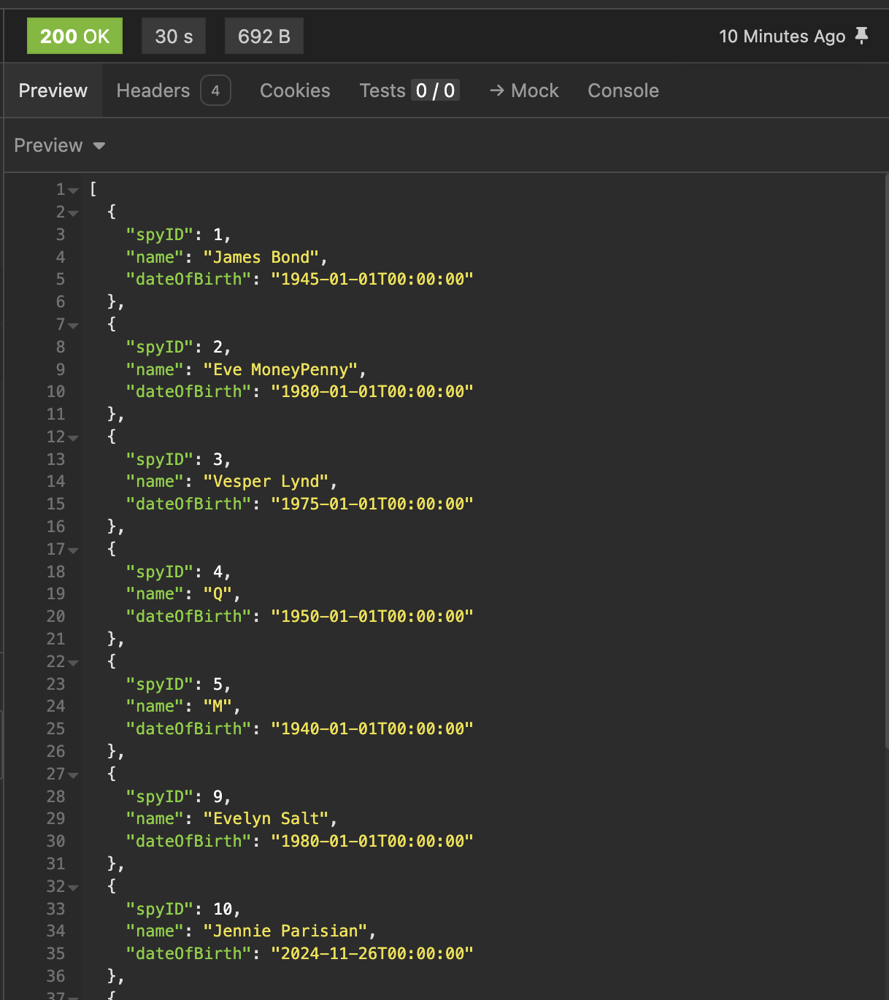
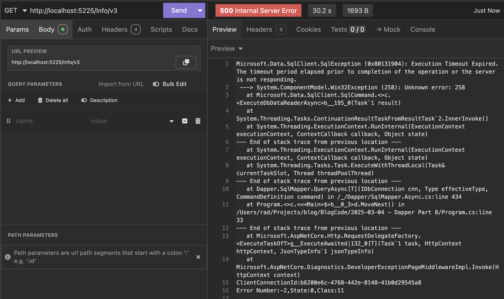

This is Part 8 of a series on using `Dapper` to simplify data access with `ADO.NET`

* [Simpler .NET Data Access With Dapper - Part 1]()
* [Dapper Part 2 - Querying The Database]()
* [Dapper Part 3 - Executing Queries]()
* [Dapper Part 4 - Passing Data To And From The Database]()
* [Dapper Part 5 - Passing Data In Bulk To The Database]()
* [Dapper Part 6 - Returning Multiple Sets Of Results]()
* [Dapper Part 7 - Adding DateOnly & TimeOnly Support]()
* **Dapper Part 8 - Controlling Database Timeouts (This post)**
* [Dapper Part 9 - Using Dynamic Types]()
* [Dapper Part 10 - Handling Cancellations]()

In our [last post](), we looked at how to add support for DateOnly and TimeOnly types to Dapper.

In this post, we shall look at potential problems around **database timeouts** and how to handle them.

Let us again take our example type:

```c#
public sealed class Spy
{
    public int SpyID { get; }
    public string Name { get; } = null!;
    public DateTime DateOfBirth { get; }
}
```

Then, a simple endpoint to view 10 spies:

```c#
app.MapGet("/Info/v1", async (SqlConnection cn) =>
{
    const string query = """
                         SELECT TOP 10 * FROM Spies
                         """;
    var result = await cn.QueryAsync<Spy>(query);

    return result;
});
```

If we run this, we get the usual result:



Let us introduce a **one-minute delay** to this query via the [WAITFOR](https://learn.microsoft.com/en-us/sql/t-sql/language-elements/waitfor-transact-sql?view=sql-server-ver16) command.

We can write a procedure that will do this for us:

```sql
CREATE OR ALTER PROC [Spies.GetAllWithDelay]
AS
BEGIN
    WAITFOR DELAY '00:00:45'
    SELECT TOP 10 * FROM Spies
END
```

We then call this procedure from an endpoint like this:

```c#
app.MapGet("/Info/v2", async (SqlConnection cn) =>
{
    const string query = "[Spies.GetAllWithDelay]";
    var result = await cn.QueryAsync<Spy>(query);

    return result;
});
```

If we run this endpoint, we get the following:



Here, we can see that there was a 30-second wait, **after which there was a timeout**.

This is because, by default, the SQL provider **will wait 30 seconds before giving up and throwing an exception**.

We can control this by taking advantage of the fact that we can configure `Dapper` to specify a timeout.

We do this as follows:

```c#
app.MapGet("/Info/v3", async (SqlConnection cn) =>
{
    const string query = "[Spies.GetAllWithDelay]";
    var result = await cn.QueryAsync<Spy>(query, commandTimeout: 60);

    return result;
});
```

The magic is happening here, where I have specified I want a 60-second timeout:

```c#
 var result = await cn.QueryAsync<Spy>(query, commandTimeout: 60);
```

If we run the endpoint now:


Here, we can see the query did not timeout and waited for results, which came after 45 seconds.

It is possible to have very slow-running queries, which will necessitate you adjusting the timeout.

What if you don't know what timeout to put?

You can take advantage of the fact that if you put a timeout of 0, the provider will wait forever. However, this is strongly discouraged, as your application hanging will be indistinguishable from waiting forever.

Rather than setting the timeout per query, you can set it **globally** like this:

```c#
var builder = WebApplication.CreateBuilder(args);

// Setup DI to inject a Sql Server connection
builder.Services.AddSingleton<SqlConnection>(_ => new SqlConnection(connectionString));

// Set the default timeout to 2 minutes
SqlMapper.Settings.CommandTimeout = TimeSpan.FromMinutes(2).Seconds;

var app = builder.Build()
```

Now, all your queries will be processed using this timeout.

In our [next post,]() we will look at how to use **dynamic types** with `Dapper`.

### TLDR

**`Dapper` allows you to set a timeout at the query level or globally that controls how long to wait before throwing a timeout exception.**

The code is in my [GitHub](https://github.com/conradakunga/BlogCode/tree/master/2025-03-04%20-%20Dapper%20Part%208).

Happy hacking!
