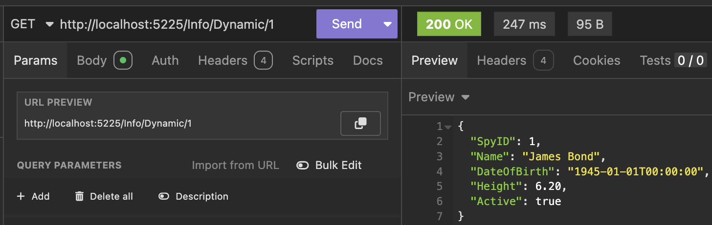

This is Part 9 of a series on using `Dapper` to simplify data access with `ADO.NET`

* [Simpler .NET Data Access With Dapper - Part 1]()
* [Dapper Part 2 - Querying The Database]()
* [Dapper Part 3 - Executing Queries]()
* [Dapper Part 4 - Passing Data To And From The Database]()
* [Dapper Part 5 - Passing Data In Bulk To The Database]()
* [Dapper Part 6 - Returning Multiple Sets Of Results]()
* [Dapper Part 7 - Adding DateOnly & TimeOnly Support]()
* [Dapper Part 8 - Controlling Database Timeouts]()
* **Dapper Part 9 - Using Dynamic Types (This Post)**
* [Dapper Part 10 - Handling Cancellations]()
* [Dapper Part 11 - Using Inheritance]()
* [Dapper Part 12 - Alternative Bulk Insert Technique]()
* [Dapper Part 13 - Using Transactions]()
* [Dapper Part 14 - Multithreading]()

In our [last post](), we looked at controlling **database timeouts** with `Dapper`.

This post will look at how to deal with [dynamic types](https://learn.microsoft.com/en-us/dotnet/csharp/advanced-topics/interop/using-type-dynamic).

Throughout this series and this blog in general, I have exclusively used [strong types](https://en.wikipedia.org/wiki/Strong_and_weak_typing). The ability to have the **compiler** and the **runtime** **verify your types** is brilliant. 

However, strong typing is unavailable in some languages (and circumstances), and **C#** (and **.NET**) can operate under those circumstances.

Let us take our usual example:

```c#
public sealed class Spy
{
    public int SpyID { get; }
    public string Name { get; } = null!;
    public DateTime DateOfBirth { get; }
}
```

We know our type and it's properties well, so we can tell `Dapper` exactly how to bind it.

```c#
app.MapGet("/Info/{spyID:int}", async (SqlConnection cn, int spyID) =>
{
    const string query = "SELECT * FROM Spies WHERE SpyID = @SpyID";
    var result = await cn.QuerySingleAsync<Spy>(query, new { SpyID = spyID });

    return result;
});
```

This returns the expected result.


The IDE tells us at all times what types we are operating with.


However, there are circumstances when **you cannot or don't wish to use strong types**. You may be doing some rapid **prototyping**. Or the source of data is in **flux**.

`Dapper` can still help under these circumstances.

We simply don't use the generic methods for querying data.

In this case:

```c#
app.MapGet("/Info/Dynamic/{spyID:int}", async (SqlConnection cn, int spyID) =>
{
    const string query = "SELECT * FROM Spies WHERE SpyID = @SpyID";
    var result = await cn.QuerySingleAsync(query, new { SpyID = spyID });

    return result;
});
```

The magic is taking place here

```c#
var result = await cn.QuerySingleAsync(query, new { SpyID = spyID });
```

This returns the following:



Notice that **all the properties from the query are returned** in the response.

The IDE tells us we are no longer dealing with a `type`, but a `dynamic` object.


This further means **you can interact with the returned object and access properties you know to be there**. At runtime, the values will be fetched.

The problem is what happens if you try to **access a property that doesn't exist** - you will get `null`.

In other words, the compiler will assume you know what you are doing when interacting with your object.

```c#
app.MapGet("/Info/Interact/{spyID:int}", async (SqlConnection cn, int spyID) =>
{
    const string query = "SELECT * FROM Spies WHERE SpyID = @SpyID";
    var result = await cn.QuerySingleAsync(query, new { SpyID = spyID });

    // Create an anonymous object
    var spy = new
    {
        result.SpyID,
        result.Name,
        result.DateOfBirth,
        // This property does not exist
        result.ThisDoesNotExist
    };
    
    return spy;
});
```

If we run this endpoint we get the following response:


You can see the **fake** property `ThisDoesNotExist` returned a `null`.

This flexibility is a **double-edged sword**. Changes to the database schema and query will lead to silently **unmapped** and/or **discarded** data in query responses.

The methods for fetching **collections** also work with dynamic objects.

```c#
app.MapGet("/Info/", async (SqlConnection cn) =>
{
    const string query = "SELECT TOP 5 *  FROM Spies";
    var result = await cn.QueryAsync(query);

    return result;
});
```

This returns the following:


### **TLDR**

***Dapper* can also work in situations where you need dynamic typing.**

The code is in my [GitHub](https://github.com/conradakunga/BlogCode/tree/master/2025-03-05%20-%20Dapper%20Part%209).

Happy hacking!
