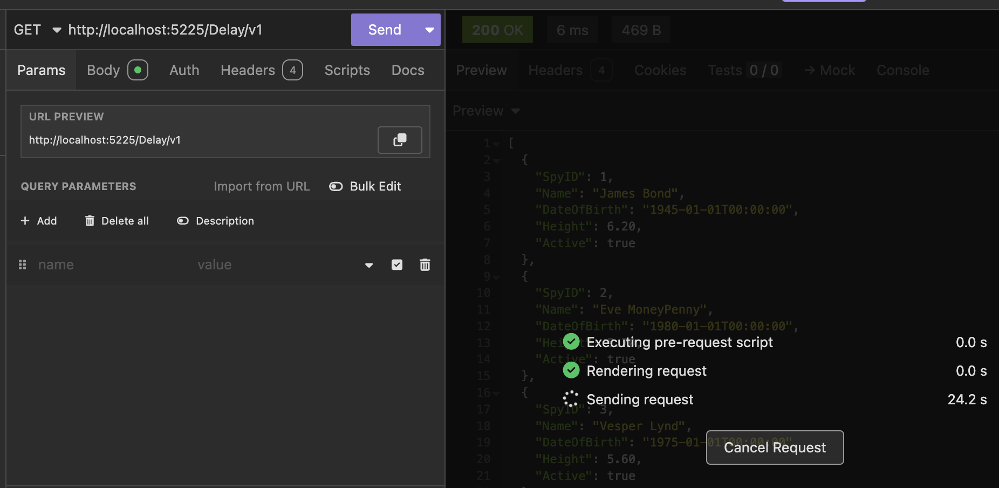

This is Part 10 of a series on using `Dapper` to simplify data access with `ADO.NET`

* [Simpler .NET Data Access With Dapper - Part 1]()
* [Dapper Part 2 - Querying The Database]()
* [Dapper Part 3 - Executing Queries]()
* [Dapper Part 4 - Passing Data To And From The Database]()
* [Dapper Part 5 - Passing Data In Bulk To The Database]()
* [Dapper Part 6 - Returning Multiple Sets Of Results]()
* [Dapper Part 7 - Adding DateOnly & TimeOnly Support]()
* [Dapper Part 8 - Controlling Database Timeouts]()
* [Dapper Part 9 - Using Dynamic Types]()
* **Dapper Part 10 - Handling Cancellations (This Post)**
* [Dapper Part 11 - Using Inheritance]()
* [Dapper Part 12 - Alternative Bulk Insert Technique]()
* [Dapper Part 13 - Using Transactions]()

In our last post, we looked at how to use `Dapper` to manage **dynamic types** in scenarios where we cannot or don't want to use **strong types.**

In this post, we will look at a scenario where we need to do some **cancellations**.

Let us take the following endpoint that gets the top 10 `Spy` entities but with a delay.

```c#
app.MapGet("/Delay/v1", async (SqlConnection cn) =>
{
    var result = await cn.QueryAsync<Spy>("[Spies.GetAllWithDelay]");

    return result;
});
```

Let us make a request, but cancel it before it is completed.



Our screen shows the following:


However, a curious thing happens after the 30th second:


We get a timeout error!

Why did that happen, given that **we canceled the request**?

What, in fact, happened here is that what got canceled was **waiting for the request to be completed**. The database query **kept going until it hit a timeout** and threw an exception.

This is very **wasteful**, given the requesting client has clearly indicated that they are no longer interested in getting a response by canceling. Therefore, there is no point in continuing to work in such a dispensation.

So how do we fix this?

We take advantage of the fact that ASP.NET, `Dapper`, and the underlying [DbConnection](https://learn.microsoft.com/en-us/dotnet/api/system.data.common.dbconnection?view=net-9.0) ([SqlConnection](https://learn.microsoft.com/en-us/dotnet/api/microsoft.data.sqlclient.sqlconnection?view=sqlclient-dotnet-standard-5.2)) support [cancellation tokens](https://learn.microsoft.com/en-us/dotnet/api/system.threading.cancellationtoken?view=net-9.0), so we can inject one into our endpoint and pass it around.

```c#
app.MapGet("/Delay/v2", async (SqlConnection cn, CancellationToken token) =>
{
    // Create a command definition object, passing our cancellation token
    var command = new CommandDefinition("[Spies.GetAllWithDelay]", cancellationToken: token);
    // Execute the command
    var result = await cn.QueryAsync<Spy>(command);

    return result;
});
```

If we cancel a request to this endpoint, we immediately see the following in the logs:


This time, **we get an explicit exception from a cancellation**.

In this manner, **we avoid wasting resources executing a query the client has canceled**.

But having said that, it is important to think about **what** is being canceled and the **impact**. Our query is a `SELECT` query, so cancellation will have no impact. But what if it was a complex **insert** query with multiple steps? What would canceling before completion mean to the state of the system? **Whether to allow canceling at all and when to do so is subjective to the circumstances of the problem domain**.

Cancellation is not unique to Dapper - the underlying ADO.NET providers are the ones that expose the cancellation ability.

### TLDR

**We can pass a `CancellationToken` to `Dapper` to propagate cancellations from client requests to the database.**

The code is in my [GitHub](https://github.com/conradakunga/BlogCode/tree/master/2025-03-06%20-%20Dapper%20Part%2010).

Happy hacking!
