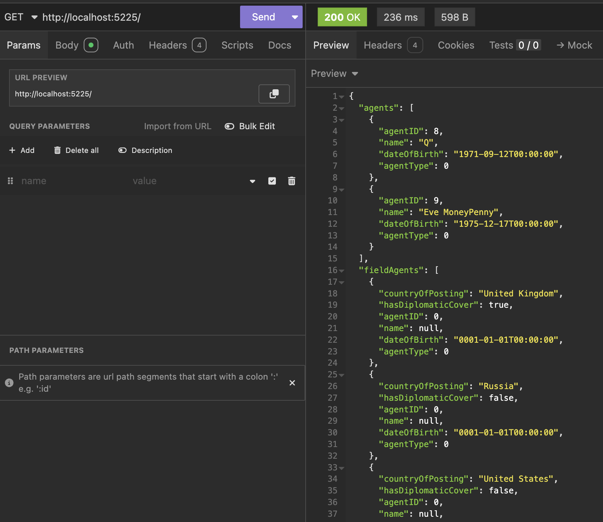

This is Part 11 of a series on using `Dapper` to simplify data access with `ADO.NET`

* [Simpler .NET Data Access With Dapper - Part 1]()
* [Dapper Part 2 - Querying The Database]()
* [Dapper Part 3 - Executing Queries]()
* [Dapper Part 4 - Passing Data To And From The Database]()
* [Dapper Part 5 - Passing Data In Bulk To The Database]()
* [Dapper Part 6 - Returning Multiple Sets Of Results]()
* [Dapper Part 7 - Adding DateOnly & TimeOnly Support]()
* [Dapper Part 8 - Controlling Database Timeouts]()
* [Dapper Part 9 - Using Dynamic Types]()
* [Dapper Part 10 - Handling Cancellations]()
* **Dapper Part 11 - Using Inheritance (This Post)**
* [Dapper Part 12 - Alternative Bulk Insert Technique]()
* [Dapper Part 13 - Using Transactions]()
* [Dapper Part 14 - Multithreading]()
* [Dapper Part 15 - Using The IN Clause]()

In our [last post](), we looked at using [cancellation tokens](https://learn.microsoft.com/en-us/dotnet/api/system.threading.cancellationtoken?view=net-9.0) to cancel queries.

In this post, we will look at how to use `Dapper` to support a common design pattern - storing a hierarchy of inheritance in a table called [Table Per Class](https://www.tutorialspoint.com/what-are-various-inheritance-mapping-strategies-available-in-hibernate).

Let us take this type, an `Agent`:

```c#
public class Agent
{
    public int AgentID { get; }
    public string Name { get; } = null!;
    public DateTime DateOfBirth { get; }
}
```

We also have this type, a `FieldAgent`. This is an `Agent` that has been posted.

```c#
public class FieldAgent
{
  public int AgentID { get; }
  public string Name { get; } = null!;
  public DateTime DateOfBirth { get; }
  public string? CountryOfPosting { get; }
  public bool HasDiplomaticCover { get; }
}
```

Looking at these types, we realize that a `FieldAgent` is a **superset** of an `Agent`.

We can refactor the `FieldAgent` as follows:

```c#
public class FieldAgent : Agent
{
    public string? CountryOfPosting { get; }
    public bool HasDiplomaticCover { get; }
}
```

What if we were to store these in a **database table**? The schema would look like this:

| Name               | Type            |
| ------------------ | --------------- |
| AgentID            | `int`           |
| Name               | `nvarchar(250)` |
| DateOfBirth        | `Date`          |
| CountryOfPosting   | `nvarchar(100)` |
| HasDiplomaticCover | `bit`           |

But just from looking at the data table, how can we tell a `FieldAgent` from a normal `Agent`?

We introduce a new field, called a **discriminator**, for this purpose.

| Name               | Type            |
| ------------------ | --------------- |
| AgentType            | `int`          |

We then create an [enum](https://learn.microsoft.com/en-us/dotnet/csharp/language-reference/builtin-types/enum) to store this:

```c#
public enum AgentType
{
    Agent,
    Field
}
```

Then we add this new property to our base class:

```c#
public class Agent
{
    public int AgentID { get; }
    public string Name { get; } = null!;
    public DateTime DateOfBirth { get; }
    public AgentType AgentType { get; }
}
```

The DDL to create this table is as follows:

```sql
CREATE TABLE Agents
    (
        AgentID            INT           PRIMARY KEY IDENTITY(1, 1),
        Name               NVARCHAR(100) NOT NULL,
        DateOfBirth        DATE          NOT NULL,
        CountryOfPosting   NVARCHAR(100) NULL,
        HasDiplomaticCover BIT           NULL,
        AgentType          INT           NOT NULL
    );
```

We can seed the data as follows:

```sql
INSERT INTO Agents
    (
        Name,
        DateOfBirth,
        CountryOfPosting,
        HasDiplomaticCover,
        AgentType
    )
VALUES
    (
        'James Bond', '1970-04-13', 'United Kingdom', 1, 1
    ),
    (
        'Natasha Romanoff', '1984-11-22', 'Russia', 0, 1
    ),
    (
        'Ethan Hunt', '1964-08-18', 'United States', 0, 1
    ),
    (
        'Q', '1971-09-12', NULL, NULL, 0
    ),
    (
        'Eve MoneyPenny', '1975-12-17', NULL, NULL, 0
    );
```

To query and correctly hydrate our objects, we operate as follows:

1. Create a **connection** to the database
2. Execute a query and return a [reader](https://learn.microsoft.com/en-us/dotnet/api/system.data.common.dbdatareader?view=net-9.0)
3. Map the **reader** to **parsers**
4. **Conditionally load** the parsers using the reader.

Our endpoint will look like this:

```c#
app.MapGet("/", async (SqlConnection cn) =>
{
    List<Agent> agents = [];
    List<FieldAgent> fieldAgents = [];

    const string sql = """
                       SELECT
                           Agents.AgentID,
                           Agents.Name,
                           Agents.DateOfBirth,
                           Agents.CountryOfPosting,
                           Agents.HasDiplomaticCover,
                           Agents.AgentType
                       FROM
                           dbo.Agents;
                       """;
    await using (var reader = await cn.ExecuteReaderAsync(sql))
    {
        // Declare parsers
        var agentsParser = reader.GetRowParser<Agent>();
        var fieldAgentsParser = reader.GetRowParser<FieldAgent>();

        while (reader.Read())
        {
            // Read our discriminating column value
            var discriminator = (AgentType)reader.GetInt32(reader.GetOrdinal(nameof(AgentType)));
            // Use discriminator to parse rows
            switch (discriminator)
            {
                case AgentType.Agent:
                    agents.Add(agentsParser(reader));
                    break;
                case AgentType.Field:
                    fieldAgents.Add(fieldAgentsParser(reader));
                    break;
                default:
                    throw new ArgumentOutOfRangeException(nameof(discriminator), "Invalid agent type");
            }
        }
    }

    // Output the results
    return new { Agents = agents, FieldAgents = fieldAgents };
});
```

And our results will be as follows:



### TLDR

**`Dapper` allows you to retrieve data stored in a hierarchical tabble in the table per concrete class pattern.**

The code is in my [GitHub](https://github.com/conradakunga/BlogCode/tree/master/2025-03-07%20-%20Dapper%20Part%2011).

Happy hacking!
