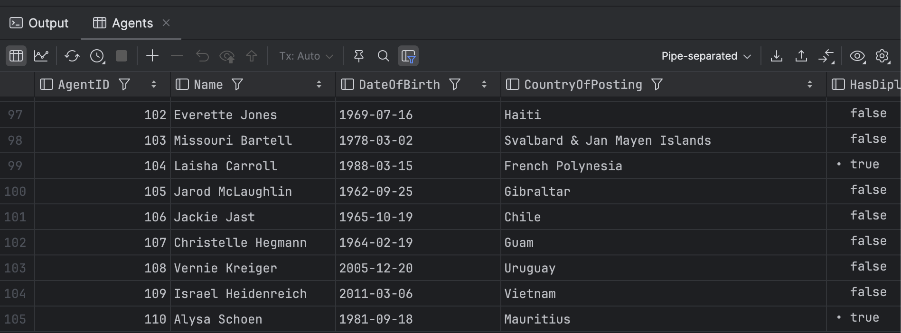

This is Part 12 of a series on using `Dapper` to simplify data access with `ADO.NET`

* [Simpler .NET Data Access With Dapper - Part 1]()
* [Dapper Part 2 - Querying The Database]()
* [Dapper Part 3 - Executing Queries]()
* [Dapper Part 4 - Passing Data To And From The Database]()
* [Dapper Part 5 - Passing Data In Bulk To The Database]()
* [Dapper Part 6 - Returning Multiple Sets Of Results]()
* [Dapper Part 7 - Adding DateOnly & TimeOnly Support]()
* [Dapper Part 8 - Controlling Database Timeouts]()
* [Dapper Part 9 - Using Dynamic Types]()
* [Dapper Part 10 - Handling Cancellations]()
* [Dapper Part 11 - Using Inheritance]()
* **Dapper Part 12 - Alternative Bulk Insert Technique (This Post)**
* [Dapper Part 13 - Using Transactions]()
* [Dapper Part 14 - Multithreading]()

In a [previous post](), we discussed inserting multiple entities in a **loop**.

In this post, we will look at a different way of achieving the same thing.

We will use the following type:

```c#
public class FieldAgent
{
    public int AgentID { get; }
    public string Name { get; } = null!;
    public DateTime DateOfBirth { get; }
    public AgentType AgentType { get; }
    public string? CountryOfPosting { get; }
    public bool HasDiplomaticCover { get; }
}
```

Next, we write a query to insert `FieldAgents`

```sql
INSERT dbo.Agents
(
   Name,
   DateOfBirth,
   CountryOfPosting,
   HasDiplomaticCover,
   AgentType
)
VALUES
(
   @Name, @DateOfBirth, @CountryOfPosting, HasDiplomaticCover, @AgentType
) 
```

Finally, we create our endpoint:

```c#
app.MapPost("/", async (SqlConnection cn) =>
{
    // Create query to insert
    const string sql = """
                       INSERT dbo.Agents
                           (
                               Name,
                               DateOfBirth,
                               CountryOfPosting,
                               HasDiplomaticCover,
                               AgentType
                           )
                       VALUES
                           (
                               @Name, @DateOfBirth, @CountryOfPosting, HasDiplomaticCover, @AgentType
                           ) 
                       """;
    // Configure bogus
    var faker = new Faker<FieldAgent>();
    // Generate a full name
    faker.RuleFor(x => x.Name, f => f.Name.FullName());
    // Date of birth, max 90 years go
    faker.RuleFor(x => x.DateOfBirth, f => f.Date.Past(90));
    // Country of posting
    faker.RuleFor(x => x.CountryOfPosting, f => f.Address.Country());
    // Randomly assign diplomatic cover
    faker.RuleFor(x => x.HasDiplomaticCover, f => f.Random.Bool());
    // Agent type is field
    faker.RuleFor(x => x.AgentType, AgentType.Field);

    // Generate  a list of 100 field agents
    var fieldAgents = faker.Generate(100);
    // Now execute the query
    var inserted = await cn.ExecuteAsync(sql, fieldAgents);

    return inserted;
});
```

If we run this, we will get the following:


Our 100 rows have been **inserted**.

We can verify this by checking the table.



**It is important to note that you may have provided a collection of entities to insert, but what is going to happen is the insert query will be run 100 times to insert each `FieldAgent`.**

### TLDR

**Rather than writing your own loop, you can provide a collection of entities for entry, and `Dapper` will execute the relevant queries for each element.**

The code is in my [GitHub](https://github.com/conradakunga/BlogCode/tree/master/2025-03-08%20-%20Dapper%20Part%2012).

Happy hacking!
