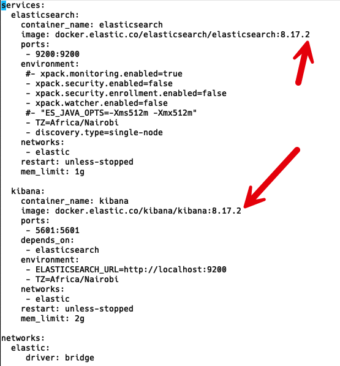
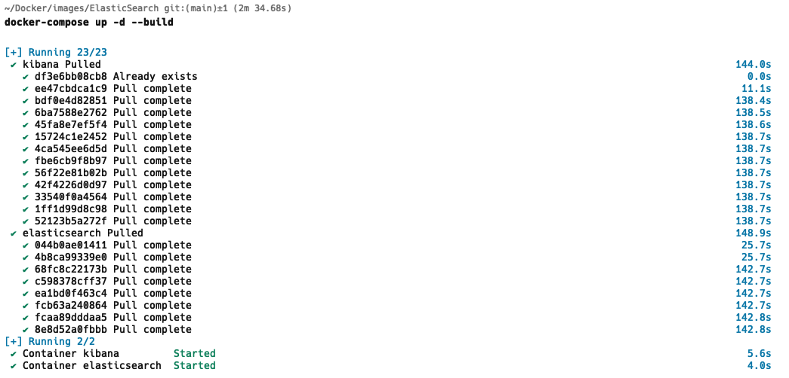
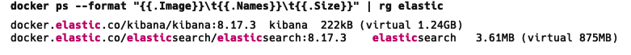

Currently, on my machine, I have a number of [Docker](https://www.docker.com/) images running.

I can **list** them as follows:


```bash
docker ps --format '{{.Image}}\t{{.Names}}\t{{.Size}}'
```


This returns the following:

```plaintext
changemakerstudiosus/papercut-smtp:latest	optimistic_hellman	1.45MB (virtual 270MB)
rabbitmq:management-alpine	rabbitmq	225kB (virtual 192MB)
ghcr.io/microsoft/garnet	Garnet	217kB (virtual 235MB)
datalust/seq:preview	seq	1.73MB (virtual 439MB)
docker.elastic.co/kibana/kibana:8.17.2	kibana	222kB (virtual 1.28GB)
docker.elastic.co/elasticsearch/elasticsearch:8.17.2	elasticsearch	15.3MB (virtual 871MB)
containrrr/watchtower	Watchtower	216kB (virtual 14.4MB)
redis:alpine	redis	225kB (virtual 42MB)
mcr.microsoft.com/mssql/server:2022-latest	sql_server_2022	419MB (virtual 2.04GB)
```

I can **filter** to just view the elastic containers using [ripgrep](https://github.com/BurntSushi/ripgrep).


```bash
docker ps --format "{{.Image}} - {{.Names}}: {{.Size}}" | rg elastic
```


This returns the following:

```plaintext
docker.elastic.co/kibana/kibana:8.17.2 - kibana: 222kB (virtual 1.28GB)
docker.elastic.co/elasticsearch/elasticsearch:8.17.2 - elasticsearch: 15.2MB (virtual 871MB)
```

If you don't use `ripgrep`, standard [grep](https://en.wikipedia.org/wiki/Grep) will work just as well.

We can see here that my containers are using version `8.17.2`.

I can then check if there is a later version of the [elastic images](https://hub.docker.com/_/elasticsearch). I have covered this in a [previous post]().

The command returns the following as of today (9 March 2025)

```plaintext
8.17.3
8.17.2
8.17.1
8.17.0
8.16.5
8.16.4
8.16.3
8.16.2
7.17.28
7.17.27
```

So there is a new tag - `8.17.3`

Upgrading this consists of the following steps:

1. **Update** the [docker-compose.yaml](https://docs.docker.com/reference/compose-file/) files
2. **Restart** the image (s)

The first is very straightforward, using [vi](https://www.geeksforgeeks.org/vi-editor-unix/) or your favourite editor.



Typically, the next step would be to **stop** the image, like so:

```bash
docker-compose --down
```

And then **start** it again

```bash
docker-compose up --d
```

This can be **combined into a single step**.

```bash
docker-compose up -d --build
```

This will stop the container, pull down the latest image (if not already present) and then re-build and start in the background the container with the new image.



If we re-run our command to list running images, filtered by `elastic`

```bash
docker ps --format '{{.Image}} - {{.Names}}: {{.Size}}' | rg elastic
```

We will see the following:



### TLDR

**The command `docker-compose up -d --build` can stop, rebuild and restart your containers in a single command.**

Happy hacking!
