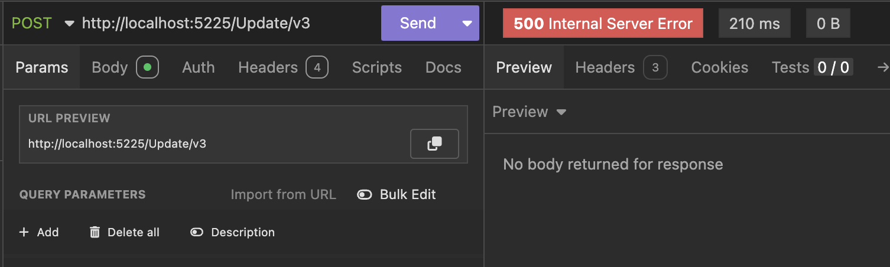

This is Part 13 of a series on using `Dapper` to simplify data access with `ADO.NET`

* [Simpler .NET Data Access With Dapper - Part 1]()
* [Dapper Part 2 - Querying The Database]()
* [Dapper Part 3 - Executing Queries]()
* [Dapper Part 4 - Passing Data To And From The Database]()
* [Dapper Part 5 - Passing Data In Bulk To The Database]()
* [Dapper Part 6 - Returning Multiple Sets Of Results]()
* [Dapper Part 7 - Adding DateOnly & TimeOnly Support]()
* [Dapper Part 8 - Controlling Database Timeouts]()
* [Dapper Part 9 - Using Dynamic Types]()
* [Dapper Part 10 - Handling Cancellations]()
* [Dapper Part 11 - Using Inheritance]()
* [Dapper Part 12 - Alternative Bulk Insert Technique]()
* **Dapper Part 13 - Using Transactions (This Post)**
* [Dapper Part 14 - Multithreading]()
* [Dapper Part 15 - Using The IN Clause]()
* [Dapper Part 16 - Consideration When Passing Parameters]()

In the [last post of this series](), we looked at an alternative way to insert several rows at once.

In this post, we will look at how to use [database transactions](https://www.geeksforgeeks.org/transaction-in-dbms/).

You will need this functionality in scenarios where we need **multiple database operations to be treated as a unit.** Which is to say, **they all fail together or they all succeed together**.

Let us look at our existing data in the `Spy` table.


Suppose we want to change some information for the first 3 spies.

We would create an endpoint as follows:

```c#
app.MapPost("/Update/v1", async (SqlConnection cn) =>
{
    // setup our update queries
    const string firstUpdate = "UPDATE Spies SET Name = 'James Perceval Bond' WHERE SpyID = 1";
    const string secondUpdate = "UPDATE Spies SET Name = 'Eve Janet MoneyPenny' WHERE SpyID = 2";
    const string thirdUpdate = "UPDATE Spies SET Name = 'Vesper Leonora Lynd' WHERE SpyID = 3";

    // Execute our queries
    await cn.ExecuteAsync(firstUpdate);
    await cn.ExecuteAsync(secondUpdate);
    await cn.ExecuteAsync(thirdUpdate);

    // Return ok
    return Results.Ok();
});
```

If we execute this endpoint and query our database again, we get the following:


So far, so good.

Here, all three queries are **independent of each other**. If, for some reason, the update for ***Vesper Lynd*** failed - `thirdUpdate`, **the other two would be unaffected**.

Sometimes, we do not want this. 

A common situation is where you insert an `Order` and some `OrderItems`.

In this situation, we will require a [transaction](https://learn.microsoft.com/en-us/dotnet/api/microsoft.data.sqlclient.sqltransaction?view=sqlclient-dotnet-standard-5.2).

This is done as follows:

```c#
app.MapPost("/Update/v2", async (SqlConnection cn, ILogger<Program> logger) =>
{
    // Open the connection
    await cn.OpenAsync();
    // Obtain a transaction from the connection
    await using (var transaction = await cn.BeginTransactionAsync())
    {
        try
        {
            // setup our update queries
            const string firstUpdate = "UPDATE Spies SET Name = 'James Michael Bond' WHERE SpyID = 1";
            const string secondUpdate = "UPDATE Spies SET Name = 'Eve Jean MoneyPenny' WHERE SpyID = 2";
            const string thirdUpdate = "UPDATE Spies SET Name = 'Vesper Madison Lynd' WHERE SpyID = 3";

            // Execute our queries, passing the transaction to each
            await cn.ExecuteAsync(firstUpdate, transaction);
            await cn.ExecuteAsync(secondUpdate, transaction);
            await cn.ExecuteAsync(thirdUpdate, transaction);

            // Commit the transaction if all queries
            // executed successfully
            await transaction.CommitAsync();
        }
        catch (Exception ex)
        {
            // Log the exception
            logger.LogError(ex, "An error occured during transaction");
            // Rollback changes
            await transaction.RollbackAsync();
        }
    }

    // Return ok
    return Results.Ok();
});
```

If we run this endpoint, we get the following results:


This is as expected.

To demonstrate what happens if one of the queries fails, let us introduce an exception into a third endpoint.

```c#
app.MapPost("/Update/v3", async (SqlConnection cn, ILogger<Program> logger) =>
{
    // Open the connection
    await cn.OpenAsync();
    // Obtain a transaction from the connection
    await using (var trans = await cn.BeginTransactionAsync())
    {
        try
        {
            // setup our update queries
            const string firstUpdate = "UPDATE Spies SET Name = 'James Bond' WHERE SpyID = 1";
            const string secondUpdate = "UPDATE Spies SET Name = 'Eve MoneyPenny' WHERE SpyID = 2";
            const string thirdUpdate = "UPDATE Spies SET Name = 'Vesper Lynd' WHERE SpyID = 3";

            // Execute our queries, passing the transaction to each
            await cn.ExecuteAsync(firstUpdate, transaction: trans);
            await cn.ExecuteAsync(secondUpdate, transaction: trans);
            await cn.ExecuteAsync(thirdUpdate, transaction: trans);

            // throw some exception here
            throw new Exception("A random exception");

            // Commit the transaction if all queries
            // executed successfully
            await trans.CommitAsync();
        }
        catch (Exception ex)
        {
            // Log the exception
            logger.LogError(ex, "An error occured during transaction");
            // Rollback changes
            await trans.RollbackAsync();
            // Return an error response
            return Results.InternalServerError();
        }
    }

    // Return ok
    return Results.Ok();
});
```

This returns the following:



If we look at the logs:


And finally if we look at the database:


Here we can see that much as the queries themselves **should have executed successfully**, the fact that we indicated that we should **rollback any transaction once we encounter an exception** overrides that.

### TLDR

**`Dapper`, through the underling `DbConnection`, allows us to use database transactions in our logic.**

The code is in my [GitHub](https://github.com/conradakunga/BlogCode/tree/master/2025-03-10%20-%20Dapper%20Part%2013).

Happy hacking!
