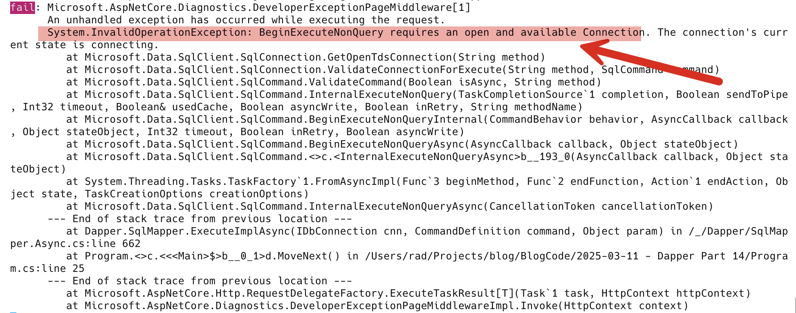
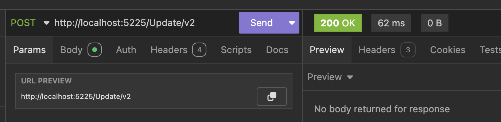
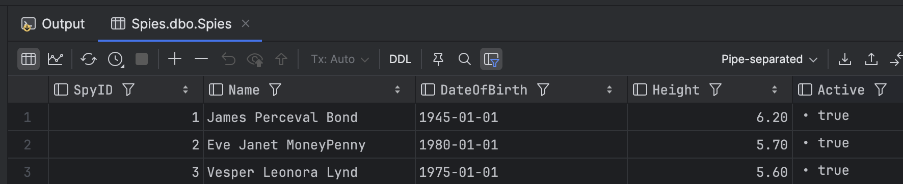

This is Part 14 of a series on using `Dapper` to simplify data access with `ADO.NET`

* [Simpler .NET Data Access With Dapper - Part 1]()
* [Dapper Part 2 - Querying The Database]()
* [Dapper Part 3 - Executing Queries]()
* [Dapper Part 4 - Passing Data To And From The Database]()
* [Dapper Part 5 - Passing Data In Bulk To The Database]()
* [Dapper Part 6 - Returning Multiple Sets Of Results]()
* [Dapper Part 7 - Adding DateOnly & TimeOnly Support]()
* [Dapper Part 8 - Controlling Database Timeouts]()
* [Dapper Part 9 - Using Dynamic Types]()
* [Dapper Part 10 - Handling Cancellations]()
* [Dapper Part 11 - Using Inheritance]()
* [Dapper Part 12 - Alternative Bulk Insert Technique]()
* [Dapper Part 13 - Using Transactions]()
* **Dapper Part 14 - Multithreading (This Post)**

In our [last post](), we looked at how to use database transactions to treat our queries **atomically**. Which is to say, **they all succeed, or they all fail**.

In this post, we will look at some considerations when executing queries in **multiple threads**.

Suppose we want to update three `Spy` entities and run the queries that **effect these changes simultaneously in multiple threads**.

An initial attempt might look like this:

```c#
 // setup our update queries
    const string firstUpdate = "UPDATE Spies SET Name = 'James Perceval Bond' WHERE SpyID = 1";
    const string secondUpdate = "UPDATE Spies SET Name = 'Eve Janet MoneyPenny' WHERE SpyID = 2";
    const string thirdUpdate = "UPDATE Spies SET Name = 'Vesper Leonora Lynd' WHERE SpyID = 3";

    // Execute our queries
    var firstQuery = cn.ExecuteAsync(firstUpdate);
    var secondQuery = cn.ExecuteAsync(secondUpdate);
    var thirdQuery = cn.ExecuteAsync(thirdUpdate);

    await Task.WhenAll(firstQuery, secondQuery, thirdQuery);

    // Return ok
    return Results.Ok();
```

If we run this, we get the following in the logs:

 

This exception is thrown because the [DbConnection](https://learn.microsoft.com/en-us/dotnet/api/system.data.common.dbconnection?view=net-9.0) ([SqlConnection](https://learn.microsoft.com/en-us/dotnet/api/microsoft.data.sqlclient.sqlconnection?view=sqlclient-dotnet-standard-5.2)) object **is not thread-safe**! **The three threads compete** to open, execute, and close the connection.

The solution to this problem is to **create a new connection for each query**.

This will look like this:

```c#
app.MapPost("/Update/v2", async () =>
{
    // setup our update queries
    const string firstUpdate = "UPDATE Spies SET Name = 'James Perceval Bond' WHERE SpyID = 1";
    const string secondUpdate = "UPDATE Spies SET Name = 'Eve Janet MoneyPenny' WHERE SpyID = 2";
    const string thirdUpdate = "UPDATE Spies SET Name = 'Vesper Leonora Lynd' WHERE SpyID = 3";

    // Execute our queries, with a new connection for each
    var firstQuery = new SqlConnection(connectionString).ExecuteAsync(firstUpdate);
    var secondQuery = new SqlConnection(connectionString).ExecuteAsync(secondUpdate);
    var thirdQuery = new SqlConnection(connectionString).ExecuteAsync(thirdUpdate);

    await Task.WhenAll(firstQuery, secondQuery, thirdQuery);

    // Return ok
    return Results.Ok();
});
```

We get the following results from the API:



And our data is updated:



### TLDR

**The `DbConnection` object is not thread-safe, and should you wish to run queries in parallel, create connections for each thread.**

The code is in my [GitHub](https://github.com/conradakunga/BlogCode/tree/master/2025-03-11%20-%20Dapper%20Part%2014).

Happy hacking!
