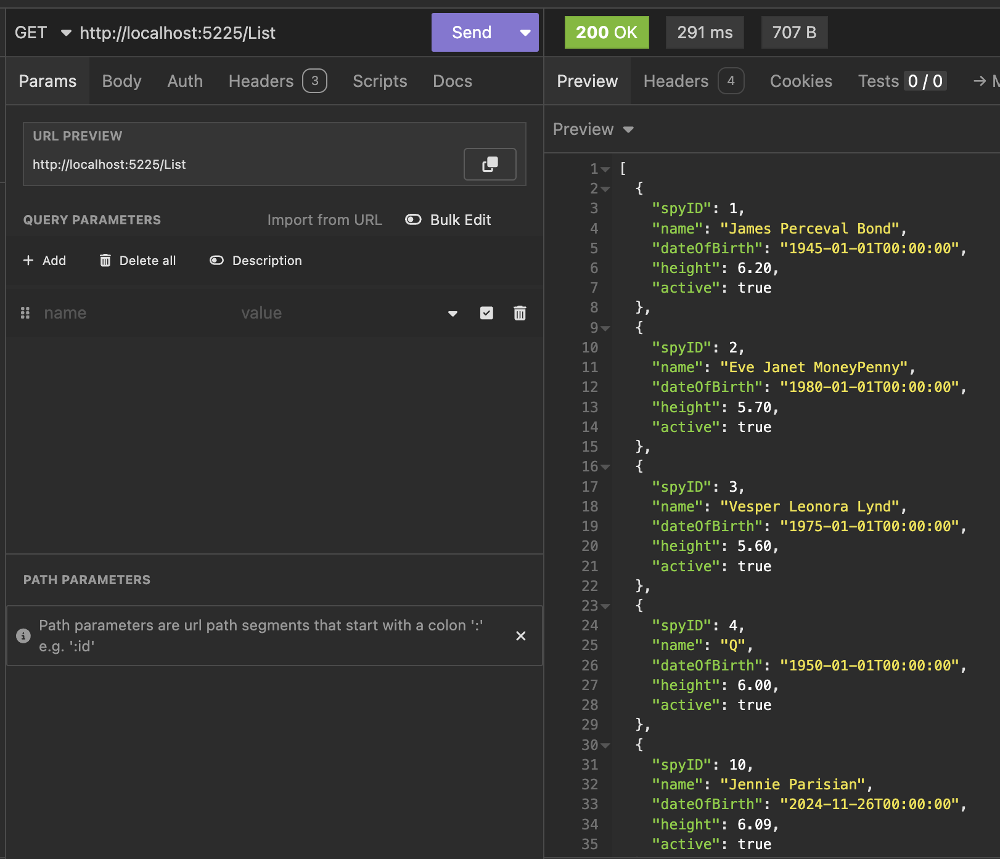

This is Part 15 of a series on using `Dapper` to simplify data access with `ADO.NET`

* [Simpler .NET Data Access With Dapper - Part 1]()
* [Dapper Part 2 - Querying The Database]()
* [Dapper Part 3 - Executing Queries]()
* [Dapper Part 4 - Passing Data To And From The Database]()
* [Dapper Part 5 - Passing Data In Bulk To The Database]()
* [Dapper Part 6 - Returning Multiple Sets Of Results]()
* [Dapper Part 7 - Adding DateOnly & TimeOnly Support]()
* [Dapper Part 8 - Controlling Database Timeouts]()
* [Dapper Part 9 - Using Dynamic Types]()
* [Dapper Part 10 - Handling Cancellations]()
* [Dapper Part 11 - Using Inheritance]()
* [Dapper Part 12 - Alternative Bulk Insert Technique]()
* [Dapper Part 13 - Using Transactions]()
* [Dapper Part 14 - Multithreading]()
* **Dapper Part 15 - Using The IN Clause (This Post)**
* [Dapper Part 16 - Consideration When Passing Parameters]()

In the [last post](), we looked at considerations for **multithreading**.

This post will discuss how to use the [SQL IN clause](https://learn.microsoft.com/en-us/sql/t-sql/language-elements/in-transact-sql?view=sql-server-ver16).

In a [previous post](), we saw how to use [table-valued parameters](https://learn.microsoft.com/en-us/sql/relational-databases/tables/use-table-valued-parameters-database-engine?view=sql-server-ver16) to bulk-send data to the database.

Sometimes, you have a situation where your data is in a simple **list of primitives**.

In such a situation, you do not need the overhead of a [user-defined type](https://learn.microsoft.com/en-us/sql/relational-databases/clr-integration-database-objects-user-defined-types/working-with-user-defined-types-in-sql-server?view=sql-server-ver16) and a `table-valued parameter`.

Let us take a situation where we need to load the details of several `Spy` entities with their `SpyIDs` provided at runtime.

If we knew the IDs **in advance**, we would write a query like this:

```sql
SELECT *
FROM Spies
WHERE Spies.SpyID in (1, 2 ,3 ,4, 6, 10, 13, 56)
```

However, if the IDs are being provided at **runtime**, we do something like this:

```c#
app.MapGet("/List", async (SqlConnection cn) =>
{
    // create query
    const string query = """
                         SELECT * FROM Spies
                         WHERE Spies.SpyID IN @Spies
                         """;
    // define a collection to store the IDs
    int[] ids = [1, 2, 3, 4, 6, 10, 13, 56];

    // Fetch the spies
    var spies = await cn.QueryAsync<Spy>(query, new { Spies = ids});
    return spies;
});
```

This will return the following:



The magic is taking place here:

```c#
 // Fetch the spies
 var spies = await cn.QueryAsync<Spy>(query, new { Spies = ids});
```

`Dapper` can use the list to construct a valid `IN` query.

Note that the query itself **does not have brackets around the parameter.**

```sql
SELECT * FROM Spies
WHERE Spies.SpyID IN @Spies
```

### TLDR

**Dapper can construct and execute valid `IN` clause statements using collections.**

The code is in my [GitHub](https://github.com/conradakunga/BlogCode/tree/master/2025-03-12%20-%20Dapper%20Part%2015).

Happy hacking!
