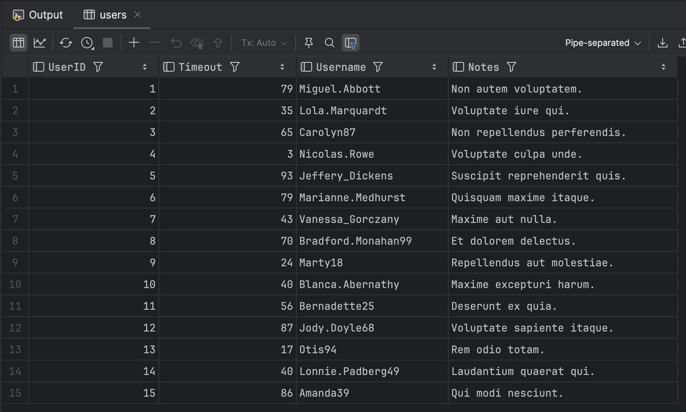
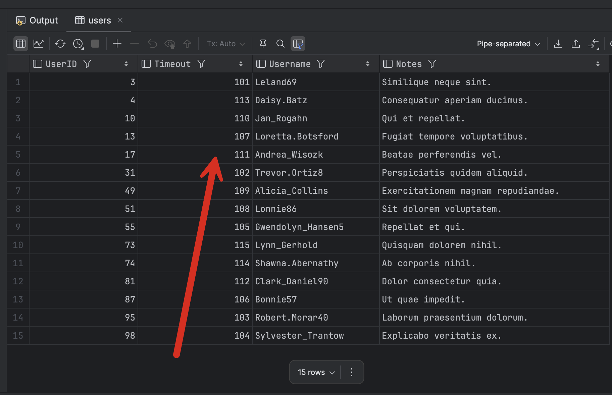

I ran into an interesting issue recently that might trip you up.

This is when you use [user-defined table types](https://learn.microsoft.com/en-us/sql/relational-databases/server-management-objects-smo/tasks/using-user-defined-tables?view=sql-server-ver16), as [outlined in a previous post]().

Assume we have the following table:

```sql
CREATE TABLE Users
    (
        UserID   INT            PRIMARY KEY NOT NULL,
        Timeout  INT            NOT NULL,
        Username NVARCHAR(50)   NOT NULL,
        Notes    NVARCHAR(1000) NOT NULL
    )
```

We then have the following user-defined table type

```sql
CREATE TYPE dbo.UserType AS TABLE
    (
        UserID   INT            NOT NULL,
        Timeout  INT            NOT NULL,
        Username NVARCHAR(50)   NOT NULL,
        Notes    NVARCHAR(1000) NOT NULL
    );
GO
```

And we have the following procedure that, for our own reasons, we want to use to insert multiple users.

```sql
CREATE PROC [Users.Insert] @Users UserType READONLY
AS
    BEGIN
        INSERT dbo.Users
            (
                UserID,
                Timeout,
                Username,
                Notes
            )
               SELECT
                   [@Users].UserID,
                   [@Users].Timeout,
                   [@Users].Username,
                   [@Users].Notes
               FROM
                   @Users;
    END;
```

Let us then create a type for our use.

```c#
public record User
{
    public int UserID { get; set; }
    public int Timeout { get; set; }
    public string Username { get; set; }
    public string Notes { get; set; }
}
```

We then have the following endpoint to invoke this operation.

```c#
app.MapGet("/Insert", async (SqlConnection cn) =>
{
    // Create a data table for mapping
    var dt = new DataTable();
    dt.Columns.Add("UserID", typeof(int));
    dt.Columns.Add("Timeout", typeof(int));
    dt.Columns.Add("Username", typeof(string));
    dt.Columns.Add("Notes", typeof(string));

    // Create our faker

    // Initialize a counter
    var counter = 0;

    var faker = new Faker<User>()
        // Auto number the user id from 0
        .RuleFor(u => u.UserID, f => ++counter)
        // Set the timout to be a random number between 0 and 100
        .RuleFor(u => u.Timeout, f => f.Random.Int(0, 100))
        // Generate a realistic user name
        .RuleFor(u => u.Username, f => f.Person.UserName)
        // Generate lorem notes
        .RuleFor(u => u.Notes, f => f.Lorem.Sentence(3));

    // Generate 15 users
    var users = faker.Generate(15);

    // Add to our datatable
    foreach (var user in users)
    {
        var row = dt.NewRow();
        row["UserID"] = user.UserID;
        row["Timeout"] = user.Timeout;
        row["Username"] = user.Username;
        row["Notes"] = user.Notes;
        dt.Rows.Add(row);
    }

    // Setup dapper
    var param = new DynamicParameters();
    param.Add("Users", dt.AsTableValuedParameter());
    await cn.ExecuteAsync("[Users.Insert]", param);

    return Results.Ok();
});
```

If we run this endpoint, we can see the following in the database:



So far, so good.

Now, let us clone the existing end point and make two changes:

1. Start the `UserID` numbering from **100**
2. Change the order of the `DataTable` setup - here, we **reverse** the order of **UserID** and **Timeout**.

```c#
app.MapGet("/InsertBug", async (SqlConnection cn) =>
{
    // Create a data table for mapping, swapping the order
    var dt = new DataTable();
    dt.Columns.Add("Timeout", typeof(int));
    dt.Columns.Add("UserID", typeof(int));
    dt.Columns.Add("Username", typeof(string));
    dt.Columns.Add("Notes", typeof(string));

    // Create our faker

    // Initialize a counter from 100
    var counter = 100;

    var faker = new Faker<User>()
        // Auto number the user id from 0
        .RuleFor(u => u.UserID, f => ++counter)
        // Set the timeout to be a random number between 0 and 100
        .RuleFor(u => u.Timeout, f => f.Random.Int(0, 100))
        // Generate a realistic user name
        .RuleFor(u => u.Username, f => f.Person.UserName)
        // Generate lorem notes
        .RuleFor(u => u.Notes, f => f.Lorem.Sentence(3));

    // Generate 15 users
    var users = faker.Generate(15);

    // Add to our datatable
    foreach (var user in users)
    {
        var row = dt.NewRow();
        row["UserID"] = user.UserID;
        row["Timeout"] = user.Timeout;
        row["Username"] = user.Username;
        row["Notes"] = user.Notes;
        dt.Rows.Add(row);
    }

    // Setup dapper
    var param = new DynamicParameters();
    param.Add("Users", dt.AsTableValuedParameter());
    await cn.ExecuteAsync("[Users.Insert]", param);

    return Results.Ok();
});
```

Before we run this endpoint, let us delete the existing users.

```sql
DELETE FROM Users
```

If we now run this endpoint, the database will look something like this.



If you look closely, you will see that the `Timeouts` are sequential from 100, which we had configured for our `UserID`!

The long and short of it is that **you must define the data table columns in the same order as they are when defining the user-defined table type**. If you don't when the parameter gets to the database, SQL Server will not use your column names to match - **it will use their order**.

### TLDR

**Columns for data tables that map data to user-defined table types must be defined in the same order as they are on the type.**

The code is in my [GitHub](https://github.com/conradakunga/BlogCode/tree/master/2025-03-13%20Beware%20UDTs).

Happy hacking!
