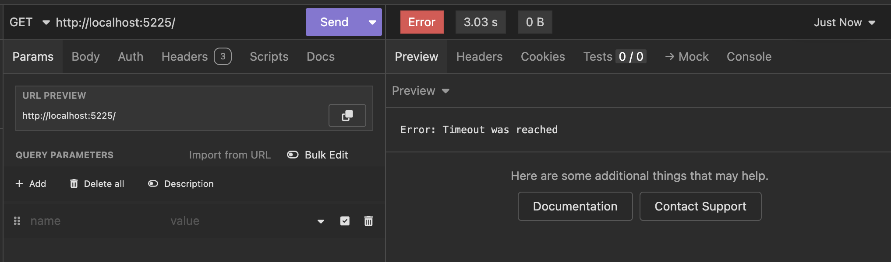
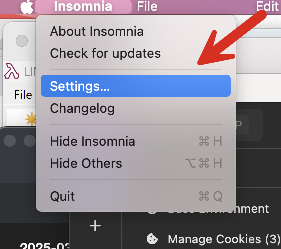
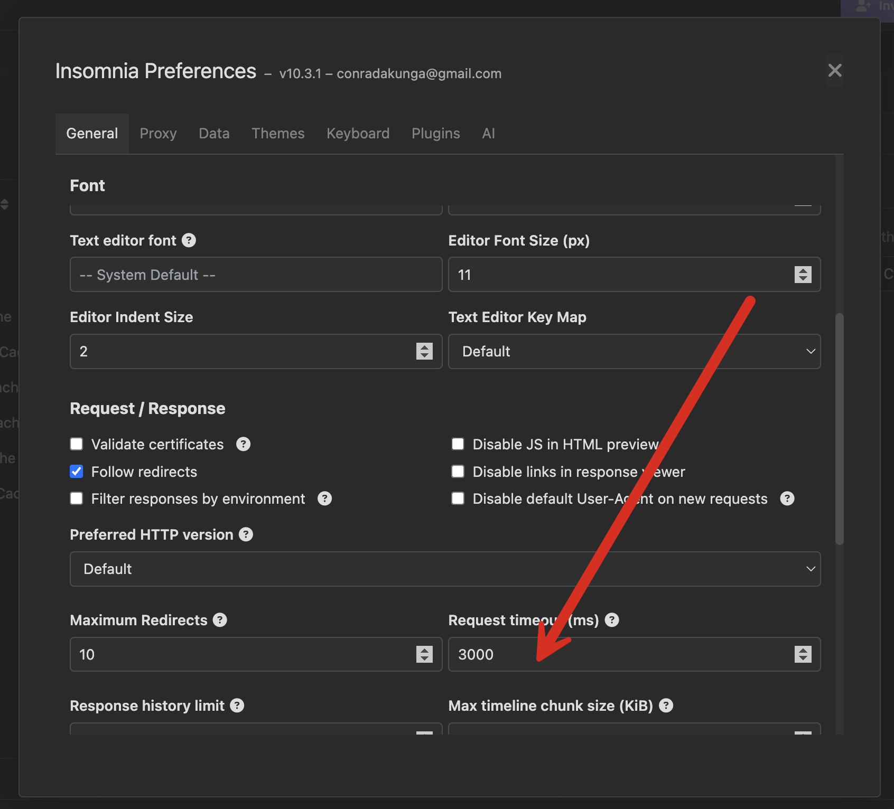

When making API requests, my tools of choice are [Insomnia](https://insomnia.rest/) and [httpie](https://httpie.io/). If working on a machine I have no control over, then the tried and trusty [curl](https://curl.se/).

I am not a fan of [Postman](https://www.postman.com/). I find it objectionable. But that is a discussion for another day. If you need Postman-like features, use [ApiDog](https://apidog.com/) instead.

If you make a request using Insomnia against an endpoint that takes **a long time to execute**, you will see the following after 30 seconds:

This is not the API triggering the timeout; this is Insomnia **canceling after a 30-second wait**. This is a default you can configure for yourself:

Go to the settings menu:

Then, scroll down to the `RequestTimeout` setting. Set that to `0` to **turn off timeouts**.

