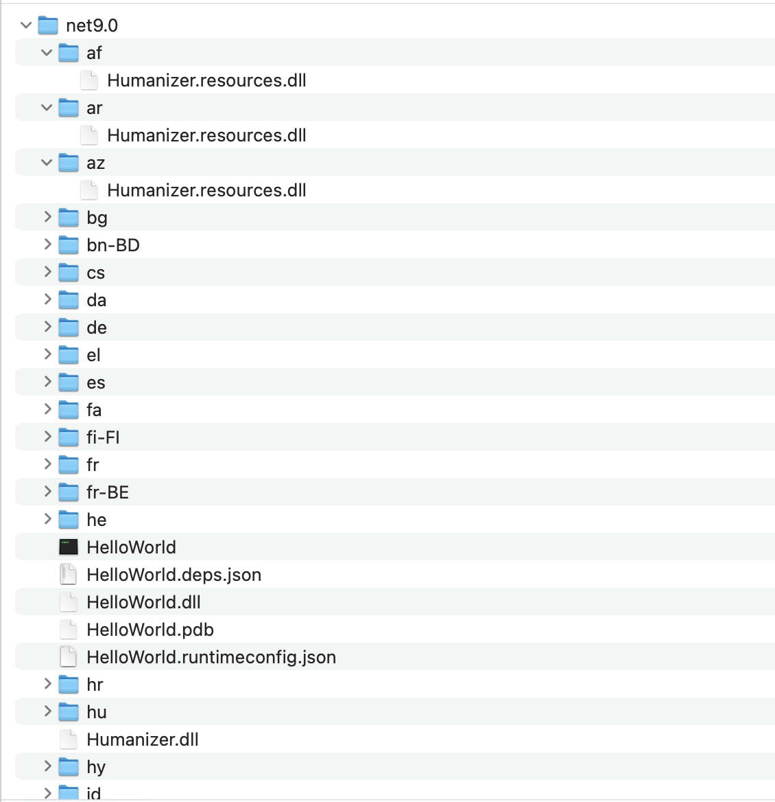
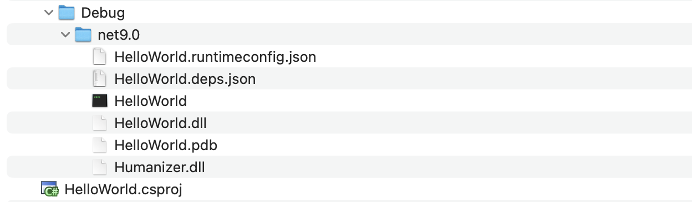
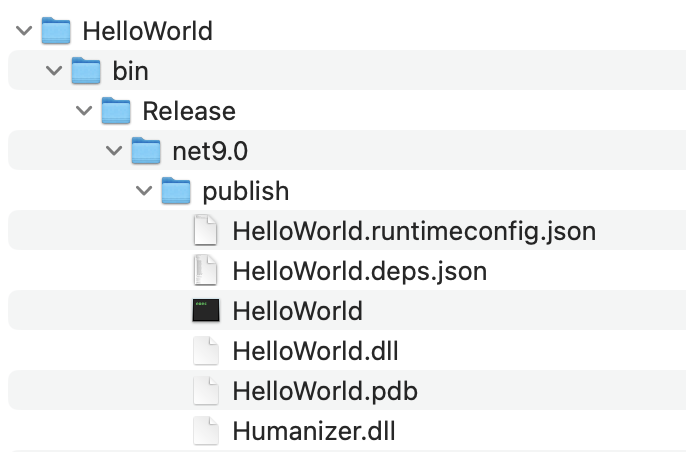
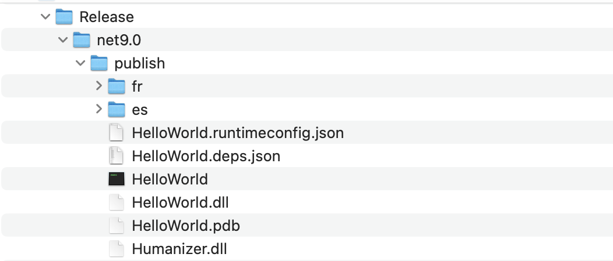

The .NET platform fully supports building applications in **multiple languages and locales**.

We can demonstrate this as follows:

Create a new project:

```bash
dotnet new console -o HelloWorld
```

Then, let us add [Humanizer](https://github.com/Humanizr/Humanizer), an excellent package with a lot of functionality that extends **strings** and **string handling**. You must have changed locations to the folder with the new project.

```bash
dotnet add package Humanizer
```

Let us finally build this application:

```bash
dotnet build
```

Looking in the bin folder, we will see multiple strangely named folders. These contain resources that the `Humanizer` library uses to support multiple languages and locales.



However, we know for sure that our do-nothing application targets English. Therefore, we do not need support for other languages.

We can control this by adding the following tag to our `.csproj`

```xml
<SatelliteResourceLanguages>en</SatelliteResourceLanguages>
```

If we now clear and rebuild the application:



We can see our folder no longer has these folders. This is because the **English locale is natively supported within the core library**.

This will also work if we [publish](https://learn.microsoft.com/en-us/dotnet/core/deploying/) the application:

```bash
dotnet publish
```



To support multiple languages, simply include them in a semicolon-delimited list.

For instance, if I also want **French** and **Spanish** ...

```xml
<SatelliteResourceLanguages>en;fr;es</SatelliteResourceLanguages>
```

We the re-publish:

```bash
dotnet publish
```



### TLDR

**The `<SatelliteResourceLanguages>` tag allows the specification of languages and locales to support when publishing localized applications.**

The code is in my [GitHub](https://github.com/conradakunga/BlogCode/tree/master/2025-03-15%20-%20Publish%20Satellite%20Assemblies).

Happy hacking!
