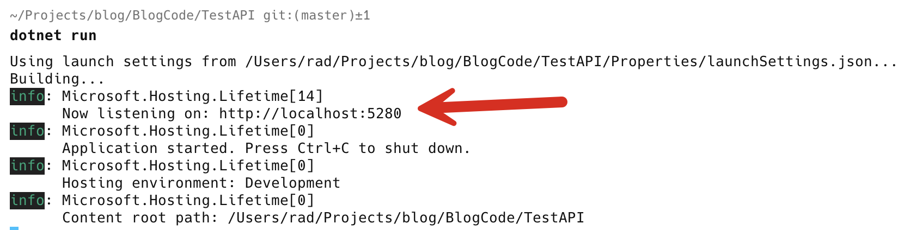
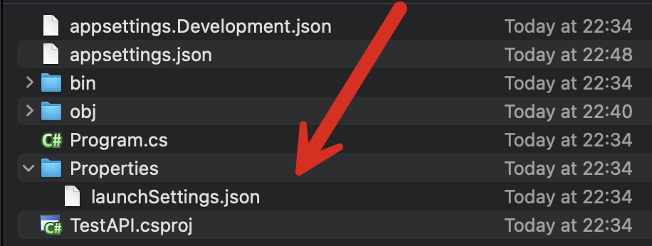
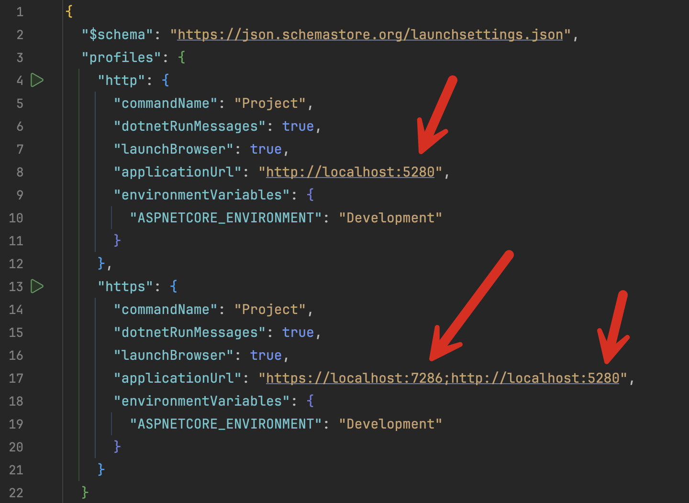
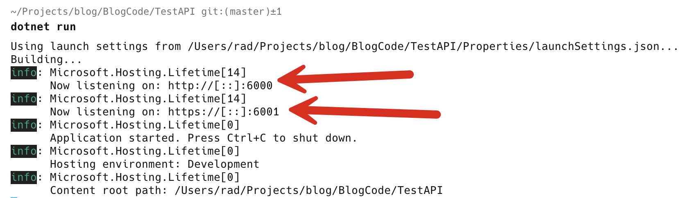
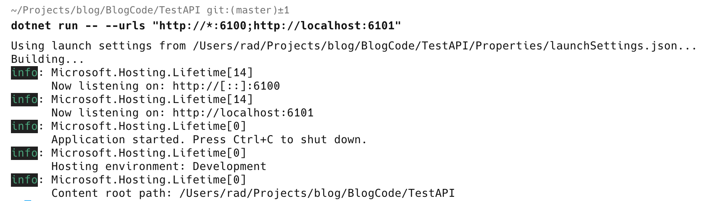

When you create a web application (or a web API), a **random, available port** is allocated to your application.

Let us start by creating a new application

```bash
dotnet new web -o TestAPI
```

We then change to the new directory `TestAPI` and run the application

```bash
dotnet run
```



Here you can see the port `5280` was assigned.

You might ask yourself - is this stored anywhere?

Yes.

In your project, there is a **Properties** folder. Within this is a file named `launchSettings.json`.



For this project, mine looks like this:

```xml
{
  "$schema": "https://json.schemastore.org/launchsettings.json",
  "profiles": {
    "http": {
      "commandName": "Project",
      "dotnetRunMessages": true,
      "launchBrowser": true,
      "applicationUrl": "http://localhost:5280",
      "environmentVariables": {
        "ASPNETCORE_ENVIRONMENT": "Development"
      }
    },
    "https": {
      "commandName": "Project",
      "dotnetRunMessages": true,
      "launchBrowser": true,
      "applicationUrl": "https://localhost:7286;http://localhost:5280",
      "environmentVariables": {
        "ASPNETCORE_ENVIRONMENT": "Development"
      }
    }
  }
}
```

The magic is taking place here:



These are the places where the **ports** are specified.

If you want to change them during the **debug** stage, change them to an available port and **restart** your application.

If the project **has been deployed, this will not work**, as there is no `launchSettings.json` for deployed files.

In this case you need to make the change to the `appsettings.json` file.

If you open it, it will look like this:

```json
{
  "Logging": {
    "LogLevel": {
      "Default": "Information",
      "Microsoft.AspNetCore": "Warning"
    }
  },
  "AllowedHosts": "*"
}
```

To specify the ports to use, add the setting `Urls`, specifying the **protocol and ports you want to use as semicolon delimited strings**.

```json
{
  "Logging": {
    "LogLevel": {
      "Default": "Information",
      "Microsoft.AspNetCore": "Warning"
    }
  },
  "AllowedHosts": "*",
  "Urls": "http://*:6000;https://*:6001"
}
```

Here, I am using `6000` for **Http** and `6001` for **Https**.

You can also, if you wish, override these in `appsettings.Devlopment.json`, `appsettings.Staging.json` or `appsettings.Production.json`, depending on your needs.

If you run the application now:



You can also pass the ports you want to use as **arguments to the run command**.

```bash
dotnet run -- --urls "http://*:6100;http://localhost:6101"
```

The extra `--` it is to make sure that the `--urls` is treated as a parameter for **configuration**, and not the `dotnet run` command itself.



### TLDR

**You can change the ports a web application is using in 3 ways:**

1. **Change in launchSettings.json**
2. **Change in appsettings.json**
3. **Pass as a command line parameter**

The code is in my [GitHub](https://github.com/conradakunga/BlogCode/tree/master/2025-03-16%20-%20Change%20Ports).

Happy hacking!
