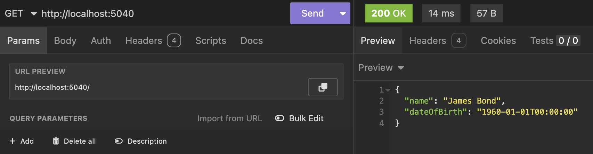
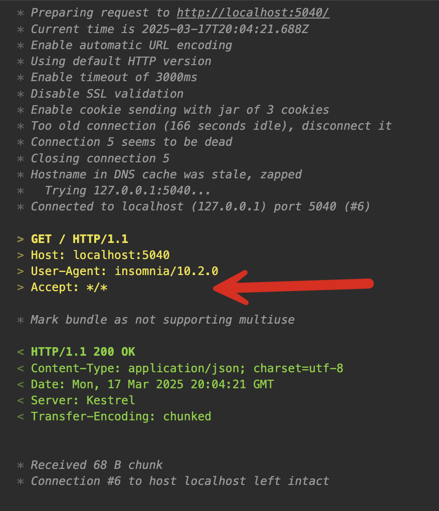
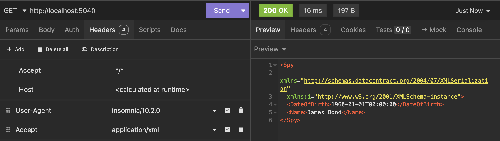
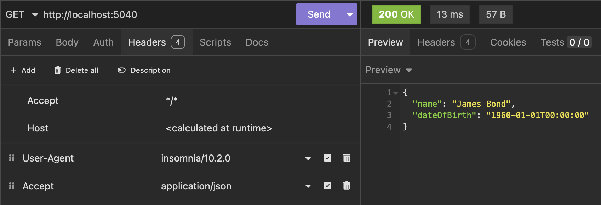

Today, in 2025, a vast majority of APIs are JSON APIs. 

However, you might be providing services to a client wanting the data in a different format, say XML.

In this post, we will build such an API.

The first step is to create a web project.

```bash
dotnet new web -o XMLSerialization
```

From that folder, we add the package [Carter](https://github.com/CarterCommunity/Carter)

```bash
dotnet add package Carter
```

`Carter` is a library that makes it much easier to **modularize your minimal API endpoints**.

Next, we will define our sample type:

```c#
public class Spy
{
    public string Name { get; set; }
    public DateTime DateOfBirth { get; set; }
}
```

We then write a **module**, a class in which we define and configure our endpoint.

```c#
public class SpyModule : ICarterModule
{
    // Add a route
    public void AddRoutes(IEndpointRouteBuilder app)
    {
        // Set the route path
        app.MapGet("/", (HttpResponse resp) =>
        {
            // Create object
            var spy = new Spy()
            {
                Name = "James Bond",
                DateOfBirth = new DateTime(1960, 1, 1)
            };

            // Return our object
            return spy;
        });
    }
}
```

Finally, we configure our startup to set up `Carter`.

```c#
using Carter;

var builder = WebApplication.CreateBuilder(args);

// Add Carter support to the services
builder.Services.AddCarter();

var app = builder.Build();

// Scan and register all Carter modules
app.MapCarter();

app.Run();
```

If we run the endpoint, we will see the following:



As I indicated earlier, `JSON` is the default format if none is specified.

The raw request to the API looks like this:



Clients who wish to specify an alternate format do so by **setting the appropriate request header** - `Accept`.

If we wanted to request the data in `XML`, we would set the following header:

```plaintext
Accept: application/xml
```


Despite this, the response is still in `JSON`.

We need to update our endpoint so that it **interrogates the request and then decides how to respond**, a process called [negotiation](https://learn.microsoft.com/en-us/aspnet/web-api/overview/formats-and-model-binding/content-negotiation).

Given there is already a handler for `JSON`, we need to write one for `XML`, and we do this by writing a class that implements the `IResponseNegotiator` interface.

It will look like this:

```c#
using System.Net.Mime;
using System.Runtime.Serialization;
using Carter;
using Microsoft.Net.Http.Headers;

public class XMLResponseNegotiator : IResponseNegotiator
{
    // Establish if the client had indicated it wanted xml
    public bool CanHandle(MediaTypeHeaderValue accept)
    {
        return accept.MatchesMediaType(MediaTypeNames.Application.Xml);
    }

    // Handle the request
    public async Task Handle<T>(HttpRequest req, HttpResponse res, T model, CancellationToken ct)
    {
        // Set the content type
        res.ContentType = MediaTypeNames.Application.Xml;

        // Create a serializer for the model type, T
        var serializer = new DataContractSerializer(typeof(T));

        // Create a memory stream
        using (var ms = new MemoryStream())
        {
            // Write the object
            serializer.WriteObject(ms, model);

            // Set the stream position to 0, for writing to the response
            ms.Position = 0;

            // Write the memory stream to the response Body
            await ms.CopyToAsync(res.Body, ct);
        }
    }
}
```

Next, we update our endpoint to **delegate handling** to the injected response.

Rather than directly returning our `Spy` object, we use the `Negotiate` response method.

```c#
  // Delegate the handling via content negotiation
  return resp.Negotiate(spy);
```

Finally, we update our startup to configure `Carter` and register this `ResponseNegotiator`

```c#
// Add Carter support to the services
builder.Services.AddCarter(configurator: c =>
{
    // Register a XML response negotiator
    c.WithResponseNegotiator<XMLResponseNegotiator>();
});
```

Finally, we send an `XML` request.



We can see here our response is coming back in `XML`.

If we send a `JSON` request:



Our API can now respond in both `XML` and `JSON`

### TLDR

**To allow handling multiple response formats, implement the `IResponseNegotiator` method and register that class with `Carter` at the application startup.**

The code is in my [GitHub](https://github.com/conradakunga/BlogCode/tree/master/2025-03-17%20-%20Content%20Negotiation).

Happy Hacking!

