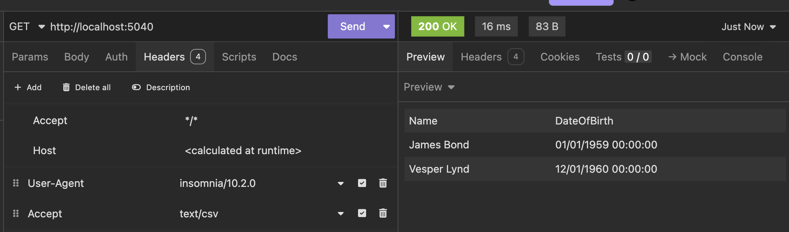
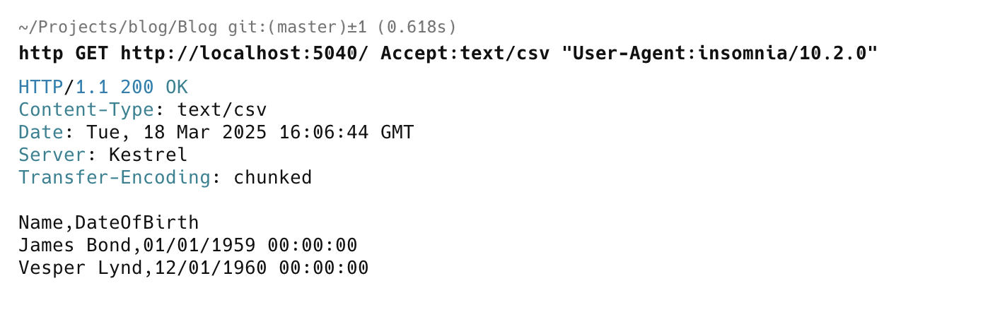

In our [last post](), we looked at how to use Carter in an ASP.NET minimal API to return `JSON` or `XML`, as the client specifies.

This post will look at how to output `CSV` at the client's request.

The first thing is installing the [CSVHelper](https://joshclose.github.io/CsvHelper/) package that we used in a [previous post]().

```c#
dotnet add package CSVHelper
```

Next, we create a content negotiation for `CSV` by implementing the `IResponseNegotiator` interface. The client will specify the header "`text/csv`", which is available as a **constant** from `MediaTypeNames.Text.Csv`

The class will look like this:

```c#
using System.Globalization;
using System.Net.Mime;
using Carter;
using CsvHelper;
using Microsoft.Net.Http.Headers;

public class CSVResponseNegotiator : IResponseNegotiator
{
    // Establish if the client had indicated it will accept csv
    public bool CanHandle(MediaTypeHeaderValue accept)
    {
        return accept.MatchesMediaType(MediaTypeNames.Text.Csv);
    }

    // Handle the request
    public async Task Handle<T>(HttpRequest req, HttpResponse res, T model, CancellationToken ct)
    {
        // Set the content type
        res.ContentType = MediaTypeNames.Text.Csv;

        // Verify that the model coming in is an IEnumerable
        if (model is IEnumerable<object> data)
        {
            // Setup our csv writer to write to the response body
            await using (var writer = new StreamWriter(res.Body)) 
            // Configure the CSV writer
            await using (var csv = new CsvWriter(writer, CultureInfo.InvariantCulture))
            {
                // Write the data to the stream
                await csv.WriteRecordsAsync(data, ct);
            }
        }
    }
}
```

We then update our endpoint to return a collection, which is what such an endpoint should return. 

1. If there are no `Spy` entities, it should return an **empty collection**.
2. If there is **only one**, it should return a collection with **one element**.
3. Otherwise, return **as many as have been found**.

```c#
using Carter;
using Carter.Response;

namespace XMLSerialization;

public class SpyModule : ICarterModule
{
    // Add a route
    public void AddRoutes(IEndpointRouteBuilder app)
    {
        // Set the route path
        app.MapGet("/", (HttpResponse resp) =>
        {
            // Create a collection of spies. This should ideally
            // come from a database
            Spy[] spies =
            [
                new()
                {
                    Name = "James Bond",
                    DateOfBirth = new DateTime(1959, 1, 1)
                },
                new()
                {
                    Name = "Vesper Lynd",
                    DateOfBirth = new DateTime(1960, 12, 1)
                },
            ];
            // Delegate the handling via content negotiation
            return resp.Negotiate(spies);
        });
    }
}
```

Finally, we register our new `CSV` content negotiator alongside the `XML` one.

```C#
// Add carter support to the services
builder.Services.AddCarter(configurator: c =>
{
    // Register a XML response negotiator
    c.WithResponseNegotiator<XMLResponseNegotiator>();
    c.WithResponseNegotiator<CSVResponseNegotiator>();
});
```

If we run this endpoint, we get the following response:



We can see that [Insomnia](https://insomnia.rest) formats the data into rows and columns.

To view the raw response, we can use [Httpie](https://httpie.io) or [curl](https://curl.se).



### TLDR

**You can implement an endpoint that returns CSV data by implementing the `IResponseNegotiator` interface and the `CSVHelper` library.**

The code is in my [GitHub](https://github.com/conradakunga/BlogCode/tree/master/2025-03-18%20-%20CSV%20Content).

Happy hacking!
