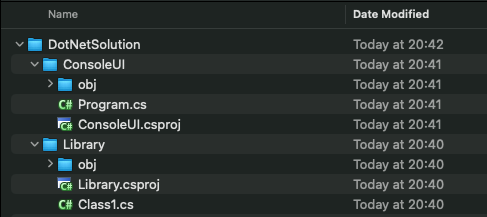
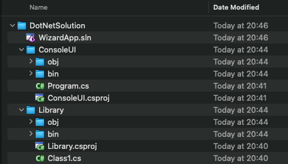
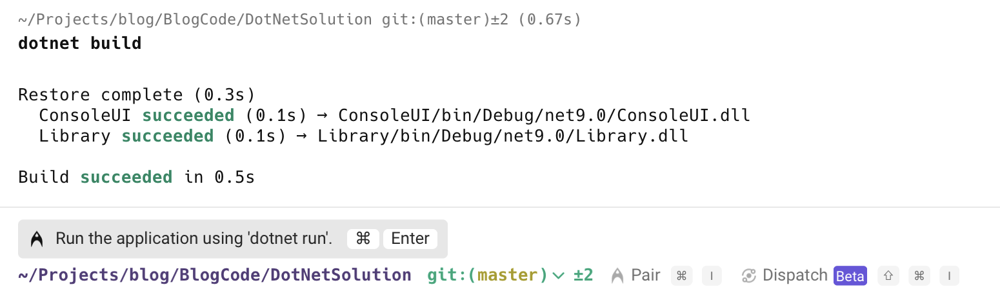
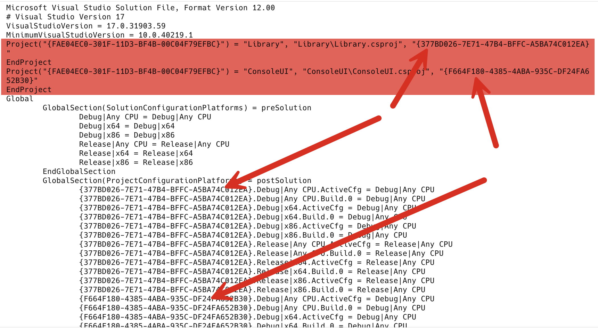

Whenever you create a .NET application, one of the essential files created is the project file. In C#, it is named `xxxx.csproj`; in VB.NET, it is named `xxxx.vbproj`; and in F#, it is named `xxxx.fsproj`.

This file contains key information for the compiler:

1. **Project type** - executable, class library, etc
2. Referenced **projects**
3. Referenced **nuget packages**
4. Project **metadata** - assembly name, namespaces, etc.

Most of the time, this is sufficient.

But sometimes, you want to manage multiple projects **as a unit**. The [solution](https://learn.microsoft.com/en-us/visualstudio/ide/solutions-and-projects-in-visual-studio?view=vs-2022#solutions) helps in this scenario.

Let us start by creating an empty folder in which to store our code:

```bash
mkdir DotNetSolution
```

We then change into this directory and create a blank **class library**

```bash
dotnet new classlib -o Library
```

Next, we create a **console application**

```bash
dotnet new console -o ConsoleUI
```

Our folder structure now looks like this:



If we wanted to build both of these, we would need to do it with **two commands**:

```bash
dotnet build Library/Library.csproj 

dotnet build ConsoleUI/ConsoleUI.csproj 
```

A **solution** can help in this situation.

The first step is to create a **blank** solution using the `dotnet new sln` command. 

From within the current directory, type the following:

```bash
dotnet new sln
```

This solution will take the **name of the current folder**.

You can also change it to whatever you want using the `-n` switch

```bash
dotnet new sln -n WizardApp
```

The file structure is now as follows:



What is in the `WizardApp.sln` file? It is actually text and can be viewed as follows:

```bash
cat WizardApp.sln
```

This will return the following:

```plaintext
Microsoft Visual Studio Solution File, Format Version 12.00
# Visual Studio Version 17
VisualStudioVersion = 17.0.31903.59
MinimumVisualStudioVersion = 10.0.40219.1
Global
	GlobalSection(SolutionConfigurationPlatforms) = preSolution
		Debug|Any CPU = Debug|Any CPU
		Release|Any CPU = Release|Any CPU
	EndGlobalSection
	GlobalSection(SolutionProperties) = preSolution
		HideSolutionNode = FALSE
	EndGlobalSection
EndGlobal
```

Currently, it is essentially empty.

We need to **add projects to the solution**.

This is done using the `dotnet sln add` command, which takes a project file (`csproj`,`vbproj` or `fsproj`) as a parameter.

```bash
dotnet sln add Library/Library.csproj 
```

This will print the following:

```plaintext
Project `Library/Library.csproj` added to the solution.
```

Similarly, for the **console** application:

```bash
dotnet sln add ConsoleUI/ConsoleUI.csproj
```

The following will be printed

```plaintext
Project `ConsoleUI/ConsoleUI.csproj` added to the solution.
```

Now, if we run `dotnet build` from the current directory:



We can see here that **both** of the projects were built successfully.

If we now examine the contents of the `sln` file:

```plaintext
Microsoft Visual Studio Solution File, Format Version 12.00
# Visual Studio Version 17
VisualStudioVersion = 17.0.31903.59
MinimumVisualStudioVersion = 10.0.40219.1
Project("{FAE04EC0-301F-11D3-BF4B-00C04F79EFBC}") = "Library", "Library\Library.csproj", "{377BD026-7E71-47B4-BFFC-A5BA74C012EA}"
EndProject
Project("{FAE04EC0-301F-11D3-BF4B-00C04F79EFBC}") = "ConsoleUI", "ConsoleUI\ConsoleUI.csproj", "{F664F180-4385-4ABA-935C-DF24FA652B30}"
EndProject
Global
	GlobalSection(SolutionConfigurationPlatforms) = preSolution
		Debug|Any CPU = Debug|Any CPU
		Debug|x64 = Debug|x64
		Debug|x86 = Debug|x86
		Release|Any CPU = Release|Any CPU
		Release|x64 = Release|x64
		Release|x86 = Release|x86
	EndGlobalSection
	GlobalSection(ProjectConfigurationPlatforms) = postSolution
		{377BD026-7E71-47B4-BFFC-A5BA74C012EA}.Debug|Any CPU.ActiveCfg = Debug|Any CPU
		{377BD026-7E71-47B4-BFFC-A5BA74C012EA}.Debug|Any CPU.Build.0 = Debug|Any CPU
		{377BD026-7E71-47B4-BFFC-A5BA74C012EA}.Debug|x64.ActiveCfg = Debug|Any CPU
		{377BD026-7E71-47B4-BFFC-A5BA74C012EA}.Debug|x64.Build.0 = Debug|Any CPU
		{377BD026-7E71-47B4-BFFC-A5BA74C012EA}.Debug|x86.ActiveCfg = Debug|Any CPU
		{377BD026-7E71-47B4-BFFC-A5BA74C012EA}.Debug|x86.Build.0 = Debug|Any CPU
		{377BD026-7E71-47B4-BFFC-A5BA74C012EA}.Release|Any CPU.ActiveCfg = Release|Any CPU
		{377BD026-7E71-47B4-BFFC-A5BA74C012EA}.Release|Any CPU.Build.0 = Release|Any CPU
		{377BD026-7E71-47B4-BFFC-A5BA74C012EA}.Release|x64.ActiveCfg = Release|Any CPU
		{377BD026-7E71-47B4-BFFC-A5BA74C012EA}.Release|x64.Build.0 = Release|Any CPU
		{377BD026-7E71-47B4-BFFC-A5BA74C012EA}.Release|x86.ActiveCfg = Release|Any CPU
		{377BD026-7E71-47B4-BFFC-A5BA74C012EA}.Release|x86.Build.0 = Release|Any CPU
		{F664F180-4385-4ABA-935C-DF24FA652B30}.Debug|Any CPU.ActiveCfg = Debug|Any CPU
		{F664F180-4385-4ABA-935C-DF24FA652B30}.Debug|Any CPU.Build.0 = Debug|Any CPU
		{F664F180-4385-4ABA-935C-DF24FA652B30}.Debug|x64.ActiveCfg = Debug|Any CPU
		{F664F180-4385-4ABA-935C-DF24FA652B30}.Debug|x64.Build.0 = Debug|Any CPU
		{F664F180-4385-4ABA-935C-DF24FA652B30}.Debug|x86.ActiveCfg = Debug|Any CPU
		{F664F180-4385-4ABA-935C-DF24FA652B30}.Debug|x86.Build.0 = Debug|Any CPU
		{F664F180-4385-4ABA-935C-DF24FA652B30}.Release|Any CPU.ActiveCfg = Release|Any CPU
		{F664F180-4385-4ABA-935C-DF24FA652B30}.Release|Any CPU.Build.0 = Release|Any CPU
		{F664F180-4385-4ABA-935C-DF24FA652B30}.Release|x64.ActiveCfg = Release|Any CPU
		{F664F180-4385-4ABA-935C-DF24FA652B30}.Release|x64.Build.0 = Release|Any CPU
		{F664F180-4385-4ABA-935C-DF24FA652B30}.Release|x86.ActiveCfg = Release|Any CPU
		{F664F180-4385-4ABA-935C-DF24FA652B30}.Release|x86.Build.0 = Release|Any CPU
	EndGlobalSection
	GlobalSection(SolutionProperties) = preSolution
		HideSolutionNode = FALSE
	EndGlobalSection
EndGlobal
```

The magic is happening here, where each project is assigned a `Guid` that is used to set some build configurations.



Let us now create a new **test** project:

```bash
dotnet new xunit -o Tests
```

We then add this to the solution:

```bash
dotnet sln add Tests/Tests.csproj
```

We can now see our `sln` is updated.

```plaintext
Microsoft Visual Studio Solution File, Format Version 12.00
# Visual Studio Version 17
VisualStudioVersion = 17.0.31903.59
MinimumVisualStudioVersion = 10.0.40219.1
Project("{FAE04EC0-301F-11D3-BF4B-00C04F79EFBC}") = "Library", "Library\Library.csproj", "{377BD026-7E71-47B4-BFFC-A5BA74C012EA}"
EndProject
Project("{FAE04EC0-301F-11D3-BF4B-00C04F79EFBC}") = "ConsoleUI", "ConsoleUI\ConsoleUI.csproj", "{F664F180-4385-4ABA-935C-DF24FA652B30}"
EndProject
Project("{FAE04EC0-301F-11D3-BF4B-00C04F79EFBC}") = "Tests", "Tests\Tests.csproj", "{8D3A15BA-6953-4FB7-BF97-B90366B886E0}"
EndProject

-- The rest trimmed out
```

We can also **remove** projects from a solution, using the `dotnet sln remove` command

```bash
dotnet sln remove Tests/Tests.csproj
```

This will print the following:

```plaintext
Project `Tests/Tests.csproj` removed from the solution.
```

It is strongly discouraged to directly manipulate this file manually.

You can also list all the projects in a `sln` file

```bash
dotnet sln list
```

This will print the following:

```plaintext
Project(s)
----------
ConsoleUI/ConsoleUI.csproj
Library/Library.csproj
```

Finally, having more than one solution file for your own reasons is also possible. Perhaps one will include the test projects, and the other won't.

In this scenario, pass the solution name as a parameter when building.

```bash
dotnet build WizardApp.sln 
```


### TLDR

**When handling software projects with multiple projects, it is beneficial to organize them into solution (`sln`) files.**

The code is in my [GitHub](https://github.com/conradakunga/BlogCode/tree/master/2025-03-19%20-%20Solutions).

Happy hacking!
