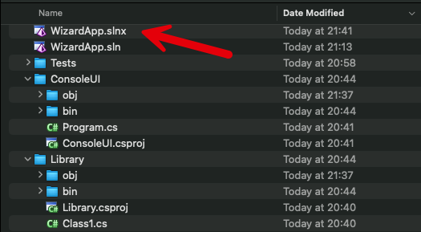

In the [last post](), we looked at how to manage **multi-project software** using **solutions**.

As a recap, the **solution** file looked like this:

```plaintext
Microsoft Visual Studio Solution File, Format Version 12.00
# Visual Studio Version 17
VisualStudioVersion = 17.0.31903.59
MinimumVisualStudioVersion = 10.0.40219.1
Project("{FAE04EC0-301F-11D3-BF4B-00C04F79EFBC}") = "Library", "Library\Library.csproj", "{377BD026-7E71-47B4-BFFC-A5BA74C012EA}"
EndProject
Project("{FAE04EC0-301F-11D3-BF4B-00C04F79EFBC}") = "ConsoleUI", "ConsoleUI\ConsoleUI.csproj", "{F664F180-4385-4ABA-935C-DF24FA652B30}"
EndProject
Global
	GlobalSection(SolutionConfigurationPlatforms) = preSolution
		Debug|Any CPU = Debug|Any CPU
		Debug|x64 = Debug|x64
		Debug|x86 = Debug|x86
		Release|Any CPU = Release|Any CPU
		Release|x64 = Release|x64
		Release|x86 = Release|x86
	EndGlobalSection
	GlobalSection(ProjectConfigurationPlatforms) = postSolution
		{377BD026-7E71-47B4-BFFC-A5BA74C012EA}.Debug|Any CPU.ActiveCfg = Debug|Any CPU
		{377BD026-7E71-47B4-BFFC-A5BA74C012EA}.Debug|Any CPU.Build.0 = Debug|Any CPU
		{377BD026-7E71-47B4-BFFC-A5BA74C012EA}.Debug|x64.ActiveCfg = Debug|Any CPU
		{377BD026-7E71-47B4-BFFC-A5BA74C012EA}.Debug|x64.Build.0 = Debug|Any CPU
		{377BD026-7E71-47B4-BFFC-A5BA74C012EA}.Debug|x86.ActiveCfg = Debug|Any CPU
		{377BD026-7E71-47B4-BFFC-A5BA74C012EA}.Debug|x86.Build.0 = Debug|Any CPU
		{377BD026-7E71-47B4-BFFC-A5BA74C012EA}.Release|Any CPU.ActiveCfg = Release|Any CPU
		{377BD026-7E71-47B4-BFFC-A5BA74C012EA}.Release|Any CPU.Build.0 = Release|Any CPU
		{377BD026-7E71-47B4-BFFC-A5BA74C012EA}.Release|x64.ActiveCfg = Release|Any CPU
		{377BD026-7E71-47B4-BFFC-A5BA74C012EA}.Release|x64.Build.0 = Release|Any CPU
		{377BD026-7E71-47B4-BFFC-A5BA74C012EA}.Release|x86.ActiveCfg = Release|Any CPU
		{377BD026-7E71-47B4-BFFC-A5BA74C012EA}.Release|x86.Build.0 = Release|Any CPU
		{F664F180-4385-4ABA-935C-DF24FA652B30}.Debug|Any CPU.ActiveCfg = Debug|Any CPU
		{F664F180-4385-4ABA-935C-DF24FA652B30}.Debug|Any CPU.Build.0 = Debug|Any CPU
		{F664F180-4385-4ABA-935C-DF24FA652B30}.Debug|x64.ActiveCfg = Debug|Any CPU
		{F664F180-4385-4ABA-935C-DF24FA652B30}.Debug|x64.Build.0 = Debug|Any CPU
		{F664F180-4385-4ABA-935C-DF24FA652B30}.Debug|x86.ActiveCfg = Debug|Any CPU
		{F664F180-4385-4ABA-935C-DF24FA652B30}.Debug|x86.Build.0 = Debug|Any CPU
		{F664F180-4385-4ABA-935C-DF24FA652B30}.Release|Any CPU.ActiveCfg = Release|Any CPU
		{F664F180-4385-4ABA-935C-DF24FA652B30}.Release|Any CPU.Build.0 = Release|Any CPU
		{F664F180-4385-4ABA-935C-DF24FA652B30}.Release|x64.ActiveCfg = Release|Any CPU
		{F664F180-4385-4ABA-935C-DF24FA652B30}.Release|x64.Build.0 = Release|Any CPU
		{F664F180-4385-4ABA-935C-DF24FA652B30}.Release|x86.ActiveCfg = Release|Any CPU
		{F664F180-4385-4ABA-935C-DF24FA652B30}.Release|x86.Build.0 = Release|Any CPU
	EndGlobalSection
	GlobalSection(SolutionProperties) = preSolution
		HideSolutionNode = FALSE
	EndGlobalSection
EndGlobal
```

This format has several challenges:

1. It is very **verbose**
2. It is difficult to **track and merge** via **source control tools**
3. It has a lot of **redundancy**
4. It is not very **human-readable**

Version [9.0.200](https://dotnet.microsoft.com/en-us/download/dotnet/9.0) of the SDK onwards supports a new, XML-based solution format.

You can verify what SDK version is active using the following command:

```bash
dotnet --info
```

On my machine, I get the following:

```plaintext
.NET SDK:
 Version:           9.0.202
 Commit:            3a53853c30
 Workload version:  9.0.200-manifests.2f9aa857
 MSBuild version:   17.13.13+1c2026462

Runtime Environment:
 OS Name:     Mac OS X
 OS Version:  14.7
 OS Platform: Darwin
 RID:         osx-arm64
 Base Path:   /usr/local/share/dotnet/sdk/9.0.202/

.NET workloads installed:
There are no installed workloads to display.
Configured to use loose manifests when installing new manifests.

Host:
  Version:      10.0.0-preview.1.25080.5
  Architecture: arm64
  Commit:       b98cabca12

.NET SDKs installed:
  9.0.202 [/usr/local/share/dotnet/sdk]
  10.0.100-preview.1.25120.13 [/usr/local/share/dotnet/sdk]

.NET runtimes installed:
  Microsoft.AspNetCore.App 9.0.3 [/usr/local/share/dotnet/shared/Microsoft.AspNetCore.App]
  Microsoft.AspNetCore.App 10.0.0-preview.1.25120.3 [/usr/local/share/dotnet/shared/Microsoft.AspNetCore.App]
  Microsoft.NETCore.App 9.0.3 [/usr/local/share/dotnet/shared/Microsoft.NETCore.App]
  Microsoft.NETCore.App 10.0.0-preview.1.25080.5 [/usr/local/share/dotnet/shared/Microsoft.NETCore.App]

Other architectures found:
  None

Environment variables:
  Not set

global.json file:
  /Users/rad/Projects/global.json

Learn more:
  https://aka.ms/dotnet/info

Download .NET:
  https://aka.ms/dotnet/download
```

To migrate to the new solution, run the command `dotnet sln migrate` from the directory your solution is in:

```bash
dotnet sln migrate
```

You will see a new file has been created with a .`slnx` extension - the original `sln` file is not deleted.



We can take a look at what is inside

```c#
cat WizardApp.slnx
```

```xml
<Solution>
  <Configurations>
    <Platform Name="Any CPU" />
    <Platform Name="x64" />
    <Platform Name="x86" />
  </Configurations>
  <Project Path="ConsoleUI/ConsoleUI.csproj" />
  <Project Path="Library/Library.csproj" />
</Solution>
```

This is now vastly **cleaner** and **simpler**.

The `dotnet sln` commands will still work with this new format.

We can add back the xUnit test project

```bash
dotnet sln  WizardApp.slnx add Tests/Tests.csproj
```

This will print the following:

```plaintext
Project `Tests/Tests.csproj` added to the solution.
```

If we now view the contents:

```xml
<Solution>
  <Configurations>
    <Platform Name="Any CPU" />
    <Platform Name="x64" />
    <Platform Name="x86" />
  </Configurations>
  <Project Path="ConsoleUI/ConsoleUI.csproj" />
  <Project Path="Library/Library.csproj" />
  <Project Path="Tests/Tests.csproj" />
</Solution>
```

### TLDR

**The new `.slnx` format is cleaner, simpler, and machine-readable, and being XML lends itself well to manipulation by tools.**

The code is in my GitHub.

Happy hacking!
