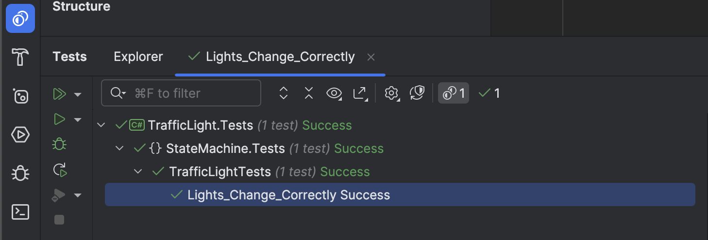

This is Part 1 of a series on using State Machines to express complex logic.

- **Using State Machines In .NET - Part 1 - Introduction (This Post)**
- [Using State Machines In .NET  - Part 2 - Basic Usage]()
- [Using State Machines In .NET  - Part 3 - Setting Initial State]()
- [Using State Machines In .NET  - Part 4 - Using Multiple Triggers]()
- [Using State Machines In .NET - Part 5 - Using Complex & Nested States]()

Suppose you are modeling a traffic light.

This sounds simple enough.

You would probably have an enum to define the states:

```c#
public enum Status
{
    Red,
    Amber,
    Green
}
```

You would then model an event that transitions between the states.

```c#
public void Transition(){}
```

Within this body, we will transition between the states.

We then add a property to store the current state of the light.

```c#
public Status CurrentStatus { get; private set; }
```

Finally, we wrap everything in a class.

```c#
public sealed class TrafficLight
{
    // Public property to retrieve the status
    public Status CurrentStatus { get; private set; }

    // Internal field to help with amber tracking
    private Status _priorStatus;

    public TrafficLight()
    {
        CurrentStatus = Status.Red;
        _priorStatus = Status.Red;
    }

    public void Transition()
    {
        // Logic here
    }
}
```

The logic is as follows:

1. If the light is `Red`, transition to `Amber`.
2. If the light is `Amber`, and was previously `Red`, transition to `Green`
3. if the light is `Amber`, and was previously `Green`, transition to `Red`

The final code will look like this:

```c#
public sealed class TrafficLight
{
    // Public property to retrieve the status
    public Status CurrentStatus { get; private set; }

    // Internal field to help with amber tracking
    private Status _priorStatus;

    public TrafficLight()
    {
        CurrentStatus = Status.Red;
        _priorStatus = Status.Red;
    }

    public void Transition()
    {
        if (CurrentStatus == Status.Red)
        {
            _priorStatus = CurrentStatus;
            CurrentStatus = Status.Amber;
        }
        else if (CurrentStatus == Status.Amber && _priorStatus == Status.Red)
        {
            CurrentStatus = Status.Green;
        }
        else if (CurrentStatus == Status.Amber && _priorStatus == Status.Green)
        {
            CurrentStatus = Status.Red;
        }
        else if (CurrentStatus == Status.Green)
        {
            _priorStatus = CurrentStatus;
            CurrentStatus = Status.Amber;
        }
    }
}
```

Let us create some unit tests to verify our logic.

```c#
public class TrafficLightTests
{
    [Fact]
    public void Lights_Change_Correctly()
    {
        var light = new TrafficLight();
        light.CurrentStatus.Should().Be(Status.Red);
        light.Transition();
        light.CurrentStatus.Should().Be(Status.Amber);
        light.Transition();
        light.CurrentStatus.Should().Be(Status.Green);
        light.Transition();
        light.CurrentStatus.Should().Be(Status.Amber);
        light.Transition();
        light.CurrentStatus.Should().Be(Status.Red);
        light.Transition();
        light.CurrentStatus.Should().Be(Status.Amber);
    }
}
```

When we run our tests, all seems to be in order.



Let us turn our attention to the transition logic again;

```c#
  public void Transition()
  {
      if (CurrentStatus == Status.Red)
      {
          _priorStatus = CurrentStatus;
          CurrentStatus = Status.Amber;
      }
      else if (CurrentStatus == Status.Amber && _priorStatus == Status.Red)
      {
          CurrentStatus = Status.Green;
      }
      else if (CurrentStatus == Status.Amber && _priorStatus == Status.Green)
      {
          CurrentStatus = Status.Red;
      }
      else if (CurrentStatus == Status.Green)
      {
          _priorStatus = CurrentStatus;
          CurrentStatus = Status.Amber;
      }
  }
```

We want to add some new logic.

There is no need to keep the lights working in the middle of the night. If it is past midnight and the state is `Red` or `Green`, transition to `Amber`. In the morning, at 6:00 AM, revert to the original schedule.

We need to make some changes to our code.

1. Given that time is now a factor, we need to inject a [TimeProvider](https://learn.microsoft.com/en-us/dotnet/api/system.timeprovider?view=net-9.0) to make it testable
2. We need to update our logic

```c#
public sealed class TrafficLight
{
    private readonly TimeProvider _provider;

    // Public property to retrieve the status
    public Status CurrentStatus { get; private set; }

    // Internal field to help with amber tracking
    private Status _priorStatus;

    public TrafficLight(TimeProvider provider)
    {
        _provider = provider;
        CurrentStatus = Status.Red;
        _priorStatus = Status.Red;
    }

    public void Transition()
    {
        // Fetch the current time
        var currentTime = TimeOnly.FromTimeSpan(_provider.GetLocalNow().TimeOfDay);
        // Get midnight
        var midnight = new TimeOnly(0, 0, 0);
        // Get 6 AM
        var sixAm = new TimeOnly(6, 0, 0);
        // Check whether ot use night logic or day logic
        if (currentTime >= midnight && currentTime < sixAm)
        {
            // Transition to Amber, if not already
            if (CurrentStatus != Status.Amber)
            {
                _priorStatus = CurrentStatus;
                CurrentStatus = Status.Amber;
            }
        }
        else
        {
            // Normal schedule
            if (CurrentStatus == Status.Red)
            {
                _priorStatus = CurrentStatus;
                CurrentStatus = Status.Amber;
            }
            else if (CurrentStatus == Status.Amber && _priorStatus == Status.Red)
            {
                CurrentStatus = Status.Green;
            }
            else if (CurrentStatus == Status.Amber && _priorStatus == Status.Green)
            {
                CurrentStatus = Status.Red;
            }
            else if (CurrentStatus == Status.Green)
            {
                _priorStatus = CurrentStatus;
                CurrentStatus = Status.Amber;
            }
        }
    }
}
```

We should also update our tests to verify our logic works.

```c#
public class TrafficLightTests
{
    [Theory]
    [InlineData(6, 00)]
    [InlineData(12, 00)]
    [InlineData(11, 59)]
    public void Lights_Change_Correctly_During_The_Day(int hour, int minute)
    {
        var currentDate = DateTime.Now;
        var provider = new FakeTimeProvider();
        provider.SetUtcNow(new DateTime(currentDate.Year, currentDate.Month, currentDate.Day, hour, minute, 0));
        var light = new TrafficLight(provider);
        light.CurrentStatus.Should().Be(Status.Red);
        light.Transition();
        light.CurrentStatus.Should().Be(Status.Amber);
        light.Transition();
        light.CurrentStatus.Should().Be(Status.Green);
        light.Transition();
        light.CurrentStatus.Should().Be(Status.Amber);
        light.Transition();
        light.CurrentStatus.Should().Be(Status.Red);
        light.Transition();
        light.CurrentStatus.Should().Be(Status.Amber);
    }

    [Theory]
    [InlineData(0, 0)]
    [InlineData(5, 59)]
    public void Lights_Change_Correctly_During_The_Night(int hour, int minute)
    {
        var currentDate = DateTime.Now;
        var provider = new FakeTimeProvider();
        provider.SetUtcNow(new DateTimeOffset(currentDate.Year, currentDate.Month, currentDate.Day, hour, minute, 0,
            TimeSpan.Zero));
        var light = new TrafficLight(provider);
        light.Transition();
        light.CurrentStatus.Should().Be(Status.Amber);
        light.Transition();
        light.CurrentStatus.Should().Be(Status.Amber);
        light.Transition();
        light.CurrentStatus.Should().Be(Status.Amber);
        light.Transition();
        light.CurrentStatus.Should().Be(Status.Amber);
        light.Transition();
        light.CurrentStatus.Should().Be(Status.Amber);
    }
}
```

Our logic for the valid state transitions is now starting to get **complicated**.

Suppose we now had a new rule - for public holidays.

Our already busy logic will get even busier as we need to do a lot of work to ensure that our **state transitions are valid**.

This class of problem lends itself well to a construct known as a [State Machine](https://en.wikipedia.org/wiki/Finite-state_machine).

In the [next post](), we will examine how **State Machines** can help with such problems.

### TLDR

**Tracking valid state transitions in an object can quickly become overwhelming as the number of states and valid transitions grows**

The code is in my [GitHub](https://github.com/conradakunga/BlogCode/tree/master/2025-03-24%20-%20State%20Machines%20Part%201).

Happy hacking!
