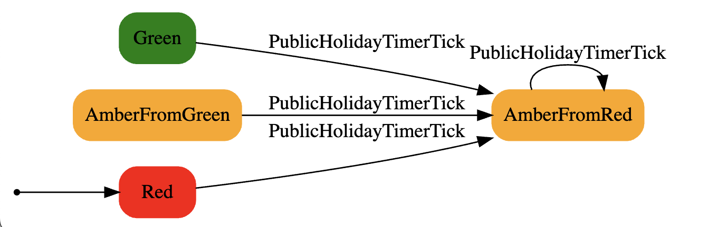

This is Part 2 of a series on using State Machines to express complex logic.

- [Using State Machines In .NET  - Part 1 - Introduction]()
- **Using State Machines In .NET  - Part 2 - Basic Usage (This Post)**
- [Using State Machines In .NET  - Part 3 - Setting Initial State]()
- [Using State Machines In .NET  - Part 4 - Using Multiple Triggers]()
- [Using State Machines In .NET - Part 5 - Using Complex & Nested States]()

Our [last post]() examined how logic for correctly setting a state can quickly become complicated.

This post will examine how state machines can help with such problems.

At its core, the rationale of a state machines boils down to the following:

1. An entity can be in one of a number of known **states**.
2. The entity can **transition from one state to another**.
3. A state can only transition to a **valid state**.
4. Not all states are **valid** transitions.
5. **Triggers** transition from one state to another.

We can revisit our example from yesterday for traffic lights.

At first glance, there are only three states

- `Red`
- `Amber`
- `Green`

However, on deeper reflection, we need to introduce two `Amber` states, given that one is a transition from `Green` and the other is a transition from `Red`.

We then define them as follows:

- `Red`
- `AmberFromRed`
- `Green`
- `AmberFromGreen`

Transitions between states can be **initiated** by a `Trigger`, which has a single function - a `NormalTimerTick`

We can use the package [Stateless](https://github.com/dotnet-state-machine/stateless) to implement this logic.

First, we define the states:

```c#
public enum Status
{
    Red,
    AmberFromRed,
    Green,
    AmberFromGreen
}
```

Next, we define the trigger

```c#
public enum Trigger
{
    NormalTimerTick
}
```

Finally, we create a class and, within the class, create a `StateMachine` object that we **configure** in the **constructor**.

```c#
using Stateless;

namespace StateMachineSample;

public sealed class TrafficLight
{
    private readonly TimeProvider _provider;
    private readonly StateMachine<Status, Trigger> _stateMachine;
    public Status CurrentStatus => _stateMachine.State;

    public TrafficLight(TimeProvider provider)
    {
        _provider = provider;
        // Create the state machine, and set the initial state as red
        _stateMachine = new StateMachine<Status, Trigger>(Status.Red);

        //
        // Configure state machine
        //

        // If red, can only transition to amber from red
        _stateMachine.Configure(Status.Red)
            .Permit(Trigger.NormalTimerTick, Status.AmberFromRed);
        // If Amber (from red) can only transition to Green
        _stateMachine.Configure(Status.AmberFromRed)
            .Permit(Trigger.NormalTimerTick, Status.Green);
        // If Green can only transition to Amber (from Green)
        _stateMachine.Configure(Status.Green)
            .Permit(Trigger.NormalTimerTick, Status.AmberFromGreen);
        // If Amber (from Green) can only transition to Red
        _stateMachine.Configure(Status.AmberFromGreen)
            .Permit(Trigger.NormalTimerTick, Status.Red);
    }

    // Logic to transition the state
    public void Transition()
    {
        _stateMachine.Fire(Trigger.NormalTimerTick);
    }
}
```

If you notice, the **only** way to transition the state is to call the `Transition` method. **There is no way to change the state directly.**

We can verify our logic is sound because our tests still pass.


The state diagram is as follows:


Our logic is much less, much cleaner, and more expressive.

Let us now amend it to factor in the following example from the previous post:

> There is no need to keep the lights working in the middle of the night. If it is past midnight and the state is `Red` or `Green`, transition to `Amber`. In the morning, at 6:00 AM, revert to the original schedule.

First, we update our `Trigger` to indicate there is another mechanism, the `NightTimerTick`.

```c#
public enum Trigger
{
    NormalTimerTick,
    NightTimerTick
}
```

Next, we update our `Transition` method:

```c#
public void Transition()
{
    // Fetch the current time
    var currentTime = TimeOnly.FromTimeSpan(_provider.GetLocalNow().TimeOfDay);
    // Get midnight
    var midnight = new TimeOnly(0, 0, 0);
    // Get 6 AM
    var sixAm = new TimeOnly(6, 0, 0);
    // Check whether ot use night logic or day logic
    if (currentTime >= midnight && currentTime < sixAm)
        _stateMachine.Fire(Trigger.NightTimerTick);
    else
        _stateMachine.Fire(Trigger.NormalTimerTick);
}
```

Finally, we update our **state machine configuration** to indicate that **multiple triggers can transition the state**.

```c#
 public TrafficLight(TimeProvider provider)
  {
      _provider = provider;
      // Create the state machine, and set the initial state as red
      _stateMachine = new StateMachine<Status, Trigger>(Status.Red);

      //
      // Configure state machine
      //

      _stateMachine.Configure(Status.Red)
          .Permit(Trigger.NormalTimerTick, Status.AmberFromRed)
          .Permit(Trigger.NightTimerTick, Status.AmberFromRed);

      _stateMachine.Configure(Status.AmberFromRed)
          .Permit(Trigger.NormalTimerTick, Status.Green)
          // Since state is already AmberFromRed, ignore transitions
          .Ignore(Trigger.NightTimerTick);

      _stateMachine.Configure(Status.Green)
          .Permit(Trigger.NormalTimerTick, Status.AmberFromGreen)
          .Permit(Trigger.NightTimerTick, Status.AmberFromRed);

      _stateMachine.Configure(Status.AmberFromGreen)
          .Permit(Trigger.NormalTimerTick, Status.Red)
          .Permit(Trigger.NightTimerTick, Status.AmberFromRed);
  }
```

The state diagram is as follows:


If we run our tests for night-time, they now pass.


We can see here that our code has **additional functionality** without affecting the initial code that runs during the day.

Let us finally tackle the requirement that we have different logic for public holidays.

> During public holidays, the lights should be permanently on Amber.

As usual, we add a new `Trigger`.

```c#
public enum Trigger
{
    NormalTimerTick,
    NightTimerTick,
    PublicHolidayTimerTick,
}
```

Next, we update our state machine configuration:

```c#
 public TrafficLight(TimeProvider provider)
  {
      _provider = provider;
      // Create the state machine, and set the initial state as red
      _stateMachine = new StateMachine<Status, Trigger>(Status.Red);

      //
      // Configure state machine
      //

      _stateMachine.Configure(Status.Red)
          .Permit(Trigger.NormalTimerTick, Status.AmberFromRed)
          .Permit(Trigger.NightTimerTick, Status.AmberFromRed)
          .Permit(Trigger.PublicHolidayTimerTick, Status.AmberFromRed);

      _stateMachine.Configure(Status.AmberFromRed)
          .Permit(Trigger.NormalTimerTick, Status.Green)
          // Since state is already AmberFromRed, ignore transitions
          .Ignore(Trigger.NightTimerTick)
          .Ignore(Trigger.PublicHolidayTimerTick);

      _stateMachine.Configure(Status.Green)
          .Permit(Trigger.NormalTimerTick, Status.AmberFromGreen)
          .Permit(Trigger.NightTimerTick, Status.AmberFromRed)
          .Permit(Trigger.PublicHolidayTimerTick, Status.AmberFromRed);
   
      _stateMachine.Configure(Status.AmberFromGreen)
          .Permit(Trigger.NormalTimerTick, Status.Red)
          .Permit(Trigger.NightTimerTick, Status.AmberFromRed)
          .Permit(Trigger.PublicHolidayTimerTick, Status.AmberFromRed);
  }
```

Finally, we implement in the logic for detecting public holidays.

```c#
  public void Transition()
  {
      //Fetch the current ate
      var currentDate = DateOnly.FromDateTime(_provider.GetLocalNow().Date);
      // Check if holidays contain the current date
      if (holidays.Any(x => x.Month == currentDate.Month && x.Day == currentDate.Day))
      {
          _stateMachine.Fire(Trigger.PublicHolidayTimerTick);
      }
      else
      {
          // Fetch the current time
          var currentTime = TimeOnly.FromTimeSpan(_provider.GetLocalNow().TimeOfDay);
          // Get midnight
          var midnight = new TimeOnly(0, 0, 0);
          // Get 6 AM
          var sixAm = new TimeOnly(6, 0, 0);
          // Check whether ot use night logic or day logic
          if (currentTime >= midnight && currentTime < sixAm)
              _stateMachine.Fire(Trigger.NightTimerTick);
          else
              _stateMachine.Fire(Trigger.NormalTimerTick);
      }
  }
```

The state diagram is as follows:



To verify all works correctly, we create tests.

```c#
[Theory]
[InlineData(1, 1, 12, 0)]
[InlineData(1, 1, 1, 0)]
[InlineData(25, 12, 12, 0)]
[InlineData(25, 12, 1, 0)]
[InlineData(26, 12, 12, 0)]
[InlineData(26, 12, 1, 0)]
public void Lights_Change_Correctly_On_Public_Holidays(int day, int month, int hour, int minute)
{
    var currentDate = DateTime.Now;
    var provider = new FakeTimeProvider();
    provider.SetUtcNow(new DateTimeOffset(currentDate.Year, month, day, hour, minute, 0, TimeSpan.Zero));
    var light = new TrafficLight(provider);
    light.Transition();
    light.CurrentStatus.Should().Be(Status.AmberFromRed);
    light.Transition();
    light.CurrentStatus.Should().Be(Status.AmberFromRed);
    light.Transition();
    light.CurrentStatus.Should().Be(Status.AmberFromRed);
    light.Transition();
    light.CurrentStatus.Should().Be(Status.AmberFromRed);
    light.Transition();
    light.CurrentStatus.Should().Be(Status.AmberFromRed);
}
```

In our [next post](), we shall look at **how to deal with initial state.**

### TLDR

***State machines allow very complex state logic to be easily expressed.***

The code is in my [GitHub](https://github.com/conradakunga/BlogCode/tree/master/2025-03-25%20-%20State%20Machines%20Part%202).

Happy hacking!
