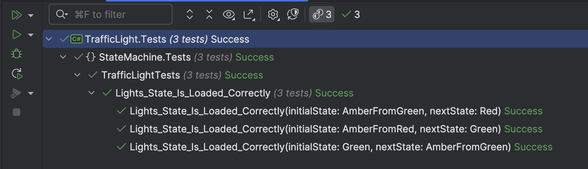

This is Part 3 of a series on using State Machines to express complex logic.

- [Using State Machines In .NET  - Part 1 - Introduction]()
- [Using State Machines In .NET  - Part 2 - Basic Usage]()
- [Using State Machines In .NET  - Part 3 - Setting Initial State]()
- [Using State Machines In .NET  - Part 4 - Using Multiple Triggers]()
- [Using State Machines In .NET - Part 5 - Using Complex & Nested States]()
- [Using State Machines In .NET - Part 6 - Firing Events On State Change]()
- [Using State Machines In .NET - Part 7 - Conditional State Transitions]()
- [Using State Machines In .NET - Part 8 - Firing Events Before State Change]()
- [Using State Machines In .NET - Part 9 - Calling Asynchronous Methods]()

Our last post examined how to use a state machine to capture and process increasingly complicated logic.

In this post we will look at a scenario where we need to start from a state that is not the initial state.

As a recap, our logic looked like this:

```c#
public TrafficLight(TimeProvider provider)
{
    // Declare a bunch of holidays
    var christmasDay = new DateOnly(2025, 12, 25);
    var boxingDay = new DateOnly(2025, 12, 26);
    var newYearsDay = new DateOnly(2025, 1, 1);

    // Set the array
    _holidays = [christmasDay, boxingDay, newYearsDay];

    // Assign the provider
    _provider = provider;

    // Create the state machine, and set the initial state as red
    _stateMachine = new StateMachine<Status, Trigger>(Status.Red);

    //
    // Configure state machine
    //

    // If red, can only transition to amber from red
    _stateMachine.Configure(Status.Red)
        .Permit(Trigger.NormalTimerTick, Status.AmberFromRed)
        .Permit(Trigger.NightTimerTick, Status.AmberFromRed)
        .Permit(Trigger.PublicHolidayTimerTick, Status.AmberFromRed);

    _stateMachine.Configure(Status.AmberFromRed)
        .Permit(Trigger.NormalTimerTick, Status.Green)
        // Since state is already AmberFromRed, ignore transitions
        .Ignore(Trigger.NightTimerTick)
        .Ignore(Trigger.PublicHolidayTimerTick);

    _stateMachine.Configure(Status.Green)
        .Permit(Trigger.NormalTimerTick, Status.AmberFromGreen)
        .Permit(Trigger.NightTimerTick, Status.AmberFromRed)
        .Permit(Trigger.PublicHolidayTimerTick, Status.AmberFromRed);

    _stateMachine.Configure(Status.AmberFromGreen)
        .Permit(Trigger.NormalTimerTick, Status.Red)
        .Permit(Trigger.NightTimerTick, Status.AmberFromRed)
        .Permit(Trigger.PublicHolidayTimerTick, Status.AmberFromRed);
}
```

We can see here that our initial state is always `Red`. This means whenever a traffic light is turned on, it always starts from the `Red` state.

This is 100% correct.

The problem arises in a scenario where we, for example, need to persist the traffic light state to a database and reload it.

In this case it is not a valid assumption to set the initial state to `Red`.

In such a scenario, we can address it by writing a constructor that takes the initial position as a parameter.

```c#
public TrafficLight(TimeProvider provider, Status state)
{
    // Declare a bunch of holidays
    var christmasDay = new DateOnly(2025, 12, 25);
    var boxingDay = new DateOnly(2025, 12, 26);
    var newYearsDay = new DateOnly(2025, 1, 1);

    // Set the array
    _holidays = [christmasDay, boxingDay, newYearsDay];

    // Assign the provider
    _provider = provider;

    // Create the state machine, and set the initial state as red
    _stateMachine = new StateMachine<Status, Trigger>(state);

    //
    // Configure state machine
    //

    // If red, can only transition to amber from red
    _stateMachine.Configure(Status.Red)
        .Permit(Trigger.NormalTimerTick, Status.AmberFromRed)
        .Permit(Trigger.NightTimerTick, Status.AmberFromRed)
        .Permit(Trigger.PublicHolidayTimerTick, Status.AmberFromRed);

    _stateMachine.Configure(Status.AmberFromRed)
        .Permit(Trigger.NormalTimerTick, Status.Green)
        // Since state is already AmberFromRed, ignore transitions
        .Ignore(Trigger.NightTimerTick)
        .Ignore(Trigger.PublicHolidayTimerTick);

    _stateMachine.Configure(Status.Green)
        .Permit(Trigger.NormalTimerTick, Status.AmberFromGreen)
        .Permit(Trigger.NightTimerTick, Status.AmberFromRed)
        .Permit(Trigger.PublicHolidayTimerTick, Status.AmberFromRed);

    _stateMachine.Configure(Status.AmberFromGreen)
        .Permit(Trigger.NormalTimerTick, Status.Red)
        .Permit(Trigger.NightTimerTick, Status.AmberFromRed)
        .Permit(Trigger.PublicHolidayTimerTick, Status.AmberFromRed);
}
```

We then write another constructor that, should not state be specified, initialize from Red.

```c#
public TrafficLight(TimeProvider provider) : this(provider, Status.Red)
{
}
```

Alternatively, we can write a single parameter with the state as an optional parameter.

```c#
public TrafficLight(TimeProvider provider, Status state = Status.Red)
{
  // Declare a bunch of holidays
  var christmasDay = new DateOnly(2025, 12, 25);
  var boxingDay = new DateOnly(2025, 12, 26);
  var newYearsDay = new DateOnly(2025, 1, 1);

  // Set the array
  _holidays = [christmasDay, boxingDay, newYearsDay];

  // Assign the provider
  _provider = provider;

  // Create the state machine, and set the initial state as red
  _stateMachine = new StateMachine<Status, Trigger>(state);

  //
  // Configure state machine
  //

  // If red, can only transition to amber from red
  _stateMachine.Configure(Status.Red)
      .Permit(Trigger.NormalTimerTick, Status.AmberFromRed)
      .Permit(Trigger.NightTimerTick, Status.AmberFromRed)
      .Permit(Trigger.PublicHolidayTimerTick, Status.AmberFromRed);

  _stateMachine.Configure(Status.AmberFromRed)
      .Permit(Trigger.NormalTimerTick, Status.Green)
      // Since state is already AmberFromRed, ignore transitions
      .Ignore(Trigger.NightTimerTick)
      .Ignore(Trigger.PublicHolidayTimerTick);

  _stateMachine.Configure(Status.Green)
      .Permit(Trigger.NormalTimerTick, Status.AmberFromGreen)
      .Permit(Trigger.NightTimerTick, Status.AmberFromRed)
      .Permit(Trigger.PublicHolidayTimerTick, Status.AmberFromRed);

  _stateMachine.Configure(Status.AmberFromGreen)
      .Permit(Trigger.NormalTimerTick, Status.Red)
      .Permit(Trigger.NightTimerTick, Status.AmberFromRed)
      .Permit(Trigger.PublicHolidayTimerTick, Status.AmberFromRed);
}
```

We then update our tests to ensure the logic is still sound.

```c#
[Theory]
[InlineData(Status.AmberFromRed, Status.Green)]
[InlineData(Status.Green, Status.AmberFromGreen)]
[InlineData(Status.AmberFromGreen, Status.Red)]
public void Lights_State_Is_Loaded_Correctly(Status initialState, Status nextState)
{
    var currentDate = DateTime.Now;
    var provider = new FakeTimeProvider();
    // Set time to midday
    provider.SetUtcNow(new DateTimeOffset(currentDate.Year, currentDate.Month, currentDate.Day, 12, 0, 0,
        TimeSpan.Zero));
    var light = new TrafficLight(provider, initialState);
    light.CurrentStatus.Should().Be(initialState);
    light.Transition();
    light.CurrentStatus.Should().Be(nextState);
}
```

Our tests pass successfully.



In our [next post]() we will look at how to tackle transitions via different triggers.

### TLDR

**State machines can be initialized from any state to address scenarios like persistence to a data store.**

The code is in my [GitHub](https://github.com/conradakunga/BlogCode/tree/master/2025-03-26%20-%20State%20Machines%20Part%203).

Happy hacking!
