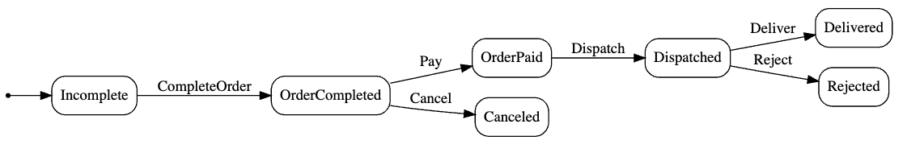
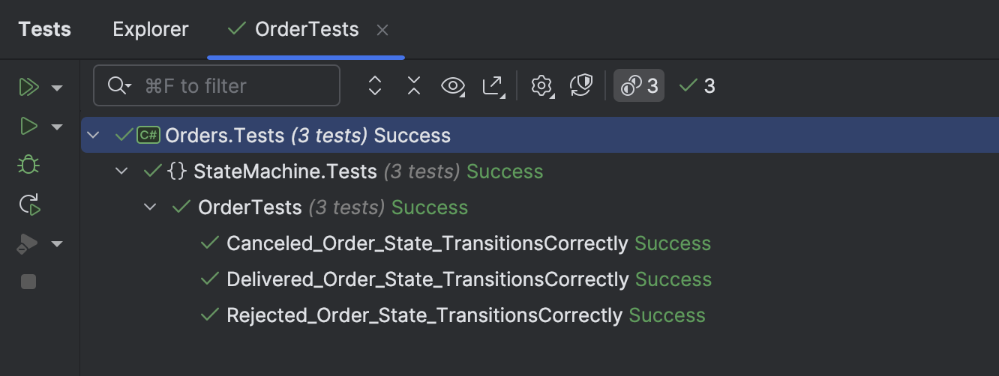

This is Part 4 of a series on using State Machines to express complex logic.

- [Using State Machines In .NET  - Part 1 - Introduction]()
- [Using State Machines In .NET  - Part 2 - Basic Usage]()
- [Using State Machines In .NET  - Part 3 - Setting Initial State]()
- **Using State Machines In .NET  - Part 4 - Using Multiple Triggers (This Post)**
- [Using State Machines In .NET - Part 5 - Using Complex & Nested States]()
- [Using State Machines In .NET - Part 6 - Firing Events On State Change]()
- [Using State Machines In .NET - Part 7 - Conditional State Transitions]()
- [Using State Machines In .NET - Part 8 - Firing Events Before State Change]()
- [Using State Machines In .NET - Part 9 - Calling Asynchronous Methods]()

In our last [two]() [posts](), we looked at configuring a state machine and setting its **initial state**.

In both examples, we used a **single trigger** to cycle through the traffic light states.

But usually, you will have a more complex problem where there are **multiple triggers** that you use to transition states.

Take, for example, an `Order`.

- An Order starts off as `Incomplete`
- Customers can **complete** the order by transitioning to `OrderComplete`.
- When it is complete, customers will get a prompt to pay.
- At this point, they can cancel, at which point it is `Canceled`, or they can make payment, at which point it is `Ordered`.
- It can then be **dispatched**, at which point it transitions to `Dispatched`.
- The order can then be **delivered**, after which it is `Delivered`.
- If the customer rejects it, it is `Rejected`.

The state diagram is like this:



We can implement our `Order` class as follows:

```c#
using Stateless;
using Stateless.Graph;

namespace Orders;

public sealed class Order
{
    private readonly StateMachine<Status, Trigger> _stateMachine;
    public string Graph => UmlDotGraph.Format(_stateMachine.GetInfo());
    public Status CurrentStatus => _stateMachine.State;

    public Order()
    {
        // Create the state machine, and set the initial state as Incomplete
        _stateMachine = new StateMachine<Status, Trigger>(Status.Incomplete);

        //
        // Configure state machine
        //

        _stateMachine.Configure(Status.Incomplete)
            .Permit(Trigger.CompleteOrder, Status.OrderCompleted);

        _stateMachine.Configure(Status.OrderCompleted)
            .Permit(Trigger.Pay, Status.OrderPaid)
            .Permit(Trigger.Cancel, Status.Canceled);

        _stateMachine.Configure(Status.OrderPaid)
            .Permit(Trigger.Dispatch, Status.Dispatched);

        _stateMachine.Configure(Status.Dispatched)
            .Permit(Trigger.Deliver, Status.Delivered)
            .Permit(Trigger.Reject, Status.Rejected);
    }

    public void CompleteOrder()
    {
        _stateMachine.Fire(Trigger.CompleteOrder);
    }

    public void PayOrder()
    {
        _stateMachine.Fire(Trigger.Pay);
    }

    public void CancelOrder()
    {
        _stateMachine.Fire(Trigger.Cancel);
    }

    public void DispatchedOrder()
    {
        _stateMachine.Fire(Trigger.Dispatch);
    }

    public void DeliverOrder()
    {
        _stateMachine.Fire(Trigger.Deliver);
    }

    public void RejectOrder()
    {
        _stateMachine.Fire(Trigger.Reject);
    }
}
```

Of interest is here we have implemented methods that we use to transition our state.

We then create tests to verify everything is functioning correctly.

```c#
public class OrderTests
{
    [Fact]
    public void Delivered_Order_State_TransitionsCorrectly()
    {
        var order = new Order();
        order.CurrentStatus.Should().Be(Status.Incomplete);
        order.CompleteOrder();
        order.CurrentStatus.Should().Be(Status.OrderCompleted);
        order.PayOrder();
        order.CurrentStatus.Should().Be(Status.OrderPaid);
        order.DispatchOrder();
        order.CurrentStatus.Should().Be(Status.Dispatched);
        order.DeliverOrder();
        order.CurrentStatus.Should().Be(Status.Delivered);
    }

    [Fact]
    public void Rejected_Order_State_TransitionsCorrectly()
    {
        var order = new Order();
        order.CurrentStatus.Should().Be(Status.Incomplete);
        order.CompleteOrder();
        order.CurrentStatus.Should().Be(Status.OrderCompleted);
        order.PayOrder();
        order.CurrentStatus.Should().Be(Status.OrderPaid);
        order.DispatchOrder();
        order.CurrentStatus.Should().Be(Status.Dispatched);
        order.RejectOrder();
        order.CurrentStatus.Should().Be(Status.Rejected);
    }

    [Fact]
    public void Canceled_Order_State_TransitionsCorrectly()
    {
        var order = new Order();
        order.CurrentStatus.Should().Be(Status.Incomplete);
        order.CompleteOrder();
        order.CurrentStatus.Should().Be(Status.OrderCompleted);
        order.CancelOrder();
        order.CurrentStatus.Should().Be(Status.Canceled);
    }
}
```

Our tests pass, as expected.



Now, suppose a developer unfamiliar with the flow attempts to `Deliver` an order **immediately** after creation.

```c#
var order = new Order();
order.CurrentStatus.Should().Be(Status.Incomplete);
order.DeliverOrder();
```

We get the following:

```plaintext
System.InvalidOperationException
No valid leaving transitions are permitted from state 'Incomplete' for trigger 'Deliver'. Consider ignoring the trigger.
```

We get an InvalidOperationException because to transition from `Incomplete` to `Delivered` is not possible.

We can test for this:

```c#
[Fact]
public void New_Order_Should_Not_Be_Deliverable()
{
    var order = new Order();
    order.CurrentStatus.Should().Be(Status.Incomplete);
    var ex = Record.Exception(() => order.DeliverOrder());
    ex.Should().BeOfType<InvalidOperationException>();
}
```

We can similarly check for the other transitions:

```c#
[Fact]
public void New_Order_Should_Not_Be_Payable()
{
    var order = new Order();
    order.CurrentStatus.Should().Be(Status.Incomplete);
    var ex = Record.Exception(() => order.PayOrder());
    ex.Should().BeOfType<InvalidOperationException>();
}

[Fact]
public void New_Order_Should_Not_Be_Rejectable()
{
    var order = new Order();
    order.CurrentStatus.Should().Be(Status.Incomplete);
    var ex = Record.Exception(() => order.RejectOrder());
    ex.Should().BeOfType<InvalidOperationException>();
}

[Fact]
public void New_Order_Should_Not_Be_Cancelable()
{
    var order = new Order();
    order.CurrentStatus.Should().Be(Status.Incomplete);
    var ex = Record.Exception(() => order.CancelOrder());
    ex.Should().BeOfType<InvalidOperationException>();
}

[Fact]
public void New_Order_Should_Not_Be_Dispatchable()
{
    var order = new Order();
    order.CurrentStatus.Should().Be(Status.Incomplete);
    var ex = Record.Exception(() => order.DispatchOrder());
    ex.Should().BeOfType<InvalidOperationException>();
}
```

Adding tests for other states and allowable transitions I leave as an exercise to you.

Thus, we can see here that even without a deep understanding of the state transitions, it is possible to **prevent the system from getting into an invalid state** without having complex logic to enforce this.

In our next post, we will look at complex / nested states.

### TLDR

**State machines allow for multiple triggers to transition between states.**

The code is in my [GitHub](https://github.com/conradakunga/BlogCode/tree/master/2025-03-27%20-%20State%20Machines%20Part%204).

Happy hacking!
