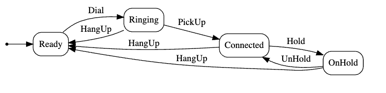
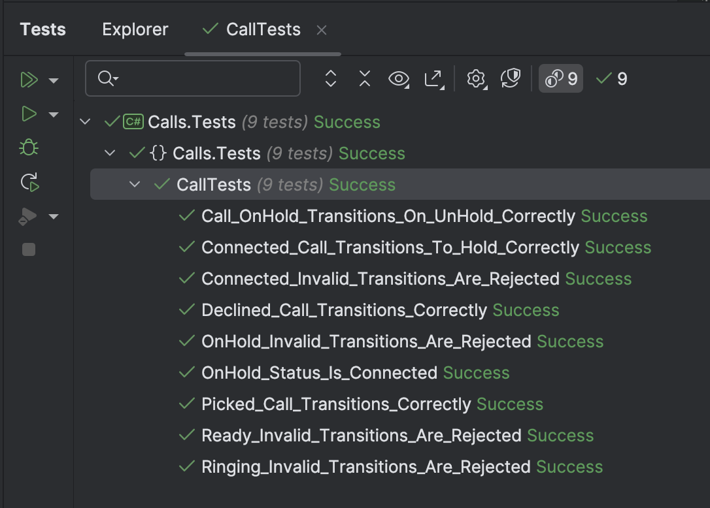

This is Part 5 of a series on using State Machines to express complex logic.

- [Using State Machines In .NET  - Part 1 - Introduction]()
- [Using State Machines In .NET  - Part 2 - Basic Usage]()
- [Using State Machines In .NET  - Part 3 - Setting Initial State]()
- [Using State Machines In .NET  - Part 4 - Using Multiple Triggers]()
- **Using State Machines In .NET - Part 5 - Using Complex & Nested States (This Post)**
- [Using State Machines In .NET - Part 6 - Firing Events On State Change]()
- [Using State Machines In .NET - Part 7 - Conditional State Transitions]()
- [Using State Machines In .NET - Part 8 - Firing Events Before State Change]()
- [Using State Machines In .NET - Part 9 - Calling Asynchronous Methods]()

Our last post examined how to use multiple triggers in your logic.

This post will look at how to model complex & nested states.

We will use an easily understood domain  - a telephone `Call` for this example.

- `Call` is initially in the `Ready` state
- A `Dial` trigger transitions to `Ringing`
- A `Ringing` call can be picked up, transitioning to `Connected`
- It can also be `HungUp`, transitioning to `Ready`
- While `Connected`, a trigger `Hold` can transition `to` `OnHold`
- It can also transition to `Ready` by the trigger `HangUp`
- While `OnHold,` it can transition back to `Connected` from the `UnHold` trigger
- It can also trigger back to `Ready` by the `HangUp` trigger.

The state transition diagram is as follows:



The code for this is as follows:

First, the statuses:

```c#
public enum Status
{
    Ready,
    Ringing,
    Connected,
    OnHold,
}
```

Then, the triggers:

```c#
public enum Trigger
{
    Dial,
    PickUp,
    HangUp,
    Hold,
    UnHold
}
```

Then, the `Call` class:

```c#
public sealed class Call
{
    private readonly StateMachine<Status, Trigger> _stateMachine;
    public string Graph => UmlDotGraph.Format(_stateMachine.GetInfo());
    public Status CurrentStatus => _stateMachine.State;

    public Call()
    {
        // Create the state machine, and set the initial state as red
        _stateMachine = new StateMachine<Status, Trigger>(Status.Ready);

        //
        // Configure state machine
        //

        _stateMachine.Configure(Status.Ready)
            .Permit(Trigger.Dial, Status.Ringing);

        _stateMachine.Configure(Status.Ringing)
            .Permit(Trigger.PickUp, Status.Connected)
            .Permit(Trigger.HangUp, Status.Ready);

        _stateMachine.Configure(Status.Connected)
            .Permit(Trigger.Hold, Status.OnHold)
            .Permit(Trigger.HangUp, Status.Ready);

        _stateMachine.Configure(Status.OnHold)
            .Permit(Trigger.UnHold, Status.Connected)
            .Permit(Trigger.HangUp, Status.Ready);
    }

    public void Dial()
    {
        _stateMachine.Fire(Trigger.Dial);
    }

    public void HangUp()
    {
        _stateMachine.Fire(Trigger.HangUp);
    }

    public void PickUp()
    {
        _stateMachine.Fire(Trigger.PickUp);
    }

    public void Hold()
    {
        _stateMachine.Fire(Trigger.Hold);
    }

    public void UnHold()
    {
        _stateMachine.Fire(Trigger.UnHold);
    }
}
```

Finally, some tests to ensure everything is ok.

```c#
public class CallTests
{
    [Fact]
    public void Declined_Call_Transitions_Correctly()
    {
        var call = new Call();
        call.CurrentStatus.Should().Be(Status.Ready);
        call.Dial();
        call.CurrentStatus.Should().Be(Status.Ringing);
        call.HangUp();
        call.CurrentStatus.Should().Be(Status.Ready);
    }

    [Fact]
    public void Picked_Call_Transitions_Correctly()
    {
        var call = new Call();
        call.CurrentStatus.Should().Be(Status.Ready);
        call.Dial();
        call.CurrentStatus.Should().Be(Status.Ringing);
        call.PickUp();
        call.CurrentStatus.Should().Be(Status.Connected);
        call.HangUp();
        call.CurrentStatus.Should().Be(Status.Ready);
    }

    [Fact]
    public void Connected_Call_Transitions_To_Hold_Correctly()
    {
        var call = new Call();
        call.Dial();
        call.PickUp();
        call.Hold();
        call.CurrentStatus.Should().Be(Status.OnHold);
    }

    [Fact]
    public void Call_OnHold_Transitions_On_UnHold_Correctly()
    {
        var call = new Call();
        call.Dial();
        call.PickUp();
        call.Hold();
        call.UnHold();
        call.CurrentStatus.Should().Be(Status.Connected);
    }

    [Fact]
    public void Ready_Invalid_Transitions_Are_Rejected()
    {
        var call = new Call(Status.Ready);
        var ex = Record.Exception(() => call.PickUp());
        ex.Should().BeOfType<InvalidOperationException>();

        ex = Record.Exception(() => call.Hold());
        ex.Should().BeOfType<InvalidOperationException>();

        ex = Record.Exception(() => call.UnHold());
        ex.Should().BeOfType<InvalidOperationException>();

        ex = Record.Exception(() => call.HangUp());
        ex.Should().BeOfType<InvalidOperationException>();
    }

    [Fact]
    public void Ringing_Invalid_Transitions_Are_Rejected()
    {
        var call = new Call(Status.Ringing);

        var ex = Record.Exception(() => call.Dial());
        ex.Should().BeOfType<InvalidOperationException>();

        ex = Record.Exception(() => call.UnHold());
        ex.Should().BeOfType<InvalidOperationException>();

        ex = Record.Exception(() => call.Hold());
        ex.Should().BeOfType<InvalidOperationException>();
    }

    [Fact]
    public void Connected_Invalid_Transitions_Are_Rejected()
    {
        var call = new Call(Status.Connected);
        var ex = Record.Exception(() => call.PickUp());
        ex.Should().BeOfType<InvalidOperationException>();


        ex = Record.Exception(() => call.Dial());
        ex.Should().BeOfType<InvalidOperationException>();
    }

    [Fact]
    public void OnHold_Invalid_Transitions_Are_Rejected()
    {
        var call = new Call(Status.OnHold);
        var ex = Record.Exception(() => call.PickUp());
        ex.Should().BeOfType<InvalidOperationException>();


        ex = Record.Exception(() => call.Dial());
        ex.Should().BeOfType<InvalidOperationException>();
    }
}
```

So far, so good.

The challenge comes when we need to get the status of a call that is `OnHold`.

Much as it is `OnHold`, a call that is `OnHold` is **also** `Connected`.

We can configure the state machine to reflect this:

```c#
  _stateMachine.Configure(Status.OnHold)
      .SubstateOf(Status.Connected)
      .Permit(Trigger.UnHold, Status.Connected)
      .Permit(Trigger.HangUp, Status.Ready);
```

We can then examine whether a call is `Connected` by using the `IsInState` method. Here, we have added a computed property to the `Call` class.

```c#
public bool IsConnected => _stateMachine.IsInState(Status.Connected);
```

Of importance is the fact that while we can interrogate the `IsConnected` property, the actual state is still `OnHold`.

A test can ensure this is working.

```c#
[Fact]
public void OnHold_Status_Is_Connected()
{
    var call = new Call(Status.Ready);
    call.Dial();
    call.PickUp();
    call.IsConnected.Should().BeTrue();
    call.Hold();
    call.CurrentStatus.Should().Be(Status.OnHold);
    call.IsConnected.Should().BeTrue();
}
```



In the [next post](), we will look at how to use events to react to state changes.

### TLDR

***States can be configured to be SubStates of other states, so nested relationships can be captured.***

The code is in my GitHub.

Happy Hacking!
