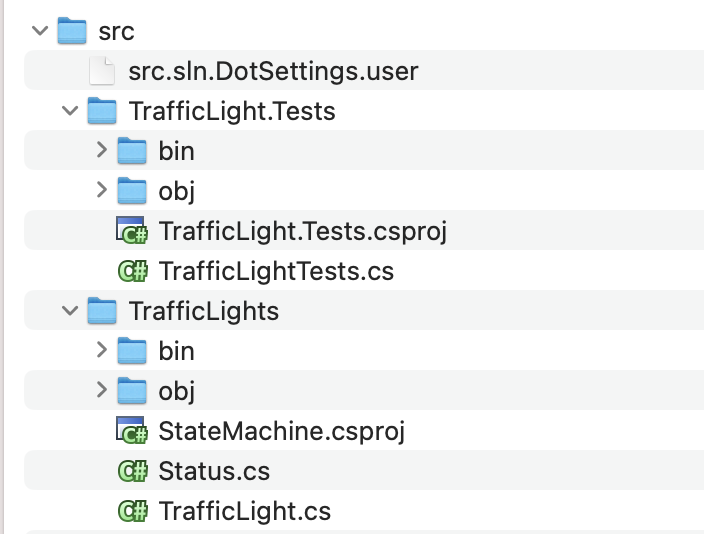

In a [previous post](), we looked at how we can organize projects into **solutions**, and now we can use the comand `dotnet sln add` and `dotnet sln remove` to achieve this.

To recap, if your folder structure is like this:



We can create a solution in the root folder like this:

```bash
dotnet new sln
```

We can then **add** the projects to the solution like this:

```bash
dotnet sln add src/TrafficLights/StateMachine.csproj

dotnet sln add src/TrafficLights.Tests/TrafficLightTests.csproj
```

You can also achieve the same thing if you **omit the project altogether**:

```bash
dotnet sln add src/TrafficLights

dotnet sln add src/TrafficLights.Tests
```

This also works for **removing** projects:

```bash
dotnet sln remove src/TrafficLights

dotnet sln remove src/TrafficLights.Tests
```

This will only work if there is a **single** `.csproj` file in the specified folder. If there is more than one, you will need to **specify which you mean**.

### TLDR

***The command to manipulate solution files will work when adding / removing projects if you omit specifying the project name.***

Happy hacking!
