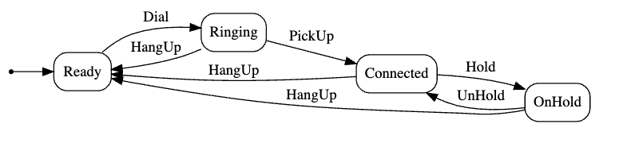

This is Part 6 of a series on using State Machines to express complex logic.

- [Using State Machines In .NET  - Part 1 - Introduction]()
- [Using State Machines In .NET  - Part 2 - Basic Usage]()
- [Using State Machines In .NET  - Part 3 - Setting Initial State]()
- [Using State Machines In .NET  - Part 4 - Using Multiple Triggers]()
- [Using State Machines In .NET - Part 5 - Using Complex & Nested States]()
- **Using State Machines In .NET - Part 6 - Firing Events On State Change (This Post)**
- [Using State Machines In .NET - Part 7 - Conditional State Transitions]()
- [Using State Machines In .NET - Part 8 - Firing Events Before State Change]()
- [Using State Machines In .NET - Part 9 - Calling Asynchronous Methods]()
- [Using State Machines In .NET - Part 10 - Generating State Diagrams]()
- [Using State Machines In .NET - Part 11 - Logic Based On How A State Was Transitioned]()
- [Using State Machines In .NET - Part 12 - State Activation & Entry]()

Our [last post]() examined how to model complex & nested states.

In this post we will look at how to tackle how to use **events** during state transitions.

Let us recap the state transition diagram for a `Call`.



Our transitions looked like this:

```c#
public void Dial()
{
    _stateMachine.Fire(Trigger.Dial);
}

public void HangUp()
{
    _stateMachine.Fire(Trigger.HangUp);
}

public void PickUp()
{
    _stateMachine.Fire(Trigger.PickUp);
}

public void Hold()
{
    _stateMachine.Fire(Trigger.Hold);
}

public void UnHold()
{
    _stateMachine.Fire(Trigger.UnHold);
}
```

No suppose we were to wire in some **hardware** to do the actual logic.

To simplify the code, let us assume **logging** modeled the hardware.

It would now look like this:

```c#
public void Dial()
{
    Log.Information("Dialing...");
    _stateMachine.Fire(Trigger.Dial);
}

public void HangUp()
{
    Log.Information("Hanging Up...");
    _stateMachine.Fire(Trigger.HangUp);
}

public void PickUp()
{
    Log.Information("Connected...");
    _stateMachine.Fire(Trigger.PickUp);
}

public void Hold()
{
    Log.Information("Placing On Hold...");
    _stateMachine.Fire(Trigger.Hold);
}

public void UnHold()
{
    Log.Information("Removing from Hold...");
    _stateMachine.Fire(Trigger.UnHold);
}
```

We can then wire some a test to make sure a `Call` outputs the correct output.

```c#
[Fact]
public void Call_Transitions_Correctly()
{
  var call = new Call();
  call.Dial();
  _output.Output.Should().EndWith("Dialing...\n");
  call.PickUp();
  _output.Output.Should().EndWith("Connected...\n");
  call.Hold();
  _output.Output.Should().EndWith("Placing On Hold...\n");
  call.HangUp();
  _output.Output.Should().EndWith("Hanging Up...\n");
}
```

In the logs we can see the results:


So far so good.

The problem arises when we place a call on `Hold`, and then back to `Connected`.

```c#
[Fact]
public void Call_Transitions_Correctly_From_Hold_To_Connected()
{
  var call = new Call();
  call.Dial();
  _output.Output.Should().EndWith("Dialing...\n");
  call.PickUp();
  _output.Output.Should().EndWith("Connected...\n");
  call.Hold();
  _output.Output.Should().EndWith("Placing On Hold...\n");
  call.UnHold();
  _output.Output.Should().EndWith("Removing from Hold...\n");
  call.HangUp();
}
```

This test passes, but the log shows the following:


It is missing where it prints the ***Connected ...*** message.

If need be, we can update the `UnHold` method to print this. But you would have to do this on **all methods that transition** to `OnHold`. This would mean loss of **context**.

Given there are **multiple** ways to transition to connected we cannot place the code on the methods themselves.

[Stateless](https://www.nuget.org/packages/stateless/) supports this scenario by exposing an event that you can write your code within - `OnEntry()`

The state machine can be updated as follows:

```C#
private Call(Status status)
{
    _stateMachine = new StateMachine<Status, Trigger>(status);

    //
    // Configure state machine
    //

    _stateMachine.Configure(Status.Ready)
        .Permit(Trigger.Dial, Status.Ringing);

    _stateMachine.Configure(Status.Ringing)
        .Permit(Trigger.PickUp, Status.Connected)
        .Permit(Trigger.HangUp, Status.Ready)
        .OnEntry(() => Log.Information("Ringing..."));

    _stateMachine.Configure(Status.Connected)
        .Permit(Trigger.Hold, Status.OnHold)
        .Permit(Trigger.HangUp, Status.Ready)
        .OnEntry(() => Log.Information("Connected..."));

    _stateMachine.Configure(Status.OnHold)
        .PermitIf(Trigger.UnHold, Status.Connected)
        .PermitIf(Trigger.HangUp, Status.Ready)
        .OnEntry(() => Log.Information("Placing On Hold..."));

    _stateMachine.Configure(Status.Ready)
        .OnEntry(() => Log.Information("Hanging Up..."));
}
```

If we run our tests, we should see the following in the console:


Thus we can see **regardless of how the state was set, the correct logic will fire**.

In our next post we will look at **conditional firing of triggers**.

### TLDR

**The `OnEntry()` event allows for logic to fire whenever the state changes.**

The code is in my [GitHub](https://github.com/conradakunga/BlogCode/tree/master/2025-03-30%20-%20State%20Machines%20Part%206).

Happy Hacking!
