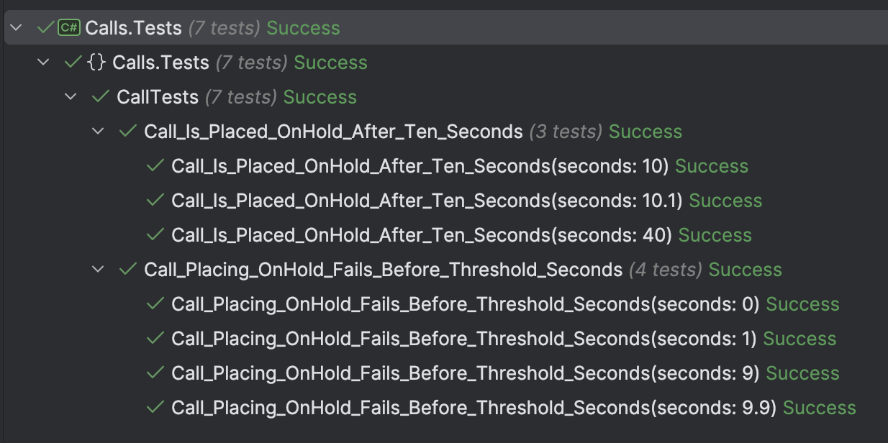

This is Part 7 of a series on using State Machines to express complex logic.

- [Using State Machines In .NET  - Part 1 - Introduction]()
- [Using State Machines In .NET  - Part 2 - Basic Usage]()
- [Using State Machines In .NET  - Part 3 - Setting Initial State]()
- [Using State Machines In .NET  - Part 4 - Using Multiple Triggers]()
- [Using State Machines In .NET - Part 5 - Using Complex & Nested States]()
- [Using State Machines In .NET - Part 6 - Firing Events On State Change]()
- **Using State Machines In .NET - Part 7 - Conditional State Transitions (This Post)**
- [Using State Machines In .NET - Part 8 - Firing Events Before State Change]()
- [Using State Machines In .NET - Part 9 - Calling Asynchronous Methods]()

In our [last post](), we examined how to use events to express the logic we want whenever the **state changes**.

In this post, we will examine situations in which **state changes are permissible only when certain conditions are met**.

Assume some sort of call center is using this code, and we want the following:

1. All calls **duration** must be recorded
2. Being on hold does not stop timing.
3. A call **can only be placed on hold after 10 seconds**, to avoid situations where a caller is immediately placed on hold.

To implement this logic, we update our `Call` class as follows:

```c#
public sealed class Call
{
    // State machine
    private readonly StateMachine<Status, Trigger> _stateMachine;

    // Store our start time for tracking
    private DateTime _startTime;

    // Constant for minimum threshold
    private const int MinimumTimeBeforeHoldInSeconds = 10;
    public Status CurrentStatus => _stateMachine.State;

    public Call(TimeProvider timeProvider) : this(Status.Ready, timeProvider)
    {
    }

    private Call(Status status, TimeProvider timeProvider)
    {
        var provider = timeProvider;
        _stateMachine = new StateMachine<Status, Trigger>(status);

        //
        // Configure state machine
        //
        _stateMachine.Configure(Status.Ready)
            .Permit(Trigger.Dial, Status.Ringing);

        _stateMachine.Configure(Status.Ringing)
            .Permit(Trigger.PickUp, Status.Connected)
            .Permit(Trigger.HangUp, Status.Ready)
            .OnEntry(() => Log.Information("Ringing..."));

        // Only allow transition of the time since start time is greater than or
        // equal to the threshold (10 seconds). This is by capturing the current time
        // at the point of requested state change and comparing with the start time

        _stateMachine.Configure(Status.Connected)
            .PermitIf(Trigger.Hold, Status.OnHold,
                () => (timeProvider.GetUtcNow().DateTime - _startTime).TotalSeconds >= MinimumTimeBeforeHoldInSeconds)
            .Permit(Trigger.HangUp, Status.Ready)
            .OnEntry(() =>
            {
                Log.Information("Connected...");
                // Set the start time
                _startTime = provider.GetUtcNow().DateTime;
            });


        _stateMachine.Configure(Status.OnHold)
            .PermitIf(Trigger.UnHold, Status.Connected)
            .PermitIf(Trigger.HangUp, Status.Ready)
            .OnEntry(() => Log.Information("Placing On Hold..."));

        _stateMachine.Configure(Status.Ready)
            .OnEntry(() => Log.Information("Hanging Up..."));
    }

    public void Dial()
    {
        _stateMachine.Fire(Trigger.Dial);
    }

    public void HangUp()
    {
        _stateMachine.Fire(Trigger.HangUp);
    }

    public void PickUp()
    {
        _stateMachine.Fire(Trigger.PickUp);
    }

    public void Hold()
    {
        _stateMachine.Fire(Trigger.Hold);
    }

    public void UnHold()
    {
        _stateMachine.Fire(Trigger.UnHold);
    }
}
```

The logic here is once the `Call` is connected, we capture the **start time**.

Then when a user tries to place the `Call` `OnHold`, we compare **that** time to the start time.

Some tests to verify this logic:

```c#
[Theory]
[InlineData(10.0)]
[InlineData(10.1)]
[InlineData(40)]
public void Call_Is_Placed_OnHold_After_Ten_Seconds(decimal seconds)
{
    var provider = new FakeTimeProvider();
    provider.SetUtcNow(DateTime.UtcNow);
    var call = new Call(provider);
    call.Dial();
    _output.Output.Should().EndWith("Ringing...\n");
    call.PickUp();
    _output.Output.Should().EndWith("Connected...\n");
    // Advance the time by 10 seconds
    provider.Advance(TimeSpan.FromSeconds((double)seconds));
    var ex = Record.Exception(() => call.Hold());
    ex.Should().BeNull();
    // Check status is on hold
    call.CurrentStatus.Should().Be(Status.OnHold);
}

[Theory]
[InlineData(9.0)]
[InlineData(9.9)]
[InlineData(0)]
[InlineData(1)]
public void Call_Placing_OnHold_Fails_Before_Threshold_Seconds(decimal seconds)
{
    var provider = new FakeTimeProvider();
    provider.SetUtcNow(DateTime.UtcNow);
    var call = new Call(provider);
    call.Dial();
    _output.Output.Should().EndWith("Ringing...\n");
    call.PickUp();
    _output.Output.Should().EndWith("Connected...\n");
    // Advance the time by 9 seconds
    provider.Advance(TimeSpan.FromSeconds((double)seconds));
    var ex = Record.Exception(() => call.Hold());
    ex.Should().BeOfType<InvalidOperationException>();
}
```

These tests should pass:



### TLDR

**Transitions between states can be controlled by conditions using the PermitIf() method during configuration.**

The code is in my [GitHub](https://github.com/conradakunga/BlogCode/tree/master/2025-03-31%20-%20State%20Machines%20Part%207).

Happy hacking!
