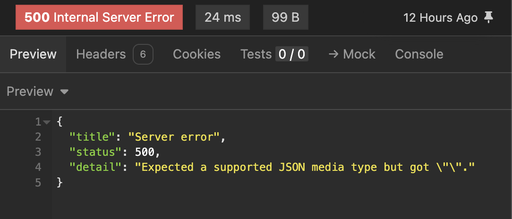
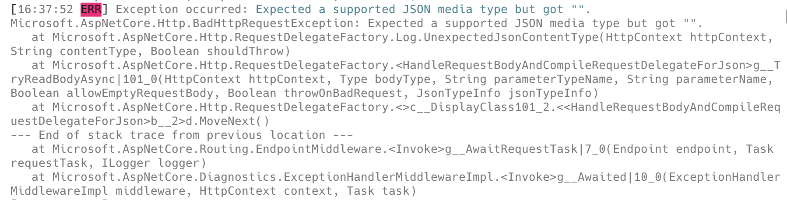
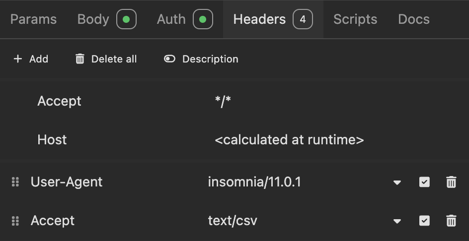

In a [recent post](), we discussed using **content negotiation** to control the **format of data** returned by an API, using the `Accept` header as set by the client.

In all the examples, the requests were [GET](https://developer.mozilla.org/en-US/docs/Web/HTTP/Reference/Methods/GET) requests.

If you use a [POST](https://developer.mozilla.org/en-US/docs/Web/HTTP/Reference/Methods/POST) request instead, you may get the following response:



The logs will show the following:



The culprit here is the request:



The payload is the following:

```xml
{
 "RequestDate": "2024-09-01T12:45:00Z"
}
```

The problem here is that the [Content-Type](https://developer.mozilla.org/en-US/docs/Web/HTTP/Reference/Headers/Content-Type) header is **missing** - `Content-Type: application/json`

When making a POST request, **make sure you specify** the `Content-Type` header.

### TLDR

**When making a POST request with a payload, the `Content-Type` header is mandatory.**

Happy hacking!
