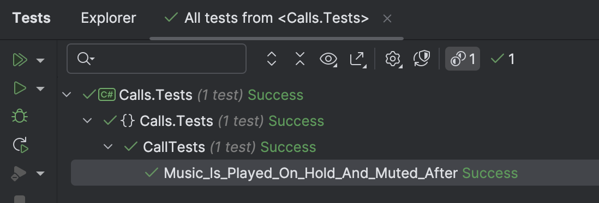
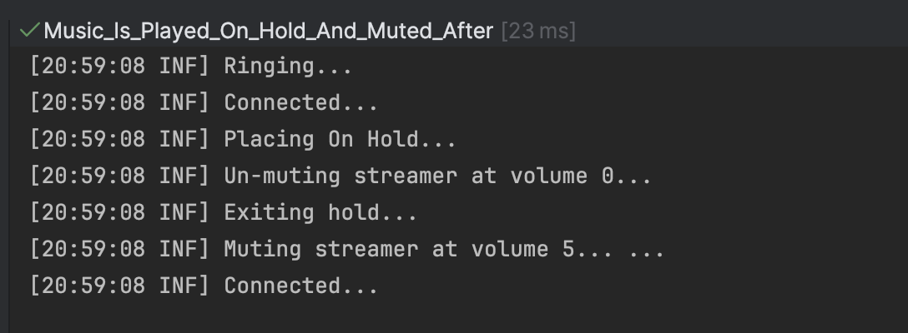

This is Part 8 of a series on using State Machines to express complex logic.

- [Using State Machines In .NET  - Part 1 - Introduction]()
- [Using State Machines In .NET  - Part 2 - Basic Usage]()
- [Using State Machines In .NET  - Part 3 - Setting Initial State]()
- [Using State Machines In .NET  - Part 4 - Using Multiple Triggers]()
- [Using State Machines In .NET - Part 5 - Using Complex & Nested States]()
- [Using State Machines In .NET - Part 6 - Firing Events On State Change]()
- [Using State Machines In .NET - Part 7 - Conditional State Transitions]()
- **Using State Machines In .NET - Part 8 - Firing Events Before State Change (This Post)**

One of our [previous posts]() looked at how to have some logic fire when **entering** a state.

In this post, we will look at how to have some logic fire when exiting a state.

Suppose our `Call` system supported playing music to users who are on hold.

Given we are designing flexible, maintainable software, we want to be able to swap put streaming services:

- [YouTube Music](https://music.youtube.com/)
- [Spotify](https://open.spotify.com/)
- [Apple Music](https://music.apple.com/us/new)

We thus define our contract, via an interface:

```c#
public interface IStreamingService
{
    // Get the current volumn
    byte Volume { get; }
    // Increase the volume by one step
    void IncreaseVolume();
    // Decease the volume by one step
    void DecreaseVolume();
    // Mute the music
    void Mute();
    // Unmute the music
    void Unmute();
}
```

We then implement one for `Spotify`.

```c#
public class SpotifyStreamer : IStreamingService
{
    public byte Volume { get; private set; }

    public void IncreaseVolume()
    {
        if (Volume < 10)
            Volume++;
    }

    public void DecreaseVolume()
    {
        if (Volume > 0)
            Volume--;
    }

    public void Mute()
    {
        Volume = 0;
    }

    public void Unmute()
    {
        Volume = 5;
    }
}
```

We then inject this into our `Call` class so that when placed on `Hold`, the music is **activated**, and when leaving `Hold`, it is **muted**.

```c#
public sealed class Call
{
    private readonly IStreamingService _service;

    public int MusicVolume => _service.Volume;

    // State machine
    private readonly StateMachine<Status, Trigger> _stateMachine;

    public Call(IStreamingService service) : this(Status.Ready, service)
    {
    }

    private Call(Status status, IStreamingService service)
    {
        _service = service;
        _stateMachine = new StateMachine<Status, Trigger>(status);
        service.Mute();

        //
        // Configure state machine
        //
        _stateMachine.Configure(Status.Ready)
            .Permit(Trigger.Dial, Status.Ringing);

        _stateMachine.Configure(Status.Ringing)
            .Permit(Trigger.PickUp, Status.Connected)
            .Permit(Trigger.HangUp, Status.Ready)
            .OnEntry(() => Log.Information("Ringing..."));

        // Only allow transition of the time since start time is greater than or
        // equal to the threshold (10 seconds). This is by capturing the current time
        // at the point of requested state change and comparing with the start time

        _stateMachine.Configure(Status.Connected)
            .Permit(Trigger.Hold, Status.OnHold)
            .Permit(Trigger.HangUp, Status.Ready)
            .OnEntry(() => { Log.Information("Connected..."); });


        _stateMachine.Configure(Status.OnHold)
            .PermitIf(Trigger.UnHold, Status.Connected)
            .PermitIf(Trigger.HangUp, Status.Ready)
            .OnEntry(() =>
                {
                    Log.Information("Placing On Hold...");
                    Log.Information("Un-muting streamer currently at volume {Volume}...", service.Volume);
                    service.Unmute();
                }
            ).OnExit(() =>
            {
                Log.Information("Exiting hold...");
                Log.Information("Muting streamer currently at volume {Volume}... ...", service.Volume);
                service.Mute();
            });

        _stateMachine.Configure(Status.Ready)
            .OnEntry(() => Log.Information("Hanging Up..."));
    }

    public void Dial()
    {
        _stateMachine.Fire(Trigger.Dial);
    }

    public void HangUp()
    {
        _stateMachine.Fire(Trigger.HangUp);
    }

    public void PickUp()
    {
        _stateMachine.Fire(Trigger.PickUp);
    }

    public void Hold()
    {
        _stateMachine.Fire(Trigger.Hold);
    }

    public void UnHold()
    {
        _stateMachine.Fire(Trigger.UnHold);
    }
}
```

Finally, we write some tests to verify everything functions correctly.

```c#
[Fact]
public void Music_Is_Played_On_Hold_And_Muted_After()
{
    var spotify = new SpotifyStreamer();
    var call = new Call(spotify);
    call.Dial();
    call.PickUp();
    call.MusicVolume.Should().Be(0);
    call.Hold();
    call.MusicVolume.Should().Be(5);
    call.UnHold();
    call.MusicVolume.Should().Be(0);
}
```

If we run our tests ...



The console prints the messages we expect:



In this way, we can have code that takes advantage of state changes **before** or **after**.

### TLDR

**Stateless offers an `OnExit()` method that you can use to write logic to fire just before the transition exits.**

The code is in my [GitHub](https://github.com/conradakunga/BlogCode/tree/master/2025-04-01%20-%20State%20Machines%20Part%208).

Happy Hacking!
