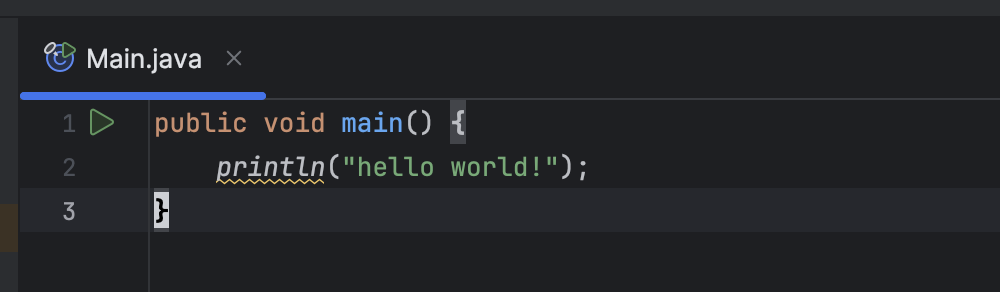
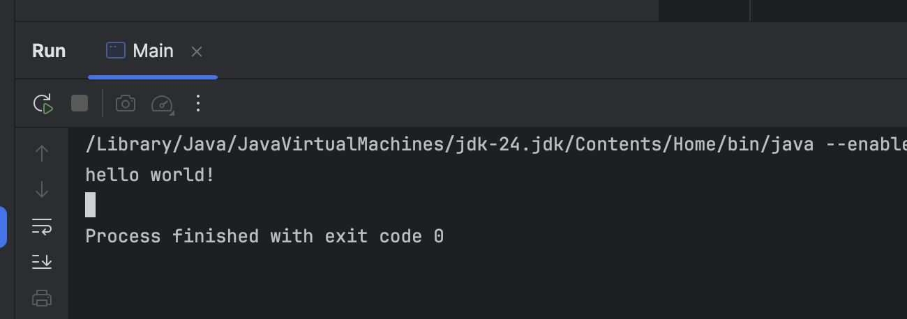

It's been a while since I did some [Java](https://www.java.com/en/) work - middleware that interfaced with [Oracle FlexCube](https://www.oracle.com/ke/financial-services/banking/flexcube/core-banking-software/) and [Finacle](https://www.finacle.com/), which implemented [ISO 8583](https://en.wikipedia.org/wiki/ISO_8583).

[Oracle](https://www.oracle.com/) has [recently released](https://www.java.com/releases/matrix/) Java 24 SDK, and I wondered what was new.

The most striking is this:

```java
public void main() {
    println("hello world!");
}
```

This is a complete application.



And it runs:



What is striking about this?

This is what a traditional Java application looks like:

```java
public class HelloWorld {
    public static void main(String[] args) {
        System.out.println("hello world!");
    }
}
```

This is great because it makes the language more **approachable** to newbies who do not need to know what a `class` is or what `static` is. Or `String[]`. Or `args`. Or `System.out`.

### TLDR

**Java has begun to take strides to be friendly to newbies.**

Happy hacking!
