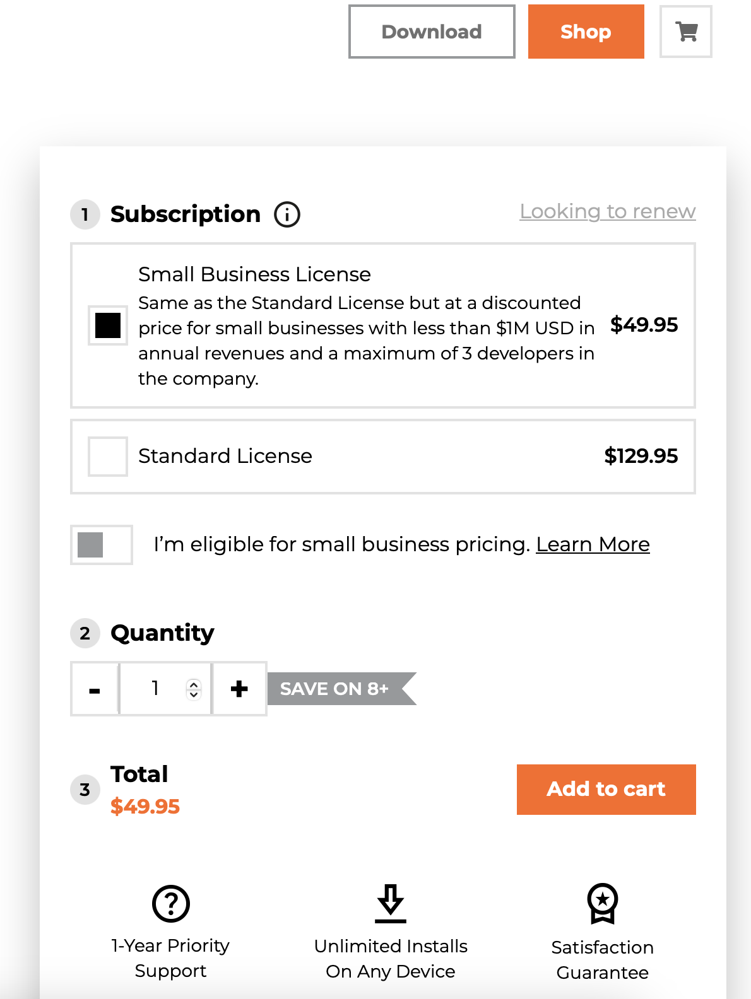

I have long used the [FluentAssertions](https://fluentassertions.com/) library to make my test code easier to **read** (and **write**). Recently, the authors converted the library to a commercial license (**which is 100% in order**), but at a [price point I found objectionable]() for teams.

Checking today, I see there has been a concession in the form of a **small business license**.

In the short period when alternatives like [Shouldly](https://docs.shouldly.org) were candidates for replacement, an even better alternative has emerged.

Thanks to the power of the community and open-source software, the code was forked into a new repository - [AwesomeAssertions](https://awesomeassertions.org). This is a **drop-in replacement** that preserves the same **namespaces** and **type names**.

Another reason I prefer this is that they have also forked and published a corresponding [analyzer](https://github.com/AwesomeAssertions/AwesomeAssertions.analyzers) that can help you write better assertions.

As a reminder, the new [license applies to the library's version 8](https://xceed.com/fluent-assertions-faq/). You can continue to use the older version 7 (or prior) as those preserve the original license.

### TLDR

**`AwesomeAssertions` is a drop-in replacement for `FluentAssertions`.**

Happy hacking!
